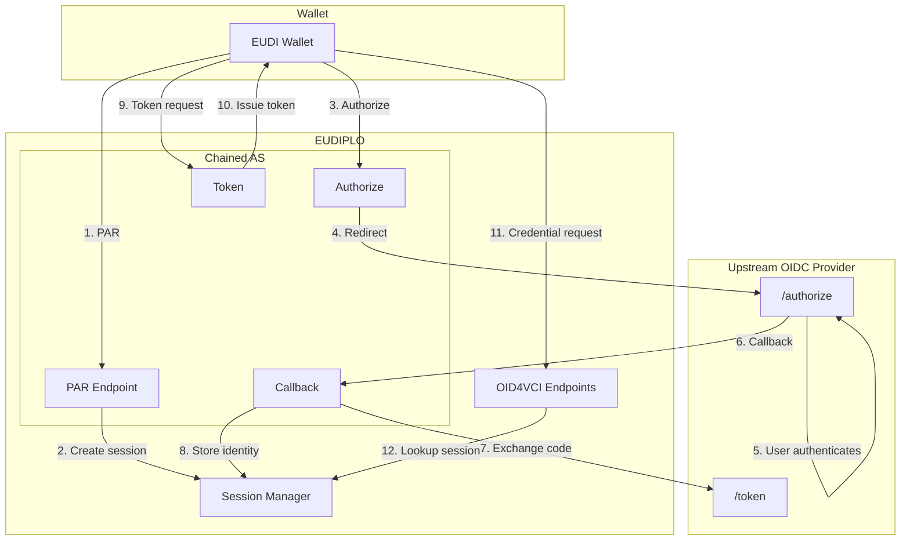
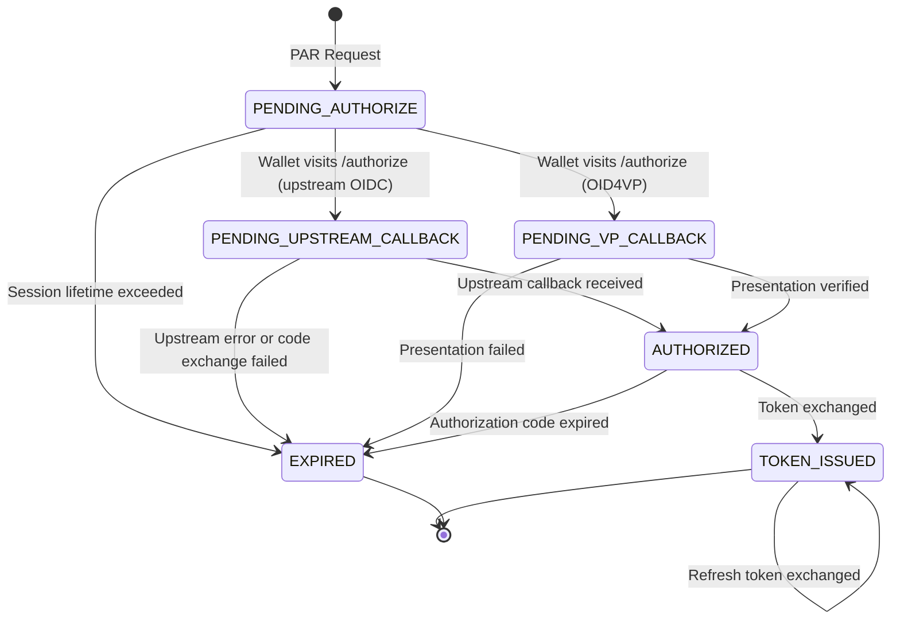

# Authorization

The authorization layer in EUDIPLO determines how wallets authenticate to receive credentials. EUDIPLO supports four authorization server types for credential issuance (`built-in`, `external`, `chained`, `oid4vp`), each suited to different deployment scenarios and security requirements.

## Authorization Modes

EUDIPLO can act as:

1. **Built-in Authorization Server** (`built-in`) — EUDIPLO issues authorization codes itself, without an external identity provider
2. **External Authorization Server** (`external`) — Delegate to an existing OAuth 2.0/OIDC provider (e.g., Keycloak, Azure AD)
3. **Chained Authorization Server** (`chained`) — EUDIPLO acts as an AS facade, delegating authentication to upstream OIDC while issuing its own tokens
4. **OID4VP-Based Authorization Server** (`oid4vp`) — EUDIPLO acts as an AS facade that authorizes the wallet via an OID4VP presentation (configured `presentationConfigId`) and issues its own tokens. Each entry is served at `/issuers/{tenant}/authorization-servers/{id}` (`par`, `authorize`, `vp-callback`, `token`)

For detailed protocol extension points and integration patterns, see:

- [Interactive Authorization Endpoint (IAE)](./extension-points/iae.md) — Multi-step authorization flows with user interaction
- [OpenID Federation](./extension-points/federation.md) — Federation-based trust evaluation

## Chained Authorization Server

The **Chained Authorization Server (Chained AS)** is an optional mode where EUDIPLO acts as an OAuth 2.0 Authorization Server facade. Instead of implementing user authentication directly, it delegates to an upstream OIDC provider while issuing its own access tokens with custom claims for session correlation.

### Overview

In credential issuance flows using the authorization code grant, the wallet needs an access token to request credentials. Typically, this token comes from either:

1. **EUDIPLO's built-in AS** - Simple setup, but it does not authenticate the user against an identity provider
2. **External AS (e.g., Keycloak)** - Uses existing identity infrastructure, but requires the AS to put the EUDIPLO session ID into the access token claim configured as `sessionBinding.claim`

The **Chained AS** provides another option: EUDIPLO acts as the AS but delegates authentication to an upstream OIDC provider. This combines the benefits of both approaches without requiring modifications to your existing OIDC provider.

### Architecture

### Session Flow States

The Chained AS maintains session state through the OAuth flow:

The same session model is used by the OID4VP-based authorization servers (`PENDING_VP_CALLBACK` instead of `PENDING_UPSTREAM_CALLBACK`).

A VP-backed variant of the chained AS also exists at `/issuers/{tenant}/chained-as-vp` (`par`, `authorize`, `vp-callback`, `token`, with metadata and JWKS under the matching `.well-known/.../chained-as-vp` paths). It is selected by a `chained` entry with `vp.enabled` and `vp.presentationConfigId`, which the current `chained` configuration schema does not accept; use the `oid4vp` type for presentation-based authorization.

### Token Structure

Access tokens issued by the Chained AS are JWTs signed by EUDIPLO containing:

| Claim                   | Description                                                          |
| ----------------------- | -------------------------------------------------------------------- |
| `iss`                   | Chained AS issuer URL (`{PUBLIC_URL}/issuers/{tenant}/chained-as`)   |
| `sub`                   | Client ID of the requesting wallet                                   |
| `aud`                   | EUDIPLO credential issuer URL (`{PUBLIC_URL}/issuers/{tenant}`)      |
| `iat` / `exp`           | Issued-at and expiry (`token.lifetimeSeconds`, default 3600 seconds) |
| `jti`                   | Unique token identifier                                              |
| `issuer_state`          | Session ID for credential offer correlation                          |
| `client_id`             | Wallet's client identifier                                           |
| `authorization_details` | Authorization details from the pushed authorization request (if any) |
| `upstream_sub`          | Subject from upstream ID token (if the upstream returned one)        |
| `upstream_iss`          | Issuer from upstream ID token (if the upstream returned one)         |
| `cnf.jkt`               | DPoP key thumbprint (if DPoP is used)                                |

With the example host and tenant, `iss` is `https://eudiplo.example.com/issuers/tenant1/chained-as`.

### Comparison with Other Modes

| Feature                  | Built-in AS                  | External AS                              | Chained AS        | OID4VP-based AS     |
| ------------------------ | ---------------------------- | ---------------------------------------- | ----------------- | ------------------- |
| User authentication      | No login step (IAE optional) | External provider                        | External provider | OID4VP presentation |
| Token issuer             | EUDIPLO                      | External                                 | EUDIPLO           | EUDIPLO             |
| Session ID in token      | ✅ `sub` (automatic)         | ⚠️ Configured `sessionBinding.claim`     | ✅ `issuer_state` | ✅ `issuer_state`   |
| Session correlation      | ✅ Native                    | ⚠️ Via configured `sessionBinding.claim` | ✅ Native         | ✅ Native           |
| Modify external provider | N/A                          | Required (to emit the binding claim)     | Not required      | N/A                 |
| DPoP support             | ✅                           | Depends on provider                      | ✅                | ✅                  |
| Wallet attestation       | ✅                           | ❌ Not possible                          | ✅                | ✅                  |

### Security Considerations

#### Client Secret Management

The upstream client secret (`upstream.clientSecret`) is optional and stored in the issuance configuration. If it is omitted, EUDIPLO authenticates to the upstream token endpoint as a public client and relies on PKCE. If you use a secret, consider:

- Using environment variables for secrets in production
- Rotating secrets periodically
- Using a secrets manager for enterprise deployments

#### PKCE

The request from EUDIPLO to the upstream provider always uses PKCE with `S256`.

On the wallet leg, PKCE with `S256` is required, as mandated by HAIP: a PAR request without a `code_challenge`, or with a `code_challenge_method` other than `S256`, is rejected with `invalid_request`. The token request must include the matching `code_verifier`. The AS metadata advertises only `S256`.

#### DPoP

When `requireDPoP` is enabled, wallets must provide a DPoP proof with their PAR and token requests. The thumbprint of the DPoP key presented at PAR is bound to the access token via the `cnf.jkt` claim.

#### State Parameter

The Chained AS generates a cryptographically random state parameter for the upstream authorization request, preventing CSRF attacks.

### Configuration

See [Issuance: Authorization](../issuance/authorization.md) for configuration details and examples.

### Endpoints Reference

All endpoints are tenant-scoped:

| Endpoint                                                              | Method | Auth | Description                                                                  |
| --------------------------------------------------------------------- | ------ | ---- | ---------------------------------------------------------------------------- |
| `/issuers/{tenant}/chained-as/par`                                    | POST   | None | Pushed Authorization Request - initiates the flow                            |
| `/issuers/{tenant}/chained-as/authorize`                              | GET    | None | Authorization endpoint - redirects to upstream                               |
| `/issuers/{tenant}/chained-as/callback`                               | GET    | None | Handles upstream callback                                                    |
| `/issuers/{tenant}/chained-as/token`                                  | POST   | None | Exchanges code (`authorization_code`) or `refresh_token` for an access token |
| `/.well-known/oauth-authorization-server/issuers/{tenant}/chained-as` | GET    | None | AS metadata discovery                                                        |
| `/.well-known/jwks.json/issuers/{tenant}/chained-as`                  | GET    | None | Public keys for token verification                                           |

### Upstream Provider Requirements

The upstream OIDC provider must:

1. **Support OIDC Discovery** - Publish `.well-known/openid-configuration`
2. **Support Authorization Code Flow** - With `response_type=code`
3. **Client Registration** - A confidential client (the secret is sent as `client_secret` in the token request) or, if `upstream.clientSecret` is omitted, a public client using PKCE
4. **Return ID Tokens** - Include `sub` and `iss` claims

Tested providers:

- Keycloak
- Auth0
- Azure AD / Entra ID
- Google Identity Platform
