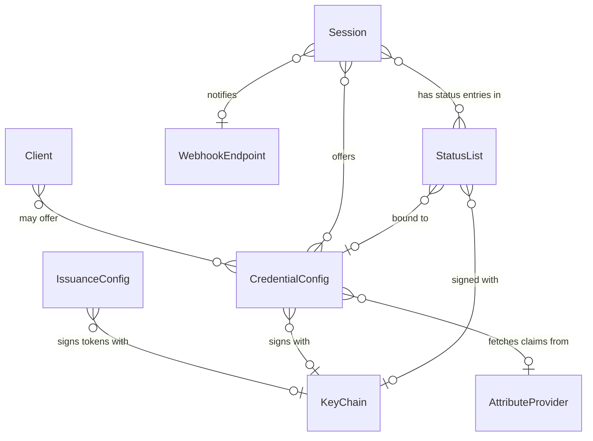
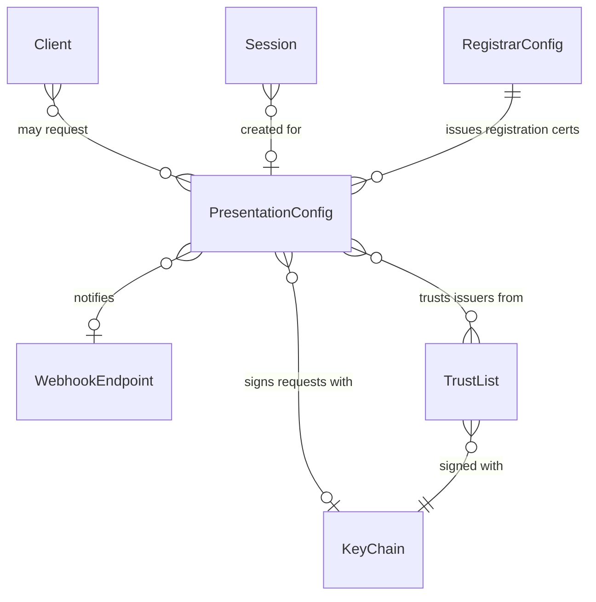
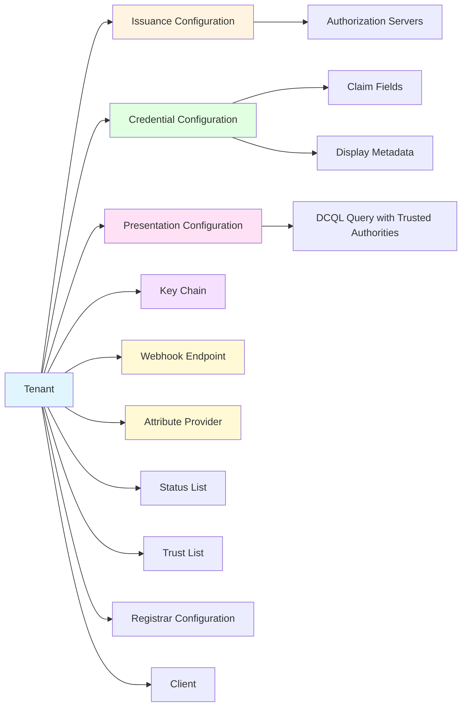

# Core Concepts

EUDIPLO's architecture is built around a small set of core entities that work together to enable credential issuance and presentation. Understanding these concepts and their relationships is essential for configuring and using the system effectively.

---

## Entities and Their Relationships

All entities below are scoped to a **Tenant** (via `tenantId`), so the tenant is left out of the diagrams to keep them readable. The diagrams show how the tenant-scoped entities relate to each other, split into issuance and presentation. `KeyChain`, `WebhookEndpoint`, `Client` and `Session` appear in both.

### Issuance

### Presentation

The diagrams use crow's foot notation: `o|` marks an optional reference, `o{` zero or more. They show the configuration entities and sessions; their main properties are described in [Core Entities](#core-entities). Internal bookkeeping tables (nonces, DPoP proof IDs, deferred transactions, session logs, status-list index mappings, trust-list versions, uploaded files, audit logs and config-import metadata) are omitted.

---

## Core Entities

### Tenant

A **Tenant** represents an isolated configuration space for a single organization or environment. All other entities are scoped to a tenant via the `tenantId` column.

**Key Properties:**

- **Multi-tenancy isolation**: Each tenant has its own credentials, keys, and sessions
- **Session cleanup configuration**: Controls TTL and cleanup mode (`full` or `anonymize`)
- **Status list configuration**: Controls the size and bits per entry for newly created status lists

**Usage:** See [Tenant Management](../administration/tenants.md) for operational details.

---

### Client

A **Client** is an API client that authenticates against EUDIPLO's management API (OAuth 2.0 client credentials) and belongs to one tenant.

**Key Properties:**

- **Roles**: Permissions such as `presentation:manage` or `issuance:offer`
- **Allowed presentation configs**: Optional allow list of presentation configuration IDs the client may use
- **Allowed issuance configs**: Optional allow list of credential configuration IDs the client may offer

If an allow list is empty, the client may use all configurations of its tenant.

**Usage:** See [Authentication](../administration/authentication.md).

---

### Credential Configuration

A **Credential Configuration** defines the structure, display properties, and metadata for a specific credential type (e.g., "University Diploma", "Employee Badge").

**Key Properties:**

- **Format**: Credential format (`mso_mdoc` for ISO mDOC, `dc+sd-jwt` for SD-JWT VC)
- **Fields**: Array of claim definitions with paths, types, and disclosure policies
- **Display metadata**: Localized name, description, colors, logo, and background images
- **Signing key**: Optional reference to an `attestation` `KeyChain`; if unset, the tenant's default attestation key chain is used
- **Attribute provider**: Optional reference to an external system that supplies claim values
- **Webhook endpoint**: A `webhookEndpointId` can be stored, but it is not used at runtime yet; issuance notifications go to the webhook endpoint given in the credential offer
- **Status management**: Whether issued credentials get an entry in a `StatusList` so they can be revoked or suspended

**Relationship to Issuance:**

- A credential configuration is referenced by an issuance session when creating a credential offer
- Multiple credential configurations can be issued through the same issuance configuration

**Usage:** See [Credential Configuration](../issuance/credential-configuration.md).

---

### Issuance Configuration

An **Issuance Configuration** defines _how_ credentials are issued: which authorization servers to use, batch size, token behavior, and shared trust-list policy. Each tenant has at most one issuance configuration.

**Key Properties:**

- **Authorization servers**: One or more AS configurations (built-in, external, chained, or OID4VP-based)
- **DPoP requirement**: Whether wallets must prove possession of their keys
- **Wallet attestation defaults**: Fallback client-authentication policy for EUDIPLO-managed authorization servers
- **Key-attestation trust**: Shared wallet-provider trust lists used when validating holder-key attestations at the credential endpoint
- **Signing key**: Optional reference to a specific `KeyChain` for signing access tokens

**Relationship to Credential Configuration:**

- An issuance configuration does not directly reference credential configurations
- The wallet includes the desired `credential_configuration_id` in its request
- EUDIPLO validates that the credential configuration exists and is accessible to the tenant

**Usage:** See [Issuance Configuration](../issuance/issuance-configuration.md).

---

### Presentation Configuration

A **Presentation Configuration** defines _what_ credentials a verifier requires and _how_ to validate them.

**Key Properties:**

- **Credential query**: DCQL query (`dcql_query`) specifying required credential formats, fields, and values
- **Trusted authorities**: Part of the DCQL query; references tenant `TrustList` entities or external trust list URLs used to validate credential issuers
- **Transaction data**: Optional transaction data the wallet has to sign
- **Registration certificate**: Optional registration certificate request, issued via the tenant's `RegistrarConfig`
- **Webhook endpoint**: Where to send the verification result after validation
- **Access key chain**: Optional `access` `KeyChain` used to sign the presentation request; if unset, the tenant's default access certificate is used
- **Redirect URI**: Where the user is sent after a same-device flow (supports a `{sessionId}` placeholder)

**Relationship to KeyChain:**

- Signs the request object with an `access` `KeyChain`, which authenticates the verifier towards the wallet
- The wallet response is encrypted (`direct_post.jwt`, or `dc_api.jwt` for the Digital Credentials API) with an ephemeral key generated per session, not with a `KeyChain`

**Usage:** See [Presentation Configuration](../presentation/index.md).

---

### Key Chain

A **Key Chain** is a unified entity that combines cryptographic keys and their certificates. It supports both standalone keys (self-signed) and internal certificate chains (root CA + leaf signing key).

**Key Properties:**

- **Usage type**: `access`, `attestation`, `trustList`, `statusList`, or `encrypt`
- **KMS provider**: Where the key material is stored (`db`, `vault`, `aws-kms`, `pkcs11`, etc.)
- **Certificate chain**: Optional X.509 certificates (leaf first, then intermediates/root)
- **Rotation policy**: Optional automatic rotation for internal CA chains

**Algorithms:**

- Primary algorithm: **ES256** (ECDSA with P-256 curve)
- Used for signing access tokens, credentials, trust lists, and status lists

**Relationship to Other Entities:**

- **Credential Configuration**: References an `attestation` key chain via `keyChainId` for signing credentials
- **Issuance Configuration**: References a key chain via `signingKeyId` for signing access tokens
- **Presentation Configuration**: References an `access` key chain via `accessKeyChainId` for signing presentation requests
- **Status List**: Signed with a `statusList` key chain
- **Trust List**: Signed with a `trustList` key chain

**Usage:** See [Key Chains](../trust/key-chains.md) and [Key Management](./cryptography.md).

---

### Webhook Endpoint

A **Webhook Endpoint** is a reusable, tenant-scoped definition of an external HTTP endpoint that EUDIPLO notifies about flow results.

**Key Properties:**

- **URL**: Target of the notification requests
- **Authentication**: `none`, or a static header (for example an API key)

**Relationship to Other Entities:**

- **Presentation Configuration**: Receives the verified presentation once the wallet response is validated
- **Session**: An issuance offer can set `webhookEndpointId`; wallet notifications (credential accepted, failed or deleted) for that session are forwarded to it

**Usage:** See [Webhooks](./extension-points/webhooks.md).

---

### Attribute Provider

An **Attribute Provider** is a tenant-scoped external HTTP endpoint that supplies claim values during issuance, for example from a customer database.

**Key Properties:**

- **URL**: Endpoint EUDIPLO calls to fetch the claims
- **Authentication**: `none`, or a static header

**Relationship to Other Entities:**

- **Credential Configuration**: References an attribute provider via `attributeProviderId`; the claims it returns are validated against the credential's field definitions

**Usage:** See [Attribute Providers](./extension-points/attribute-providers.md) and [Attribute Provider](../issuance/attribute-provider.md).

---

### Status List

A **Status List** holds the revocation and suspension status of issued credentials as a compact bit array, published as a signed JWT (SD-JWT VC) or CWT (mDOC).

**Key Properties:**

- **Bits per status**: Number of bits per entry (determines the possible status values)
- **Binding**: Optionally bound to a single credential configuration; otherwise shared by all credential configurations of the tenant
- **Signing key**: Optional reference to a `statusList` `KeyChain`

**Relationship to Other Entities:**

- **Credential Configuration**: Credentials with status management enabled receive an entry in a status list
- **Session**: EUDIPLO records which status-list entries were assigned to the credentials issued in a session, so they can be revoked later

**Usage:** See [Status Management](../issuance/status-management.md).

---

### Trust List

A **Trust List** is a tenant-hosted list of trusted entities (for example PID or attestation providers), published as a signed JWT. Every change creates a new version with an incremented sequence number.

**Key Properties:**

- **Entities**: The trusted entities and their certificates
- **Signing key**: Reference to a `trustList` `KeyChain`

**Relationship to Other Entities:**

- **Presentation Configuration**: Can reference a tenant trust list in the DCQL `trusted_authorities` to validate credential issuers
- **Issuance Configuration**: Wallet-provider trust lists can reference a tenant trust list as well

**Usage:** See [Trust Lists](../trust/trust-lists.md).

---

### Registrar Configuration

A **Registrar Configuration** stores the connection to an external wallet registrar. Each tenant has at most one.

**Key Properties:**

- **Registrar and OIDC URLs**: Where EUDIPLO requests registration and access certificates
- **Credentials**: Client ID and user credentials used to authenticate against the registrar
- **Registration certificate defaults**: Values such as privacy policy and support URI merged into every registration certificate request

**Relationship to Other Entities:**

- **Presentation Configuration**: Registration certificates requested in `registration_cert` are issued through the registrar; EUDIPLO rejects requests whose DCQL query asks for more than the certificate allows
- **Issuance Configuration**: Can request an issuer registration certificate the same way

**Usage:** See [Registrar](../trust/registrar.md) and [Registration Certificates](../trust/registration-certificates.md).

---

### Session

A **Session** tracks the state of a single issuance or presentation flow. It stores protocol-specific data, user identity, credentials, and transaction state.

**Key Properties:**

- **Status**: `active`, `fetched`, `completed`, `expired`, or `failed`
- **Single-use enforcement**: Sessions are marked `consumed` after first use to prevent replay attacks
- **Cleanup modes**: Sessions can be fully deleted or anonymized (keep metadata, remove personal data)
- **Webhook endpoint**: Optional endpoint notified about the session result
- **Security fields** (OID4VP only): `walletNonce` and `responseCode` implement the OID4VP §13.3 security model

**Lifecycle:**

1. **Created** when a credential offer or presentation request is generated
2. **Updated** as the wallet progresses through authorization, token exchange, and credential/presentation submission
3. **Consumed** when the offer is redeemed (issuance: at the token exchange) or the wallet response is accepted (presentation)
4. **Cleaned up** based on tenant-specific TTL and cleanup mode

**Usage:** See [Session Management](./sessions.md).

---

## Configuration Hierarchy

The configuration model follows a hierarchical structure:

References between these entities are shown in [Entities and Their Relationships](#entities-and-their-relationships).

**Key Points:**

- All entities are tenant-scoped (isolated by `tenantId`)
- Issuance and presentation configurations reference key chains but not credential configurations
- Credential configurations can optionally reference an attribute provider for dynamic claim fetching
- Webhook endpoints and attribute providers are defined once per tenant and reused by any number of configurations
- Sessions are created per flow and reference either the offered credential configurations or a presentation configuration

---

## Runtime Flow: Issuance

When issuing a credential:

1. **Offer Creation**: EUDIPLO creates a credential offer and a new `Session` (status: `active`)
2. **Authorization**: The wallet authenticates via one of the configured authorization servers
3. **Token Exchange**: The wallet exchanges the authorization code for an access token (signed by the referenced `KeyChain`); the session is marked `consumed`, so the code or pre-authorized code cannot be redeemed again
4. **Credential Request**: The wallet requests a credential, referencing the `credential_configuration_id`
5. **Claim Resolution**: If an attribute provider is configured, EUDIPLO fetches the claim values from it; all claims are then validated against the credential configuration's field definitions
6. **Signing**: EUDIPLO signs the credential using the attestation `KeyChain` associated with the credential configuration; with status management enabled, the credential gets an entry in a `StatusList`
7. **Session Update**: The session status becomes `fetched`
8. **Wallet Notification**: When the wallet calls the notification endpoint, the status becomes `completed` (credential accepted) or `failed`
9. **Webhook Notification**: The notification event is forwarded to the webhook endpoint given in the offer, if any

See [Issuance Architecture](./issuance.md) for protocol-level details.

---

## Runtime Flow: Presentation

When verifying a credential:

1. **Request Creation**: EUDIPLO creates a presentation request, signed with the access `KeyChain`, and a new `Session` (status: `active`)
2. **Wallet Response**: The wallet submits a VP Token, encrypted with the session's ephemeral key
3. **Verification**: EUDIPLO verifies the credential signature against the trusted authorities in the `PresentationConfig`
4. **Trust Validation**: If trust lists are configured, EUDIPLO verifies the issuer is in the trust list
5. **Session Update**: The session is marked `consumed` and status becomes `completed`
6. **Webhook Notification**: The verification result is sent to the configured webhook endpoint

See [Presentation Architecture](./presentation.md) for protocol-level details.

---

## Next Steps

- **Tenant Management**: [Tenant Administration](../administration/tenants.md)
- **Configuration Model**: [Configuration Import and Portability](./configuration-model.md)
- **Issuance Flow**: [Issuance Architecture](./issuance.md)
- **Presentation Flow**: [Presentation Architecture](./presentation.md)
- **Key Management**: [Cryptography](./cryptography.md)
- **Session Lifecycle**: [Session Management](./sessions.md)
- **Integrations**: [Webhooks](./extension-points/webhooks.md) and [Attribute Providers](./extension-points/attribute-providers.md)
