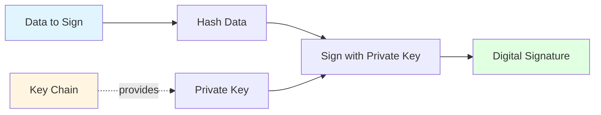
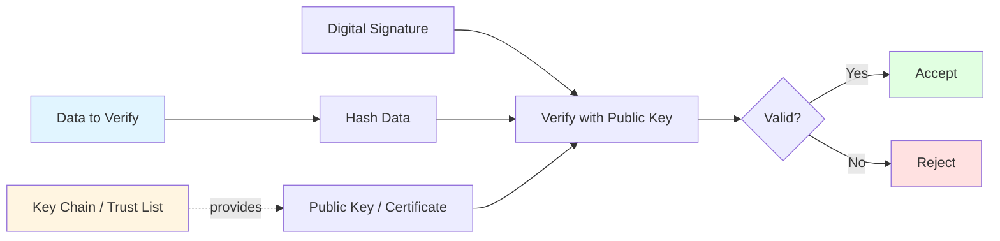
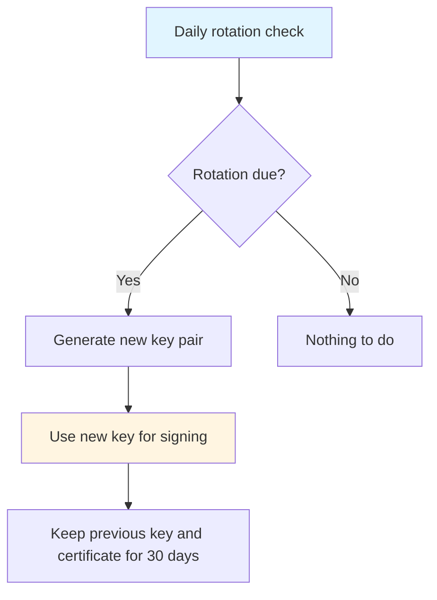

# Cryptography

This page provides a concise overview of EUDIPLO's cryptographic operations, algorithms, and the relationship between **Key Chains** and signing/verification workflows.

---

## Overview

EUDIPLO uses **Key Chains** to manage cryptographic key material for signing and verification operations across all protocols (OID4VCI, OID4VP, status lists, trust lists).

**Key Chain:** A logical grouping of cryptographic keys with metadata (usage type, rotation policy, KMS provider). Each key chain represents a **single purpose** (e.g., credential signing, access token signing, status list signing).

---

## Supported Algorithms

EUDIPLO uses the following algorithms:

| Algorithm   | Type          | Curve             | Use Case                                                                         |
| ----------- | ------------- | ----------------- | -------------------------------------------------------------------------------- |
| **ES256**   | ECDSA         | P-256 (secp256r1) | All signing: credentials, access tokens, status lists, trust lists, requests     |
| **ECDH-ES** | Key agreement | P-256             | Encrypted OID4VP responses, encrypted credential requests, ISO 18013-7 responses |

ES256 is the only signing algorithm: `CRYPTO_ALG` accepts no other value. It is the **EUDI Wallet ARF baseline requirement** and ensures interoperability across EUDI ecosystem implementations. Other algorithms (for example EdDSA) may be added in future releases.

---

## Hashing and Signing

### Signing Operations

All signing operations follow a consistent pattern:



**Steps:**

1. **Hash the data**: Compute SHA-256 hash of the data (for ES256)
2. **Retrieve private key**: Load private key from the configured KMS provider
3. **Sign the hash**: Use ECDSA to sign the hash
4. **Encode signature**: Encode signature as Base64URL (for JWT) or as COSE_Sign1 (for the mDOC Mobile Security Object and CWT status lists)

---

### Verification Operations

Signature verification follows the inverse pattern:



**Steps:**

1. **Hash the data**: Compute SHA-256 hash of the data
2. **Retrieve public key**: Extract public key from JWT header (`x5c` or JWKS) or trust list
3. **Verify the signature**: Use ECDSA to verify the signature against the hash
4. **Accept or reject**: Proceed if valid; reject if invalid

---

## Key Chain Usage Modes

Each Key Chain has a **usage type** (`usageType`) that determines its purpose:

| Usage Type    | Purpose             | Example Operations                                                             |
| ------------- | ------------------- | ------------------------------------------------------------------------------ |
| `access`      | Access and requests | Sign OID4VCI access tokens and OID4VP request objects                          |
| `attestation` | Credential signing  | Sign SD-JWT VCs and mDOCs                                                      |
| `statusList`  | Status list signing | Sign OAuth Token Status Lists                                                  |
| `trustList`   | Trust list signing  | Sign the trust lists EUDIPLO hosts for the tenant                              |
| `encrypt`     | Decryption          | Decrypt encrypted OID4VCI credential requests and ISO 18013-7 (HPKE) responses |

**Example:** A tenant might have three key chains:

```json
[
    { "id": "access-key", "usageType": "access", "kmsProvider": "db" },
    {
        "id": "attestation-key",
        "usageType": "attestation",
        "kmsProvider": "db"
    },
    { "id": "status-key", "usageType": "statusList", "kmsProvider": "db" }
]
```

---

## Key Chain and Protocol Mapping

| Protocol Operation             | Key Chain Usage        | Algorithm | Signing / Decrypting Entity    | Counterpart                                         |
| ------------------------------ | ---------------------- | --------- | ------------------------------ | --------------------------------------------------- |
| **Issue Access Token**         | `access`               | ES256     | EUDIPLO (Authorization Server) | EUDIPLO credential endpoint verifies it             |
| **Sign Presentation Request**  | `access`               | ES256     | EUDIPLO (Verifier)             | Wallet (via `x5c`)                                  |
| **Issue SD-JWT VC**            | `attestation`          | ES256     | EUDIPLO (Issuer)               | Verifier (via `x5c` or federation)                  |
| **Issue mDOC**                 | `attestation`          | ES256     | EUDIPLO (Issuer)               | Verifier (via certificate chain)                    |
| **Sign Status List**           | `statusList`           | ES256     | EUDIPLO (Issuer)               | Verifier                                            |
| **Sign Trust List**            | `trustList`            | ES256     | EUDIPLO (Trust list provider)  | Wallets and verifiers that use the trust list       |
| **Decrypt OID4VP Response**    | none (per-session key) | ECDH-ES   | EUDIPLO (Verifier)             | Wallet encrypts to the key from the request         |
| **Decrypt Credential Request** | `encrypt`              | ECDH-ES   | EUDIPLO (Issuer)               | Wallet encrypts to the key from the issuer metadata |

---

## Key Material Formats

### JWK (JSON Web Key)

EUDIPLO stores and transports public keys using the **JWK (JSON Web Key)** format:

**ES256 Public Key (JWK):**

```json
{
    "kty": "EC",
    "crv": "P-256",
    "x": "f83OJ3D2xF1Bg8vub9tLe1gHMzV76e8Tus9uPHvRVEU",
    "y": "x_FEzRu9m36HLN_tue659LNpXW6pCyStikYjKIWI5a0",
    "use": "sig",
    "alg": "ES256"
}
```

**Private Key (JWK):**

Private keys include the `d` parameter (the private exponent). **EUDIPLO never exports or logs private key JWKs**.

```json
{
    "kty": "EC",
    "crv": "P-256",
    "x": "f83OJ3D2xF1Bg8vub9tLe1gHMzV76e8Tus9uPHvRVEU",
    "y": "x_FEzRu9m36HLN_tue659LNpXW6pCyStikYjKIWI5a0",
    "d": "jpsQnnGQmL-YBIffH1136cspYG6-0iY7X1fCE9-E9LI"
}
```

---

### X.509 Certificates

For **X.509-based trust models** (ETSI TL, mDOC), EUDIPLO supports certificate chains:

**Certificate Chain Structure:**

```json
{
    "x5c": [
        "MIICmzCCAYOgAwIBAgIBADANBgkqhkiG9w0BAQsFADA...",
        "MIIDXTCCAkWgAwIBAgIJAJC1HiIAZAiIMA0GCSqGSIb3...",
        "MIIDdzCCAl+gAwIBAgIBADANBgkqhkiG9w0BAQsFADB..."
    ]
}
```

**Order:**

1. Leaf certificate (issuer's signing certificate)
2. Intermediate CA certificates
3. Root CA certificate (optional)

**Verification:**

EUDIPLO verifies the certificate chain by:

1. Verifying each certificate's signature using the next certificate in the chain
2. Checking certificate validity dates (`notBefore`, `notAfter`)
3. Checking certificate revocation status via CRL (OCSP is not supported)
4. Verifying the root CA is trusted (via trust list or trust store)

---

## Key Rotation

Key Chains support **automatic key rotation** for internal certificate chains (root CA + leaf signing key).

### Rotation Policy

A rotation policy specifies **when** to rotate the signing key and how long new certificates are valid:

```json
{
    "rotationPolicy": {
        "enabled": true,
        "intervalDays": 90,
        "certValidityDays": 365
    }
}
```

| Field              | Description                                       |
| ------------------ | ------------------------------------------------- |
| `enabled`          | Whether rotation is enabled                       |
| `intervalDays`     | Rotate the signing key after this many days       |
| `certValidityDays` | Validity period of newly issued leaf certificates |

**Rotation Flow:**



**Steps:**

1. **Check**: A scheduled job runs every day at midnight and rotates every key chain whose `intervalDays` have passed since the last rotation (or since creation)
2. **Generate new key pair**: Create a new key via the configured KMS provider and issue a new leaf certificate from the chain's root CA
3. **Activate new key**: The new key is used for all new signatures
4. **Keep previous key**: The previous key and certificate are kept for a fixed grace period of 30 days (`previousKeyExpiry`), so relying parties can still validate recently signed material

**Benefits:**

- Limits the impact of a key compromise
- Supports key lifecycle policies
- Supports gradual migration to new keys

---

## Key Derivation and Thumbprints

### Key Thumbprint (JKT)

For DPoP (Demonstrating Proof-of-Possession), EUDIPLO computes the **JWK Thumbprint (JKT)** of the wallet's public key:

**Formula:**

```text
jkt = Base64URL(SHA-256(UTF8(JWK_CANONICAL)))
```

**Canonical JWK:**

The canonical JWK is a JSON object with keys sorted alphabetically:

```json
{
    "crv": "P-256",
    "kty": "EC",
    "x": "f83OJ3D2xF1Bg8vub9tLe1gHMzV76e8Tus9uPHvRVEU",
    "y": "x_FEzRu9m36HLN_tue659LNpXW6pCyStikYjKIWI5a0"
}
```

**Use Case:**

The JKT is embedded in the access token (`cnf.jkt`) to bind the token to the wallet's key.

---

## Encryption (JWE)

EUDIPLO uses **JWE (JSON Web Encryption)** so that wallet responses in OID4VP flows are always encrypted.

### Encryption Algorithm

| Parameter       | Value                  | Notes                                                 |
| --------------- | ---------------------- | ----------------------------------------------------- |
| `alg`           | `ECDH-ES`              | Direct key agreement on P-256, no key wrapping        |
| `enc`           | `A128GCM` or `A256GCM` | Offered in `encrypted_response_enc_values_supported`  |
| `response_mode` | `direct_post.jwt`      | `dc_api.jwt` when the Digital Credentials API is used |

**Flow:**

1. EUDIPLO generates an **ephemeral key pair for each presentation session** and puts the public key into the signed request
2. The wallet generates its own ephemeral key pair and derives the content encryption key via ECDH-ES (Concat KDF)
3. The wallet encrypts the response with AES-GCM and sends the JWE to EUDIPLO
4. EUDIPLO decrypts it with the session's private key; the key is removed from the session once the session ends

**JWE Structure (compact serialization):**

```text
<Base64URL(JWE Protected Header)>..<Base64URL(IV)>.<Base64URL(Ciphertext)>.<Base64URL(Authentication Tag)>
```

With `ECDH-ES` in direct mode, the encrypted key part is empty.

**Other encryption uses:**

- Encrypted OID4VCI credential requests are decrypted with the tenant's `encrypt` key chain, whose public key is published in the issuer metadata
- ISO 18013-7 responses (HPKE) are decrypted with the tenant's `encrypt` key chain as well

---

## Key Storage and Security

### Database-Stored Keys (`db` Provider)

Keys stored in the database are **encrypted at rest** using AES-256-GCM:

| Field                   | Encryption   | Notes                                              |
| ----------------------- | ------------ | -------------------------------------------------- |
| **Private Key (JWK)**   | ✅ Encrypted | Encrypted with the data encryption key (see below) |
| **Public Key (JWK)**    | ❌ Plaintext | Public keys are not sensitive                      |
| **Certificate (X.509)** | ❌ Plaintext | Certificates are public material                   |

The same data encryption key also protects other sensitive columns, such as session data and the per-session response encryption keys.

**Data Encryption Key:**

`ENCRYPTION_KEY_SOURCE` selects where the 256-bit data encryption key comes from:

| Source          | Description                                                                                        |
| --------------- | -------------------------------------------------------------------------------------------------- |
| `env` (default) | Derived from `MASTER_SECRET` with HKDF-SHA256 (info `eudiplo-encryption-at-rest`); for development |
| `vault`         | Fetched from HashiCorp Vault                                                                       |
| `aws`           | Fetched from AWS Secrets Manager                                                                   |
| `azure`         | Fetched from Azure Key Vault                                                                       |

For production, use `vault`, `aws` or `azure`, so the key is not derived from a secret that is also used for other purposes.

---

### External KMS Providers

For production deployments, use an external KMS provider to store private keys:

| Provider            | Security Model                                                  |
| ------------------- | --------------------------------------------------------------- |
| **HashiCorp Vault** | Keys stored in Vault Transit secrets engine (never leave Vault) |
| **AWS KMS**         | Keys stored in AWS HSM (FIPS 140-2 Level 2)                     |
| **PKCS#11 HSM**     | Keys stored in hardware security module (FIPS 140-2 Level 3+)   |
| **CSC**             | Remote signing service via the Cloud Signature Consortium API   |
| **HTTP**            | Custom remote KMS service that signs on EUDIPLO's behalf        |

**Signing Flow (External KMS):**

1. EUDIPLO sends data to be signed to the KMS provider
2. KMS provider signs the data using the private key
3. KMS provider returns the signature
4. EUDIPLO includes the signature in the JWT/CWT

**Benefits:**

- Private keys **never leave the KMS** (even for signing operations)
- FIPS 140-2 compliance
- Centralized key lifecycle management
- Key usage auditing in the KMS itself

---

## Certificate Trust and Validation

For X.509-based trust models (mDOC, ETSI TL), EUDIPLO validates certificates using:

### Certificate Validation Checks

| Check                      | Description                                                                                    |
| -------------------------- | ---------------------------------------------------------------------------------------------- |
| **Signature Verification** | Verify certificate is signed by the issuing CA (path building from the leaf to a trust anchor) |
| **Validity Dates**         | Verify `notBefore <= now <= notAfter`                                                          |
| **Trust Anchor**           | Verify root CA is in the configured trust list                                                 |
| **Revocation Status**      | Check the certificate against its CRL (OCSP is not supported)                                  |

**Trust List Configuration:**

Trust lists are referenced in the DCQL query of a presentation configuration, per requested credential:

```json
{
    "dcql_query": {
        "credentials": [
            {
                "id": "pid",
                "format": "dc+sd-jwt",
                "meta": { "vct_values": ["urn:eudi:pid:de:1"] },
                "trusted_authorities": [
                    {
                        "type": "etsi_tl",
                        "values": [
                            {
                                "trustListId": "580831bc-ef11-43f4-a3be-a2b6bf1b29a3"
                            },
                            {
                                "url": "https://trust.example.com/tl.jwt",
                                "verifierX509Der": "MIIC..."
                            }
                        ]
                    }
                ]
            }
        ]
    }
}
```

A value either references a trust list hosted by the tenant (`trustListId`) or an external trust list (`url`) together with the key or certificate used to verify its signature (`verifierKey` or `verifierX509Der`).

---

## Next Steps

- **Key Management**: [KMS Providers and Configuration](../administration/kms.md)
- **Key Chain Management**: [Key Chain API](../trust/key-chains.md)
- **Security Architecture**: [Token Validation and DPoP](./security.md)
- **Trust Lists**: [Trust List Management](../trust/trust-lists.md)
- **Status Lists**: [Revocation and Suspension](../issuance/status-management.md)
