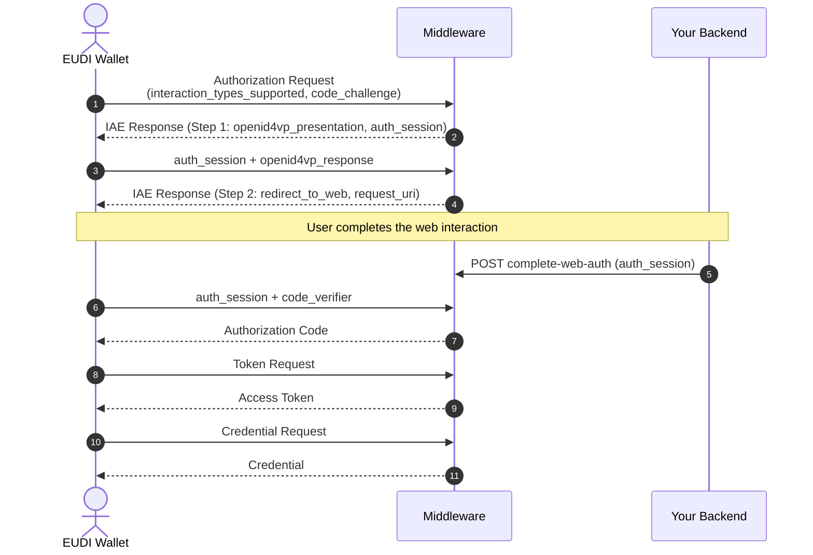

# Interactive Authorization Endpoint (IAE)

:::caution[Work in progress]

The interactive authorization implementation is work in progress. The behavior described on this page reflects the current state and may change.

:::

The **Interactive Authorization Endpoint (IAE)** enables user interactions during the credential issuance flow. It allows wallets to request user authorization through a sequence of configurable actions before credential issuance completes.

This is particularly useful for:

- **Identity verification** – Request a verifiable presentation from the wallet (e.g., PID, mDL)
- **Web-based flows** – Redirect users to complete forms, payments, or external verification
- **Multi-step authorization** – Combine multiple actions in sequence (e.g., present ID, then complete KYC form)

## How It Works

The IAE is part of the OID4VCI authorization code flow and is served at `POST /issuers/{tenantId}/authorize/interactive`. When a wallet initiates issuance with `interaction_types_supported` (and `client_id`), EUDIPLO creates an `auth_session` and responds with the first required action. The wallet sends each follow-up request with the `auth_session` and must complete each action in sequence before receiving an authorization code.



## Supported Action Types

IAE supports the following action types, which can be combined in any order:

| Action Type              | Description                                                                 |
| ------------------------ | --------------------------------------------------------------------------- |
| `openid4vp_presentation` | Request a verifiable presentation from the wallet using OpenID4VP           |
| `redirect_to_web`        | Redirect the user to a web page for additional interaction (forms, payment) |

## Configuring IAE Actions

IAE actions are configured per credential configuration. You can define a sequence of actions that must be completed before credential issuance.

### Example: Single Presentation

Request a PID presentation before issuing a credential:

```json
{
    "id": "citizen-credential",
    "iaeActions": [
        {
            "type": "openid4vp_presentation",
            "label": "Identity Verification",
            "presentationConfigId": "pid-presentation-config"
        }
    ]
}
```

### Example: Multi-Step Flow

First verify identity with a presentation, then redirect to a web form:

```json
{
    "id": "organization-credential",
    "iaeActions": [
        {
            "type": "openid4vp_presentation",
            "label": "Identity Verification",
            "presentationConfigId": "pid-presentation-config"
        },
        {
            "type": "redirect_to_web",
            "label": "Complete Registration",
            "url": "https://eudiplo.example.com/register",
            "description": "Please complete the organization registration form"
        }
    ]
}
```

## Action Types Reference

### OpenID4VP Presentation

Requests a verifiable presentation from the wallet.

| Field                  | Type   | Required | Description                                 |
| ---------------------- | ------ | -------- | ------------------------------------------- |
| `type`                 | string | Yes      | Must be `"openid4vp_presentation"`          |
| `label`                | string | No       | Display label for this step                 |
| `presentationConfigId` | string | Yes      | ID of the presentation configuration to use |

The presentation configuration defines which credentials and claims to request. See [Presentation Configuration](../../presentation/presentation-configuration.md) for details.

### Redirect to Web

Redirects the user to a web page for additional interaction.

| Field         | Type   | Required | Description                                      |
| ------------- | ------ | -------- | ------------------------------------------------ |
| `type`        | string | Yes      | Must be `"redirect_to_web"`                      |
| `label`       | string | No       | Display label for this step                      |
| `url`         | string | Yes      | URL of the web interaction                       |
| `callbackUrl` | string | No       | URL for the external service to redirect back to |
| `description` | string | No       | Instructions for the user                        |

For this action, EUDIPLO currently returns:

```json
{
    "status": "require_interaction",
    "type": "redirect_to_web",
    "auth_session": "<auth-session>",
    "request_uri": "urn:ietf:params:oauth:request_uri:<uuid>",
    "expires_in": 600
}
```

:::note[Current behavior]

The configured `url`, `description` and `callbackUrl` are validated and stored but currently not used: they are not included in the response, and no `{auth_session}` placeholder substitution takes place. The returned `request_uri` is stored with the auth session but is not currently resolved by any EUDIPLO endpoint.

:::

## Completing Web-Based Actions

Completing a `redirect_to_web` action takes two calls:

1. Your backend marks the web interaction as completed (no request body):

    ```bash
    POST https://eudiplo.example.com/issuers/tenant1/authorize/interactive/complete-web-auth/{auth_session}
    ```

2. The wallet sends a follow-up request with the `auth_session` and the PKCE `code_verifier` matching the `code_challenge` from its initial request:

    ```bash
    POST https://eudiplo.example.com/issuers/tenant1/authorize/interactive
    Content-Type: application/json

    {
        "auth_session": "<auth-session>",
        "code_verifier": "<pkce-code-verifier>"
    }
    ```

EUDIPLO verifies the `code_verifier` (method `S256` by default, or `plain`), checks that the web interaction was marked as completed, and either:

- Return the next action (if more steps remain), or
- Issue the authorization code (if all steps are complete)

## Session State

During the IAE flow, EUDIPLO tracks:

| Field                | Description                             |
| -------------------- | --------------------------------------- |
| `currentStepIndex`   | Index of the current action (0-based)   |
| `completedStepsData` | Data collected from each completed step |
| `iaeActions`         | The configured action sequence          |

This state is managed automatically. Your backend only needs to respond to the configured actions.

## Attribute Provider Integration

For an `openid4vp_presentation` action, the endpoint currently only checks that the `openid4vp_response` is valid JSON and stores it with the auth session before advancing to the next step.

Presented credentials are currently **not** passed to the **Attribute Provider**. When claims are fetched for the credential request, the Attribute Provider receives only `session`, `credential_configuration_id` and, if available, `identity`.

See [Attribute Providers](./attribute-providers.md) for configuration details.

## Fallback Behavior

If no `iaeActions` are configured for a credential, EUDIPLO falls back to the wallet's `interaction_types_supported` preference:

1. If the wallet supports `openid4vp_presentation` and the tenant has a presentation configuration → use OpenID4VP with the tenant's first presentation configuration
2. If the wallet supports `redirect_to_web` → use web redirect
3. Otherwise → return an error

This ensures backward compatibility with wallets that don't support multi-step flows.

## Error Handling

IAE errors are returned as JSON with HTTP status 400:

```json
{
    "error": "invalid_request",
    "error_description": "Missing openid4vp_response or code_verifier"
}
```

Common errors:

| Error Code        | Description                                                                                                                                                 |
| ----------------- | ----------------------------------------------------------------------------------------------------------------------------------------------------------- |
| `invalid_request` | Missing or invalid parameters, unknown or expired `auth_session`, unsupported interaction type, missing `code_challenge`, or malformed `openid4vp_response` |
| `invalid_grant`   | `code_verifier` does not match the `code_challenge`                                                                                                         |
| `access_denied`   | Web interaction was not marked as completed                                                                                                                 |
| `server_error`    | Presentation request could not be created or no presentation configuration is available                                                                     |
