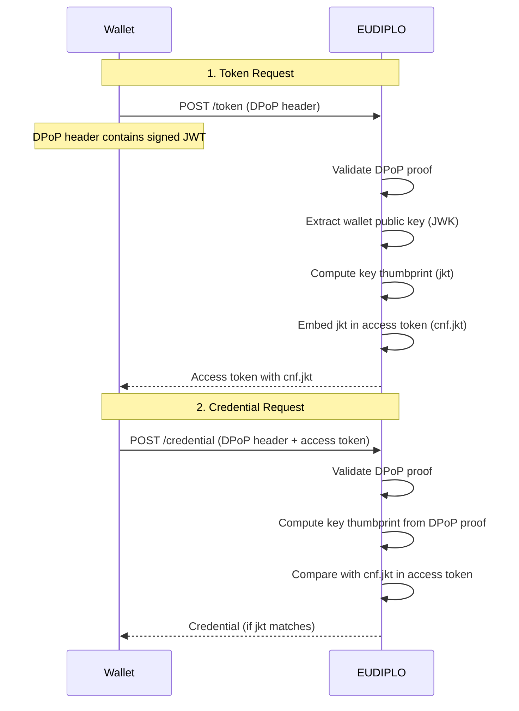
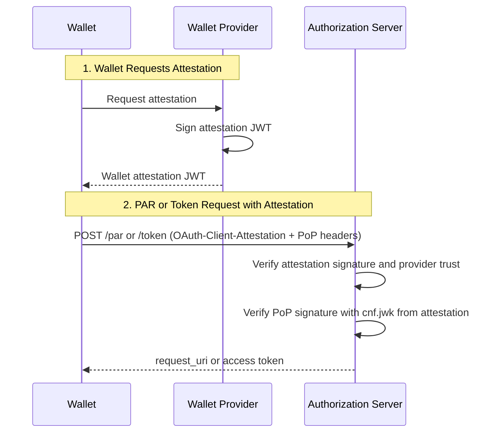

# Security Architecture

This page provides an overview of EUDIPLO's security architecture, including cryptographic algorithms, token validation, DPoP support, and secret handling policies.

---

## Cryptographic Algorithms

EUDIPLO uses **ES256 (ECDSA with P-256 curve)** as the primary signing algorithm across all protocols:

| Operation                | Algorithm | Curve | Notes                                                        |
| ------------------------ | --------- | ----- | ------------------------------------------------------------ |
| **Access Token Signing** | ES256     | P-256 | JWT signed by issuer AS                                      |
| **SD-JWT VC Signing**    | ES256     | P-256 | Credential signed by issuer attestation key                  |
| **mDOC Signing**         | ES256     | P-256 | Mobile Security Object (MSO) signed via COSE                 |
| **Status List Signing**  | ES256     | P-256 | OAuth Token Status List JWT signed by issuer                 |
| **Trust List Signing**   | ES256     | P-256 | Trust lists hosted by EUDIPLO, signed with a `trustList` key |
| **VP Token Signing**     | ES256     | P-256 | Verifiable Presentation signed by wallet                     |

**Rationale:**

ES256 is the **EUDI Wallet Architecture Reference Framework (ARF) baseline requirement** and is widely supported across EUDI ecosystem implementations. EUDIPLO only signs with ES256 (`CRYPTO_ALG` accepts no other value). Alternative algorithms may be added in future releases based on interoperability requirements.

---

## Key Loading and Storage

EUDIPLO enforces **asynchronous key loading** to prevent blocking the main application thread during key retrieval from external KMS providers.

### Key Providers

All signing keys are managed via pluggable **KMS providers**:

| Provider  | Description                              | Use Case                                                 |
| --------- | ---------------------------------------- | -------------------------------------------------------- |
| `db`      | Database-stored keys (encrypted at rest) | Development, testing, small-scale deployments            |
| `vault`   | HashiCorp Vault Transit secrets engine   | Production environments with centralized key management  |
| `aws-kms` | AWS Key Management Service               | Cloud-native deployments on AWS                          |
| `pkcs11`  | PKCS#11 Hardware Security Module         | High-security environments (air-gapped, FIPS compliance) |
| `http`    | Remote KMS microservice                  | Custom key management infrastructure                     |
| `csc`     | Cloud Signature Consortium (CSC) API     | Remote signature services                                |

See [Key Management](../administration/kms.md) for provider configuration.

---

### Secret Handling Policy

EUDIPLO enforces a **zero-secret-export policy** for private key material:

| Scenario                                  | Policy                                                                                                                                                                                                                  |
| ----------------------------------------- | ----------------------------------------------------------------------------------------------------------------------------------------------------------------------------------------------------------------------- |
| **Private Keys in Configuration Bundles** | ❌ **Never exported** — A configuration export does not include private keys held in the database. It lists a `PRIVATE_KEY_REQUIRED` requirement instead, so the key has to be supplied or regenerated on import.       |
| **Private Keys in API Responses**         | ❌ **Never returned** — The Key Chain API only returns public key material (JWK public key or X.509 certificate).                                                                                                       |
| **Environment Variable Placeholders**     | ✅ **Allowed** — Secret references (e.g., `${VAULT_TOKEN}`) can be used in `kms.json` and in any string field of imported configuration files.                                                                          |
| **Response Encryption Keys**              | ⚠️ **Per session** — The key used to decrypt the wallet response is generated for each presentation session, stored encrypted in the session and removed when the session ends. It is never loaded from a KMS provider. |

**Audit Logging:**

The `AuditLogService` records configuration changes per tenant, not key operations. Each entry contains the timestamp, tenant ID, action type, actor (user, client or system), the changed fields with their values before and after, and the request ID. Recorded actions include tenant changes; creating, updating and deleting presentation configs, credential configs, webhook endpoints and attribute providers; issuance and status list config changes; configuration bundle imports and exports; and generated client secrets.

---

## Token Validation

EUDIPLO enforces strict JWT validation for all token-based flows (access tokens, VP tokens, credentials).

### Required Claims

| Claim              | Description             | Validation Rule                                                   |
| ------------------ | ----------------------- | ----------------------------------------------------------------- |
| `iss` (Issuer)     | Token issuer identifier | Must match expected issuer (tenant URL or configured external AS) |
| `aud` (Audience)   | Token audience          | Must include EUDIPLO's tenant base URL                            |
| `exp` (Expiration) | Expiration timestamp    | Token must not be expired (current time < `exp`)                  |
| `nbf` (Not Before) | Not-before timestamp    | Token must be valid (current time >= `nbf`)                       |
| `iat` (Issued At)  | Issuance timestamp      | Token must not be issued in the future (current time >= `iat`)    |

**Clock Skew Tolerance:**

JWT time checks allow a clock skew of `CRYPTO_TOLERANCE` seconds (default **5 seconds**). Presentation verification uses the presentation config's `skewSeconds` (default **60 seconds**), and DPoP proofs allow 60 seconds (see [DPoP](#dpop-demonstrating-proof-of-possession)).

---

### Access Token Validation (OID4VCI)

When a wallet presents an access token at the credential endpoint, EUDIPLO verifies:

1. **Signature**: Verify JWT signature using the authorization server's public key (from its JWKS)
2. **Issuer**: Check that `iss` matches the expected authorization server
3. **Audience**: Check that `aud` is the tenant's credential issuer URL
4. **Expiration**: Check that `exp` is in the future (built-in access tokens are valid for 300 seconds)
5. **Session Correlation**: Find the issuance session. Tokens of the built-in authorization server carry the session ID in `sub`; chained and OID4VP-based authorization servers use `issuer_state`; external authorization servers use the claim configured in `sessionBinding.claim`
6. **DPoP Binding** _(if enabled)_: Verify `cnf.jkt` matches the DPoP proof key thumbprint

**Example Access Token (built-in authorization server):**

```json
{
    "iss": "https://eudiplo.example.com/issuers/tenant1",
    "sub": "session-uuid",
    "aud": "https://eudiplo.example.com/issuers/tenant1",
    "exp": 1234567890,
    "iat": 1234567590,
    "client_id": "wallet-client-id",
    "authorization_details": [
        {
            "type": "openid_credential",
            "credential_configuration_id": "pid"
        }
    ],
    "cnf": {
        "jkt": "dpop-key-thumbprint"
    }
}
```

---

### VP Token Validation (OID4VP)

When a wallet submits a VP Token, EUDIPLO verifies:

1. **Decryption**: Decrypt the JWE response with the private key generated for this session (responses are always encrypted: `direct_post.jwt`, or `dc_api.jwt` for the Digital Credentials API)
2. **Signature**: Verify each credential's signature using the issuer's public key
3. **Nonce**: Verify the presentation is bound to the `nonce` sent in the request (stored as `vp_nonce` in the session)
4. **Audience**: Verify the presentation is bound to the verifier's client ID
5. **Trust Validation**: Verify the credential issuer is trusted (via trust list or federation)
6. **Status Check**: Verify the credential is not revoked or suspended (via status list)
7. **Claims Validation**: Verify presented claims match the DCQL query

See [Presentation Architecture](./presentation.md) for detailed verification flow.

---

## DPoP (Demonstrating Proof-of-Possession)

EUDIPLO supports **DPoP (RFC 9449)** to bind access tokens to the wallet's public key. This prevents token theft and replay attacks.

### DPoP Flow



### DPoP Proof Structure

The DPoP proof is a signed JWT included in the `DPoP` HTTP header:

```json
{
    "typ": "dpop+jwt",
    "alg": "ES256",
    "jwk": {
        "kty": "EC",
        "crv": "P-256",
        "x": "...",
        "y": "..."
    }
}
.
{
    "jti": "unique-jti",
    "htm": "POST",
    "htu": "https://eudiplo.example.com/issuers/tenant1/authorize/token",
    "iat": 1234567800
}
```

**Claims:**

| Claim | Description                     |
| ----- | ------------------------------- |
| `jti` | Unique JWT ID (prevents replay) |
| `htm` | HTTP method (`POST`, `GET`)     |
| `htu` | HTTP URI (request endpoint URL) |
| `iat` | Issued-at timestamp             |

**Validation:**

1. Verify JWT signature using the `jwk` claim
2. Verify `htm` matches the HTTP method
3. Verify `htu` matches the request URL
4. Verify `iat` is recent: at most 300 seconds old, with 60 seconds of allowed clock skew (token, PAR, credential, notification and deferred endpoints)
5. At resource endpoints, verify `ath` matches the access token and the proof key matches the token's `cnf.jkt`
6. Verify the proof is used only once: each `jti` is recorded per key thumbprint in the `dpop_proof_jti` table until the proof leaves the freshness window (`iat` + 300 s + 60 s skew). The composite primary key decides between concurrent requests, also across backend instances; expired entries are removed every 10 minutes.

A replayed proof is rejected like any other invalid proof: the token and PAR endpoints answer `400 invalid_request`, and the credential, notification and deferred credential endpoints answer `401 invalid_token` with a `WWW-Authenticate` header, as for any invalid access token or DPoP proof.

**Configuration:**

DPoP is enabled per issuance configuration:

```json
{
    "dPopRequired": true
}
```

---

## Wallet and Key Attestation

EUDIPLO uses two different attestation mechanisms during issuance:

| Mechanism          | Purpose                                                                                                 | Checked by                               | Configured in                                                  |
| ------------------ | ------------------------------------------------------------------------------------------------------- | ---------------------------------------- | -------------------------------------------------------------- |
| Wallet attestation | Authenticates the wallet as an OAuth client                                                             | Authorization server PAR/token endpoints | Authorization server config, with issuance-level defaults      |
| Key attestation    | Attests the holder key and its storage/user-authentication properties before binding a credential to it | Credential endpoint                      | Credential config proof policy plus issuance-level trust lists |

Wallet attestation answers “is this wallet client trusted to use this AS?”. Key attestation answers “is this holder key acceptable for binding the issued credential?”. They may rely on the same wallet-provider trust-list format, but they are evaluated at different protocol endpoints.

### Wallet Attestation

EUDIPLO supports **Wallet Attestation (OAuth 2.0 Client Attestation PoP)** to verify the wallet provider's trustworthiness before an EUDIPLO-managed authorization server issues access tokens.

### Wallet Attestation Flow



### Attestation Headers

| Header                         | Description                                                             |
| ------------------------------ | ----------------------------------------------------------------------- |
| `OAuth-Client-Attestation`     | Wallet provider's signed attestation JWT (includes wallet's public key) |
| `OAuth-Client-Attestation-PoP` | Wallet's proof-of-possession JWT (signed with wallet's private key)     |

**Attestation JWT:**

```json
{
    "iss": "https://wallet-provider.example.com",
    "sub": "wallet-instance-id",
    "iat": 1234567800,
    "exp": 1234567890,
    "cnf": {
        "jwk": {
            "kty": "EC",
            "crv": "P-256",
            "x": "...",
            "y": "..."
        }
    }
}
```

**PoP JWT:**

```json
{
    "iss": "wallet-instance-id",
    "aud": "https://eudiplo.example.com/issuers/tenant1",
    "iat": 1234567800,
    "jti": "unique-jti"
}
```

**Validation:**

1. Verify attestation JWT signature using wallet provider's public key (from trust list or JWKS)
2. Verify attestation is not expired (`exp`)
3. Extract wallet's public key from attestation (`cnf.jwk`)
4. Verify PoP JWT signature using wallet's public key
5. Verify PoP `aud` matches the authorization server issuer URL
6. Verify PoP `jti` has not been used before (replay prevention)

**Configuration:**

Wallet attestation is enabled per EUDIPLO-managed authorization server. Issuance-level settings remain available as defaults:

```json
{
    "authorizationServers": [
        {
            "type": "built-in",
            "id": "wallet-attested-as",
            "walletAttestationRequired": true,
            "walletProviderTrustLists": [
                {
                    "url": "https://trust-list.example.eu/wallet-providers",
                    "verifierX509Der": "MIIB..."
                }
            ]
        }
    ]
}
```

### Key Attestation

Key attestation is evaluated at the Credential Endpoint when the wallet asks the issuer to bind a credential to holder key material. It is configured on the credential type, not on the authorization server.

```json
{
    "config": {
        "proofTypesSupported": ["jwt", "attestation"],
        "keyAttestationsRequired": {
            "key_storage": ["iso_18045_high"],
            "user_authentication": ["iso_18045_high"]
        }
    }
}
```

EUDIPLO accepts key attestations either as `proofs.attestation` or as a `key_attestation` protected header inside a JWT holder proof. Key-attestation signers are trusted through the issuance-level `walletProviderTrustLists`; authorization-server-specific trust lists are only for wallet client authentication.

---

## Session Security (OID4VP §13.3)

EUDIPLO implements the **OID4VP §13.3 session security model** to prevent session fixation and replay attacks.

### Wallet Nonce Separation

The `walletNonce` is a **wallet-facing identifier** that is **distinct from the session ID**. The relying party frontend uses the session ID to poll the result, so it must not be visible in the QR code.

**Flow:**

1. EUDIPLO creates the session and a random `walletNonce`
2. The QR code or deep link contains `request_uri` = `/presentations/{walletNonce}/oid4vp/request`; the wallet posts its response to `/presentations/{walletNonce}/oid4vp`
3. The signed request contains a separate random `nonce` (stored as `vp_nonce`), which the wallet binds its presentation to
4. The session ID never appears in the wallet-facing URLs

**Database Schema:**

```typescript
@Entity()
export class Session {
    @PrimaryColumn("uuid")
    id: string; // Session ID, used by the relying party frontend and the management API

    @Column("varchar", { nullable: true })
    walletNonce?: string; // Wallet-facing identifier in request_uri and response_uri

    @Column("varchar", { nullable: true })
    vp_nonce?: string; // nonce sent in the request and checked in the presentation

    // ...
}
```

---

### Response Code (Same-Device Redirect)

For same-device flows (verifier website and wallet on the same device), EUDIPLO appends a random `response_code` to the redirect URI to prevent session fixation.

**Flow:**

1. The wallet posts the encrypted response to `/presentations/{walletNonce}/oid4vp`
2. EUDIPLO validates the presentation
3. EUDIPLO generates a random `response_code` (UUID) and stores it in the session as `responseCode`
4. EUDIPLO answers with `redirect_uri` = the configured redirect URI plus `response_code=...`
5. The relying party compares the `response_code` from the redirect with the session's `responseCode` (via the management API) before accepting the result

**Security Properties:**

| Property          | Enforcement                                                           |
| ----------------- | --------------------------------------------------------------------- |
| **Random**        | Random UUID per completed presentation                                |
| **Session-Bound** | Stored in the session that completed the presentation                 |
| **Single-Use**    | A session can only be completed once, so only one code is ever issued |

**Attack Prevention:**

This prevents an attacker from:

- Embedding a stolen `redirect_uri` in a malicious QR code
- Making a victim complete a session the attacker started, and then using the result in the attacker's browser

---

## Secret Handling

EUDIPLO enforces strict policies to prevent accidental exposure of secrets, private keys, and user PII.

### Secrets in Configuration

Configuration files are imported from `CONFIG_FOLDER`. Every string field can reference an environment variable with `${VAR}` or `${VAR:default}`, so secrets do not have to be stored in the files:

| Secret Type                           | Recommendation                                                                                  |
| ------------------------------------- | ----------------------------------------------------------------------------------------------- |
| **Private Keys**                      | Keep them in a KMS provider; for `db` keys in config files, use a placeholder for the `d` value |
| **Client Secrets**                    | Use a placeholder, e.g. `"secret": "${PLAYGROUND_CLIENT_SECRET}"`                               |
| **KMS Credentials**                   | Use placeholders in `kms.json`, e.g. `${VAULT_TOKEN}`                                           |
| **Registrar Credentials**             | Use placeholders for `password` and `clientSecret` in `registrar.json`                          |
| **Webhook / Attribute Provider Auth** | Use a placeholder for the header value                                                          |

Database credentials are not part of the tenant configuration; they are set through environment variables (see [Database](../administration/database.md)).

**Configuration Export:**

When exporting configuration bundles via the management API:

- Private keys held in the database are **not included**; the bundle lists a `PRIVATE_KEY_REQUIRED` requirement instead
- Client secrets are stored hashed and are replaced by a placeholder with a `CLIENT_SECRET_REQUIRED` requirement
- KMS provider credentials, registrar credentials and webhook / attribute provider auth values are replaced by generated `${...}` placeholders with a `SECRET_REQUIRED` requirement
- Sessions are not part of the export

---

### Secrets in Logs

EUDIPLO logs with **Pino**. With `LOG_REDACT_SENSITIVE_DATA=true` (default), these fields are replaced by `[redacted]` in HTTP logs:

- Request headers: `Authorization`, `Cookie`, `DPoP`, `OAuth-Client-Attestation`, `OAuth-Client-Attestation-PoP`
- Response headers: `Set-Cookie`
- Response body fields: `access_token`, `refresh_token`, `id_token`, `c_nonce`, `credential`, `credentials`, `attestation_challenge`

Further settings limit what reaches the logs:

| Variable                        | Default | Effect                                                                          |
| ------------------------------- | ------- | ------------------------------------------------------------------------------- |
| `LOG_HTTP_RESPONSE_BODY`        | `false` | Capture HTTP response bodies                                                    |
| `LOG_OID4VP_DECRYPTED_RESPONSE` | `false` | Log decrypted OID4VP responses, which may contain personal data and credentials |
| `LOG_REDACT_SENSITIVE_DATA`     | `true`  | Redact the fields listed above; disable only for debugging                      |

The HTTP request logger skips the management API (`/api`), `/health` and `/metrics`. Configuration changes are recorded separately in the audit log (see [Audit Logging](#secret-handling-policy)).

---

## HTTPS and TLS

EUDIPLO does not enforce HTTPS for incoming requests; run it behind a reverse proxy that terminates TLS, and set `PUBLIC_URL` to the HTTPS URL. Wallets and the EUDI protocols expect HTTPS for all issuer and verifier endpoints.

For **outgoing** requests to tenant-configured URLs (webhook endpoints, attribute providers, issuer metadata fetched during presentation verification, and rulebooks and schemas fetched when publishing schema metadata), EUDIPLO applies an outbound URL policy that protects against SSRF. HTTP targets and private, loopback or link-local addresses are rejected by default, independent of `NODE_ENV`. Redirects are followed only for metadata, rulebook and schema fetches, and every hop is checked again. Enable the relaxations explicitly where needed, for example for local development or for services inside the same cluster:

| Variable                             | Default | Effect                                                                                                 |
| ------------------------------------ | ------- | ------------------------------------------------------------------------------------------------------ |
| `OUTBOUND_URL_ALLOW_HTTP`            | `false` | Allow plain HTTP targets                                                                               |
| `OUTBOUND_URL_ALLOW_PRIVATE_NETWORK` | `false` | Allow targets that resolve to private, loopback or link-local addresses (checked after DNS resolution) |
| `OUTBOUND_URL_ALLOWED_HOSTS`         | empty   | Hosts that are allowed even if they would otherwise be blocked                                         |

**TLS Configuration:**

EUDIPLO does not terminate TLS itself. Deploy behind a reverse proxy (e.g., NGINX, Traefik, AWS ALB) to handle TLS termination.

**Certificate Trust:**

For external KMS providers (e.g., Vault, AWS KMS), EUDIPLO validates TLS certificates using the system's default trust store. Custom CA certificates can be added via the `NODE_EXTRA_CA_CERTS` environment variable.

---

## Skipping Checks

Checks of the normal flow are never relaxed implicitly (for example based on `NODE_ENV`). A check that must be turned off for development or interoperability testing gets a `SKIP_<CHECK>` flag that defaults to `false`. The backend logs every active skip flag as a warning on startup, and the affected code path logs a warning each time it skips the check.

| Flag                    | Skipped check                                                                                          |
| ----------------------- | ------------------------------------------------------------------------------------------------------ |
| `SKIP_OVERASKING_CHECK` | The registration certificate must authorize every credential in the DCQL query (overasking prevention) |

See [Skip Flags](../deployment/environment-variables.md#skip-flags) for the full reference.

---

## CORS (Cross-Origin Resource Sharing)

By default, EUDIPLO enables CORS for **all origins on all endpoints**, including the management API. Protocol endpoints have to be reachable from wallets and browsers anyway, and the management API is protected by OAuth 2.0 bearer tokens rather than cookies, so a cross-origin page cannot call it without a token.

To restrict which browser origins may call the management API, set `CORS_ORIGINS` to a comma-separated list of origins:

```bash
CORS_ORIGINS=https://console.example.com,https://admin.example.com
```

When `CORS_ORIGINS` is set:

- **Management API (`/api/*`)**, including the token endpoint `/api/oauth2/token`, only returns CORS headers to the listed origins. Browsers block responses for any other origin.
- **Protocol, discovery and public endpoints** stay open to all origins. In the DC API flow, the relying party's frontend posts the wallet response directly to `/presentations/:sessionId/oid4vp` or `/presentations/:sessionId/iso-18013-7`. `.well-known` metadata, status lists, trust lists and public storage are meant to be fetched by anyone.

Each entry must be an exact origin as browsers send it: scheme, lowercase host and optional non-default port, without a path or trailing slash (`https://console.example.com`, not `https://console.example.com/`). EUDIPLO refuses to start if an entry is malformed. The startup log shows whether CORS is restricted.

:::warning Include every browser client of the management API
If the EUDIPLO Web Client is served from a different origin than the backend (for example `http://localhost:4200` in the quick start), add that origin. Otherwise the browser blocks its API calls, and with the integrated OAuth2 server also its login. The same applies to your own frontends that call `/api/*` directly from the browser.
:::

CORS is a browser mechanism, not an access control: requests from servers, scripts or other non-browser clients are not affected. To restrict who can reach the management API at the network level, for example by IP address, use the reverse proxy in front of EUDIPLO.

See [General](../deployment/environment-variables.md#general) for the variable reference.

---

## Rate Limiting

EUDIPLO has **no built-in rate limiting**. Put rate limits in front of EUDIPLO (reverse proxy, API gateway or WAF), especially for the token, PAR and credential endpoints and the management API.

Within the protocol flows, EUDIPLO limits abuse through:

- **Transaction codes**: a pre-authorized code is locked after `txCodeMaxAttempts` wrong `tx_code` attempts (default 5)
- **Single-use values**: authorization codes, pre-authorized codes, `request_uri`s, credential nonces and presentation sessions can be used only once (see [Sessions](./sessions.md#single-use-validation))
- **DPoP replay protection**: each DPoP proof `jti` is accepted only once

---

## Security Checklist

Before deploying EUDIPLO to production, verify:

- ✅ **HTTPS enabled** for all external endpoints
- ✅ **KMS provider configured** (not using `db` provider in production)
- ✅ **Environment variables** used for all secrets (no hardcoded secrets)
- ✅ **Session cleanup** enabled with appropriate retention policy
- ✅ **Rate limiting** configured in the reverse proxy or API gateway
- ✅ **CORS origins** for the management API restricted with `CORS_ORIGINS`, if required
- ✅ **Outbound URL policy** relaxations (`OUTBOUND_URL_ALLOW_*`) only where required
- ✅ **Log redaction** enabled (`LOG_REDACT_SENSITIVE_DATA=true`) and debug logging disabled
- ✅ **TLS certificates** valid and trusted
- ✅ **DPoP enforcement** enabled for production credential issuance
- ✅ **Wallet attestation** enabled for high-security use cases
- ✅ **Trust list validation** configured for credential verification
- ✅ **No `SKIP_*` flags** set (the startup log lists active ones)

---

## Next Steps

- **Cryptography**: [Key Management and Algorithms](./cryptography.md)
- **Chained AS**: [Authorization Architecture](./authorization.md)
- **Key Management**: [KMS Providers](../administration/kms.md)
- **Session Management**: [Session Lifecycle](./sessions.md)
- **Issuance Flow**: [Issuance Architecture](./issuance.md)
- **Presentation Flow**: [Presentation Architecture](./presentation.md)
