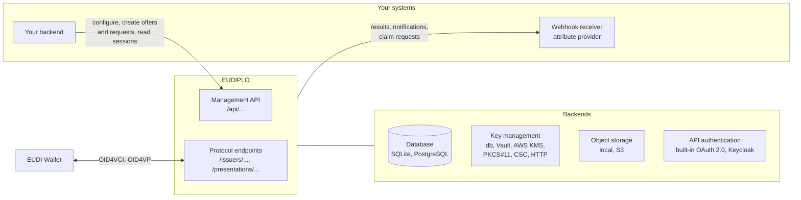
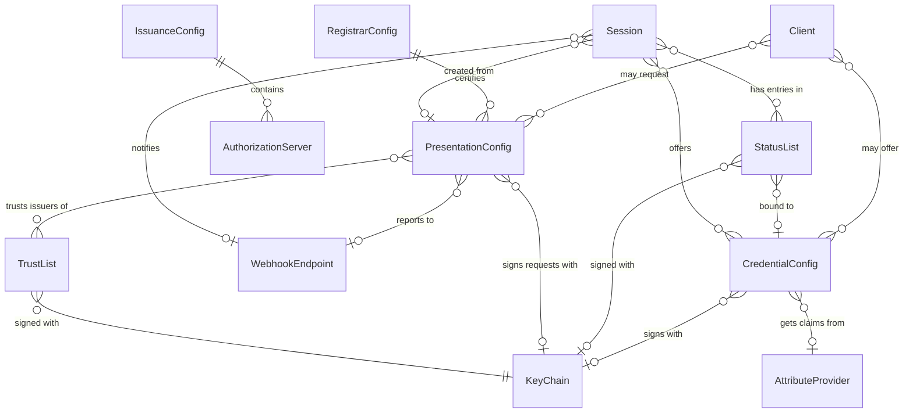

# Concepts

This section explains how EUDIPLO works: where it sits, which entities it stores and how they turn into protocol messages. It contains no setup steps; for those, start with the [cookbooks](../cookbooks/index.md).

## What EUDIPLO is

EUDIPLO is a self-hosted issuer and verifier service. Your backend talks to its management API; wallets talk to its protocol endpoints.

| EUDIPLO is                                                                    | EUDIPLO is not                                                                    |
| ----------------------------------------------------------------------------- | --------------------------------------------------------------------------------- |
| A **protocol endpoint** for wallets: OID4VCI, OID4VP, ISO 18013-7             | A **wallet**: it issues to and verifies from wallets, it stores no user credentials |
| A **credential factory** that signs SD-JWT VC and mdoc credentials            | An **identity provider**: user login comes from an authorization server you choose |
| A **verifier** that checks signatures, trust, status and the requested claims | A **business decision engine**: what a verified claim means is up to your backend  |
| A **session store** that tracks each flow and reports its result              | A **proxy or backend-for-frontend**: it does not serve your UI or forward requests |

## Architecture

- **Two API surfaces.** Management endpoints live under `/api` and require an OAuth 2.0 client token. Protocol endpoints are public and secured by the protocols themselves (see [API reference](../reference/api.md)).
- **Pluggable backends.** Database, object storage and API authentication are chosen per deployment with environment variables; all tenants share them. Key management is configured in `kms.json`, and a tenant can add its own providers. See [Operate](../operate/index.md).
- **Callbacks.** EUDIPLO calls your systems for results ([webhooks](../reference/webhooks.md)) and, if configured, for claim values during issuance ([attribute provider API](../reference/attribute-provider-api.md)).
- **Multi-tenancy.** Every entity below belongs to one tenant. The tenant ID appears in the wallet-facing URLs, for example `/issuers/{tenant}`.

## Core concepts

| Entity                         | What it is                                                                                                                                   | What the wallet sees                                             | Guide                                                              |
| ------------------------------ | -------------------------------------------------------------------------------------------------------------------------------------------- | ---------------------------------------------------------------- | ------------------------------------------------------------------ |
| **Tenant**                     | Isolated configuration space for one organization or environment, with its own session retention and status-list defaults                 | `/issuers/{tenant}` in issuer URLs                               | [Tenants and access](../operate/tenants-and-access.md)             |
| **Client**                     | API client of the management API: roles and optional allow lists of configurations it may use                                               | Nothing                                                          | [Tenants and access](../operate/tenants-and-access.md)             |
| **Key chain**                  | A key pair with an optional certificate chain and one usage type (`access`, `attestation`, `statusList`, `trustList`, `encrypt`), held by a KMS provider | `x5c` headers, `client_id`, JWKS                         | [Keys and certificates](../trust/keys-and-certificates.md)         |
| **Credential configuration**   | One credential type: format, claims, display, signing key, claim source, status management                                                  | An entry in `credential_configurations_supported`                | [Credential configuration](../issuance/credential-configuration.md) |
| **Issuance configuration**     | The tenant's issuer settings (one per tenant): authorization servers, DPoP, batch size, attestation trust, encryption                       | Issuer and authorization server metadata                         | [Issuance configuration](../issuance/issuance-configuration.md)    |
| **Authorization server**       | An entry of the issuance configuration: `built-in`, `external`, `chained` or `oid4vp`                                                      | `authorization_servers` in the issuer metadata                   | [Authorization servers](../issuance/authorization-servers.md)      |
| **Presentation configuration** | What a verifier asks for (DCQL query), which issuers it trusts and where results go                                                         | The signed OID4VP request object                                 | [Configure verification](../presentation/configure-verification.md) |
| **Session**                    | One issuance or presentation flow, from offer or request to result                                                                         | `issuer_state` or pre-authorized code; the wallet-facing request URL | [Sessions](sessions.md)                                         |
| **Status list**                | Bit array with the revocation and suspension state of issued credentials                                                                   | The `status` claim and the status list token                     | [Revocation](../issuance/revocation.md)                            |
| **Trust list**                 | Signed LoTE list of trusted entities hosted by the tenant                                                                                  | `trusted_authorities` in DCQL                                    | [Trust lists](../trust/trust-lists.md)                             |
| **Webhook endpoint**           | Reusable target for presentation results and issuance notifications                                                                        | Nothing                                                          | [Webhooks](../reference/webhooks.md)                               |
| **Attribute provider**         | Your HTTP service that supplies claim values at issuance                                                                                   | Nothing                                                          | [Attribute provider](../issuance/attribute-provider.md)            |
| **Registrar configuration**    | Connection to a registrar that issues access and registration certificates                                                                 | `verifier_info` and `issuer_info`                                | [Registrar](../trust/registrar.md)                                 |

## How entities relate

All entities are scoped to the tenant, so the tenant is left out of the diagram. `o|` marks an optional reference, `o{` zero or more.

- **Key chains by usage.** A configuration that names no key chain uses a key chain of the required usage type from the tenant, for example an `attestation` key chain to sign credentials.
- **Offers name the credentials.** The issuance configuration does not list credential configurations. Each offer names the credential configurations it offers, and the wallet requests them by `credential_configuration_id`.
- **Shared definitions.** Webhook endpoints and attribute providers are defined once per tenant and referenced by ID from any number of configurations and offers.
- **Sessions refer to configurations.** A session stores what it offers or requests and is evaluated against the current configuration when the wallet arrives. Internal bookkeeping (nonces, DPoP proof IDs, deferred transactions, session logs, audit logs) is not shown.

## From configuration to protocol

Configuration is stored per tenant in the database. You create it in the web client, through the management API, or by importing files at startup ([Configuration as code](../operate/configuration-as-code.md)). EUDIPLO derives every protocol message from it at runtime:

| Configuration              | Becomes                                                                                                              |
| -------------------------- | -------------------------------------------------------------------------------------------------------------------- |
| Credential configuration   | `credential_configurations_supported` in the issuer metadata, and the signed credential                              |
| Issuance configuration     | Authorization server metadata, PAR and token behavior, credential endpoint policies (DPoP, attestation, encryption) |
| Presentation configuration | The signed request object of each presentation session, and the checks applied to the response                      |
| Key chain                  | Signatures, certificate chains in `x5c`, the verifier's `client_id`, encryption keys in metadata                     |
| Trust list, status list    | Published signed lists, and the trust and status checks during verification                                          |

## Read next

- [Issuance under the hood](issuance.md): the OID4VCI flow and the credential endpoint pipeline
- [Presentation under the hood](presentation.md): the OID4VP flow and the verification pipeline
- [Sessions](sessions.md): states, single use and retention
- [Security model](security-model.md): trust boundaries, tokens, keys and encryption
