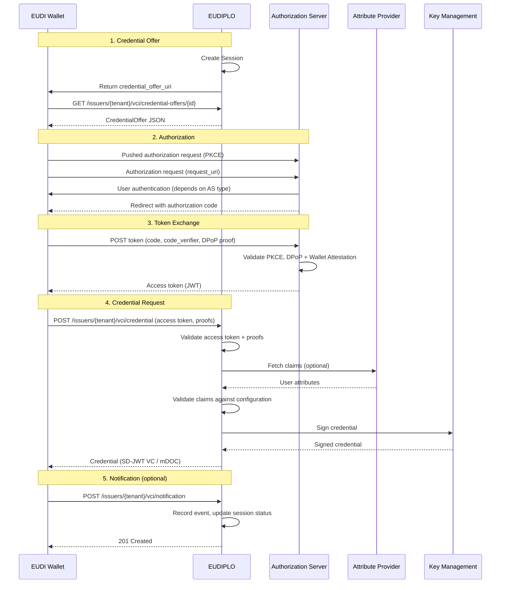
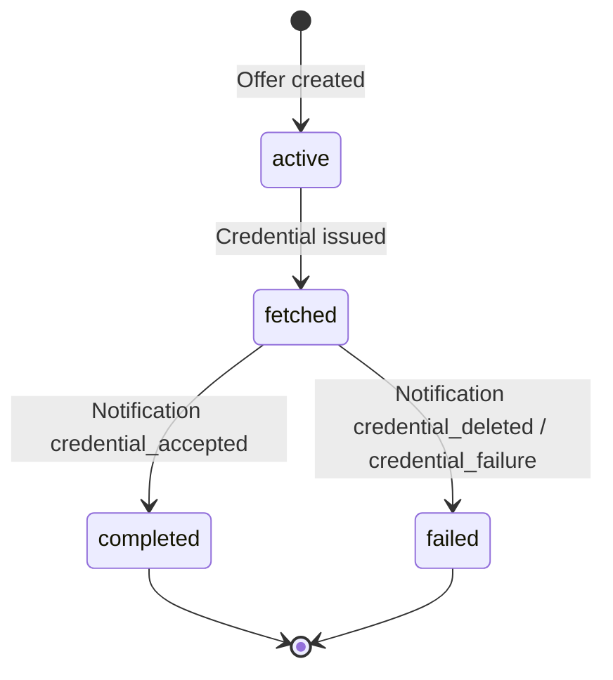

<!-- RESTRUCTURE: content that belongs elsewhere or needs restructuring in the next phase (remove this comment when done):
  - 'Module Structure' -> drop (contributing/backend-architecture.md)
  - 'Deferred Credential Endpoint' -> issuance/deferred-issuance.md
  - 'Protocol Coverage' -> reference/protocols.md
-->

# Issuance Architecture

This page provides an architecture-level overview of how EUDIPLO implements the **OpenID for Verifiable Credential Issuance (OID4VCI)** protocol. For usage-level documentation and configuration examples, see [Issuance Configuration](../issuance/index.md).

---

## Overview

EUDIPLO implements OID4VCI to enable credential issuance to EUDI Wallets. The issuance flow follows the OAuth 2.0-based protocol with credential-specific extensions:

1. **Credential Offer**: EUDIPLO creates an offer containing metadata about available credentials
2. **Authorization**: The wallet authenticates the user (via one of the configured authorization servers)
3. **Token Exchange**: The wallet exchanges an authorization code for an access token
4. **Credential Request**: The wallet requests one or more credentials using the access token
5. **Notification** _(optional)_: The wallet notifies EUDIPLO whether the credential was accepted or rejected

---

## Issuance Flow Diagram



---

## Module Structure

The issuance architecture is organized into several modules within `apps/backend/src/issuer`:

```text
issuer/
  ├── configuration/            # Administrative configuration (CRUD)
  │   ├── credentials/          # Credential configuration, format registry and issuers (SD-JWT VC, mdoc),
  │   │                         #   claims provider (application/, domain/, ports/, adapters/)
  │   ├── issuance/             # Issuance configuration (authorization servers, DPoP, batch size)
  │   ├── attribute-provider/   # External claim sources
  │   └── webhook-endpoint/     # Notification webhooks
  ├── issuance/
  │   ├── offer/                # Credential offer management API
  │   └── oid4vci/              # OID4VCI protocol
  │       ├── application/      # Use cases: offers, credential requests, proofs, nonces,
  │       │                     #   notifications, deferred issuance, issuer metadata
  │       ├── domain/           # Rules and errors (authorization servers, registration certificates)
  │       ├── ports/ adapters/  # Nonces, deferred transactions, AS metadata, registrar, publishers
  │       ├── authorization/    # Built-in, chained, external and interactive authorization servers
  │       │   ├── application/  # Token, PAR and authorize use cases
  │       │   ├── domain/       # OAuthError, PKCE, grant and PAR rules
  │       │   └── authorize/ chained-as/ chained-as-vp/ authorization-servers/
  │       ├── well-known/ metadata/  # Metadata endpoints
  │       └── oid4vci.service.ts     # Credential endpoint orchestration (being migrated)
  ├── status-list/              # OAuth Token Status List
  └── trust-list/               # Trust list management
```

Where new code goes and which rules apply is described in [Backend Architecture](../contributing/backend-architecture.md#feature-folder-shape).

---

## Credential Offer

The credential offer is the entry point for issuance. It contains metadata about the available credentials and the authorization server to use.

**Offer Structure:**

```json
{
    "credential_issuer": "https://eudiplo.example.com/issuers/tenant1",
    "credential_configuration_ids": ["diploma", "employee-badge"],
    "grants": {
        "authorization_code": {
            "issuer_state": "session-uuid",
            "authorization_server": "https://eudiplo.example.com/issuers/tenant1"
        }
    }
}
```

**Offer Delivery:**

Offers can be delivered via:

- **credential_offer_uri**: A unique URI (`/issuers/{tenant}/vci/credential-offers/{id}`) that returns the offer JSON when dereferenced (recommended)
- **credential_offer**: The offer JSON embedded directly in the QR code (limited by QR code size)

**Session Creation:**

When an offer is created, EUDIPLO generates a new `Session` entity:

- **ID**: UUID (referenced as `issuer_state` in authorization code offers)
- **Status**: `active`
- **Credentials**: List of credential configuration IDs offered, plus optional per-configuration claim sources
- **Pre-authorized code**: Generated for pre-authorized code offers
- **Webhook endpoint**: Optional `webhookEndpointId` that receives wallet notifications

---

## Authorization

The wallet authenticates the user via one of the configured authorization servers. EUDIPLO supports four authorization modes:

### 1. Built-in Authorization Server

EUDIPLO hosts a minimal OAuth AS (issuer `https://eudiplo.example.com/issuers/tenant1`) that issues authorization codes directly. No external identity provider is required. Pushed authorization requests (PAR) and PKCE with `S256` are mandatory.

**Use Case:** Development, testing, demo environments

**Flow:**

1. Wallet pushes the authorization request to `/issuers/{tenant}/authorize/par` (with `code_challenge` and `code_challenge_method=S256`) and receives a `request_uri`
2. Wallet opens `/issuers/{tenant}/authorize` with the `request_uri`
3. EUDIPLO redeems the `request_uri` (single use) and redirects to the wallet's `redirect_uri` with an authorization code; there is no login or consent screen
4. Wallet exchanges the code (with `code_verifier`) for an access token at `/issuers/{tenant}/authorize/token`

---

### 2. External Authorization Server

The wallet authenticates with a completely separate OAuth AS (e.g., Keycloak, Okta). The external AS must carry the session ID (the offer's `issuer_state`) in an access token claim, configured as `sessionBinding.claim` (method `access_token_claim`).

**Use Case:** Production environments with existing identity infrastructure

**Flow:**

1. Wallet redirects to external AS
2. External AS authenticates user and includes the session ID in the configured claim of the access token
3. Wallet presents access token to EUDIPLO
4. EUDIPLO correlates the session via the configured `sessionBinding.claim`

**Limitation:** Requires configuring the external AS to put the session ID into the configured token claim.

---

### 3. Chained Authorization Server

EUDIPLO acts as an AS facade and delegates authentication to an upstream OIDC provider. EUDIPLO issues its own access tokens with `issuer_state` embedded.

**Use Case:** Production environments where modifying the upstream AS is not feasible

**Flow:**

1. Wallet redirects to EUDIPLO's chained AS
2. EUDIPLO redirects to upstream OIDC provider
3. User authenticates at upstream provider
4. Upstream provider redirects back to EUDIPLO with authorization code
5. EUDIPLO exchanges code for ID token from upstream
6. EUDIPLO issues its own access token (with `issuer_state`) to the wallet

**Benefits:**

- No changes to upstream identity provider
- EUDIPLO maintains full control over session correlation
- Supports DPoP and wallet attestation

See [Authorization Architecture](../issuance/authorization-servers.md#authorization) for detailed architecture.

---

### 4. OID4VP-Based Authorization

The wallet authenticates by presenting existing verifiable credentials (OID4VP flow). This enables **credential-to-credential** workflows (e.g., prove you have a diploma to receive an employee badge).

**Use Case:** Advanced use cases requiring proof of existing credentials before issuance

**Flow:**

1. Wallet calls the authorization server at `/issuers/{tenant}/authorization-servers/{id}` and is redirected to EUDIPLO's OID4VP verifier
2. Wallet presents requested credentials
3. EUDIPLO verifies credentials and issues an authorization code
4. Wallet exchanges code for an access token (with `issuer_state`)

---

## Token Endpoint

The token endpoint exchanges an authorization code for an access token. EUDIPLO enforces several security mechanisms at this stage.

**DPoP (Demonstrating Proof-of-Possession):**

When `dPopRequired: true`, the wallet must include a DPoP proof in the `DPoP` header. The proof is a signed JWT that binds the access token to the wallet's public key.

**Wallet Attestation:**

When wallet attestation is required by the selected EUDIPLO-managed authorization server, the wallet must include `OAuth-Client-Attestation` and `OAuth-Client-Attestation-PoP` headers on PAR and token requests. These headers contain a signed attestation from the wallet provider proving the wallet client's authenticity. Authorization-server-specific settings override issuance-level defaults.

**Access Token Structure:**

The built-in authorization server issues a JWT signed by the key referenced in `IssuanceConfig.signingKeyId` (or the tenant's default key). It is valid for 300 seconds:

```json
{
    "iss": "https://eudiplo.example.com/issuers/tenant1",
    "sub": "session-uuid",
    "aud": "https://eudiplo.example.com/issuers/tenant1",
    "exp": 1234568100,
    "iat": 1234567800,
    "jti": "random-token-id",
    "client_id": "wallet-client-id",
    "authorization_details": [
        {
            "type": "openid_credential",
            "credential_configuration_id": "diploma",
            "credential_identifiers": ["diploma"]
        }
    ],
    "cnf": {
        "jkt": "dpop-key-thumbprint"
    }
}
```

**Claims:**

- `sub`: Session ID; correlates the token with the session
- `authorization_details`: Credential configurations the token authorizes
- `cnf.jkt`: DPoP key thumbprint (if DPoP is used)

Tokens of the chained and OID4VP-based authorization servers carry the session ID in an `issuer_state` claim instead. Tokens of an external authorization server are correlated via the configured `sessionBinding.claim`.

---

## Credential Endpoint

The credential endpoint is where the wallet requests the actual credential. This is the core of the issuance process.

**Request Flow:**

1. **Validate Access Token**: EUDIPLO verifies the access token signature, expiration, audience, and issuer
2. **Validate Proof**: The wallet must prove possession of, or provide trusted attestation for, the holder key material to bind into the credential
3. **Fetch Claims** _(optional)_: If the offer provides a claims webhook or the credential configuration references an attribute provider, EUDIPLO fetches user attributes from the external system
4. **Validate Claims**: The resolved claims, whatever their source (inline in the offer, webhook, attribute provider or deferred completion), are validated against the JSON schema derived from the credential configuration's `fields` before signing. Missing, mistyped or unknown claims are rejected (at the credential endpoint with `credential_request_denied`); configurations without `fields` are not validated
5. **Sign Credential**: EUDIPLO signs the credential using the attestation key chain
6. **Return Credential**: The credential (SD-JWT VC or mDOC) is returned to the wallet

**Proof Types:**

| Proof Type    | Description                                                                                            |
| ------------- | ------------------------------------------------------------------------------------------------------ |
| `jwt`         | Standard JWT proof signed by the wallet's holder key; may include a `key_attestation` protected header |
| `attestation` | Key attestation JWT sent directly as the credential request proof                                      |

Key attestation is separate from wallet attestation. It is advertised per credential with `config.keyAttestationsRequired` and validated by the credential issuer using the issuance-level `walletProviderTrustLists`.

**Batch Issuance:**

When `IssuanceConfig.batchSize > 1`, the issuer metadata advertises `batch_credential_issuance` and the wallet can request multiple credentials of the same configuration in a single request by sending several proofs in the `proofs` array. One credential is issued per holder key, up to `batchSize`:

```json
{
    "credential_configuration_id": "diploma",
    "proofs": {
        "jwt": ["<proof JWT for key 1>", "<proof JWT for key 2>"]
    }
}
```

With the `attestation` proof type, exactly one key attestation is sent and one credential is issued per attested key.

---

## Credential Formats

EUDIPLO supports two credential formats:

### SD-JWT VC (Selective Disclosure JWT Verifiable Credential)

**Format ID:** `dc+sd-jwt`

**Structure:**

```text
<Issuer-signed JWT>~<Disclosure 1>~<Disclosure 2>~...~<Key Binding JWT>
```

**Signing:**

The credential is signed using the attestation key chain referenced by the credential configuration. The signature algorithm is ES256 (ECDSA with P-256).

**Trust Format:**

| Mode         | Description                                                      |
| ------------ | ---------------------------------------------------------------- |
| `x5c`        | Include X.509 certificate chain in JWT header (`x5c` claim)      |
| `federation` | Include issuer entity ID in `iss` claim (federation-based trust) |

**Selective Disclosure:**

Claim disclosures are generated based on the credential configuration's `fields` array. Each field can be marked as `mandatory` or `disclosable` (selectively disclosable).

---

### mDOC (ISO 18013-5 Mobile Document)

**Format ID:** `mso_mdoc`

**Structure:**

mDOC credentials are CBOR-encoded and CWT-signed (COSE Web Token).

**Signing:**

The Mobile Security Object (MSO) is signed using the attestation key chain. The signature algorithm is ES256 (ECDSA with P-256).

**Document Type:**

Each mDOC credential has a `docType` (e.g., `org.iso.18013.5.1.mDL` for mobile driving license).

---

## Deferred Credential Endpoint

When credentials cannot be issued immediately (e.g., manual approval required, external system unavailable), EUDIPLO supports the deferred credential endpoint.

**Flow:**

1. Wallet requests a credential at `/issuers/{tenant}/vci/credential`
2. EUDIPLO returns a `transaction_id` instead of the credential
3. Wallet periodically polls `/issuers/{tenant}/vci/deferred_credential` with the `transaction_id`
4. Once the backend completes the transaction (`POST /issuer/deferred/{transactionId}/complete`), EUDIPLO returns the credential

**Use Cases:**

- Manual approval workflows
- External attribute providers with long response times
- Batch processing systems

---

## Notification Endpoint

After receiving a credential, the wallet can notify EUDIPLO whether the credential was accepted or rejected.

**Request:**

```json
{
    "notification_id": "unique-notification-id",
    "event": "credential_accepted"
}
```

**Events:**

| Event                 | Description                  |
| --------------------- | ---------------------------- |
| `credential_accepted` | User accepted the credential |
| `credential_deleted`  | User deleted the credential  |
| `credential_failure`  | Credential issuance failed   |

**Session Status:**

`credential_accepted` sets the session to `completed`; `credential_deleted` and `credential_failure` set it to `failed`.

**Webhook Integration:**

If the offer referenced a webhook endpoint (`webhookEndpointId` in the offer request), EUDIPLO forwards the notification event to it. A `webhookEndpointId` on the credential configuration is not used for notifications.

---

## Session Lifecycle

The session tracks the state of the issuance flow:



Authorization and token exchange do not change the session status. Issuance sessions are not moved to `expired` (only presentation sessions are); they keep their last status until session cleanup removes or anonymizes them.

**Session Cleanup:**

Sessions are cleaned up based on the tenant's `sessionConfig`:

| Cleanup Mode | Behavior                                                                                   |
| ------------ | ------------------------------------------------------------------------------------------ |
| `full`       | Completely delete the session and all associated data                                      |
| `anonymize`  | Keep metadata (status, timestamps) but remove personal data (credentials, user attributes) |

**Single-Use Enforcement:**

Sessions are atomically marked `consumed: true` when the first token request (authorization code or pre-authorized code) succeeds, so a code or offer cannot be redeemed twice. Refresh token requests remain possible.

---

## Key Management Integration

The issuance flow integrates with the Key Management system:

| Operation                | Key Chain                                       | Algorithm |
| ------------------------ | ----------------------------------------------- | --------- |
| **Access Token Signing** | `IssuanceConfig.signingKeyId` (usage: `access`) | ES256     |
| **Credential Signing**   | Attestation key chain (usage: `attestation`)    | ES256     |
| **Status List Signing**  | Status list key chain (usage: `statusList`)     | ES256     |

See [Cryptography](./security-model.md#cryptography) for key management details.

---

## Protocol Coverage

EUDIPLO implements the following OID4VCI features:

| Feature                      | Supported | Notes                                          |
| ---------------------------- | --------- | ---------------------------------------------- |
| Pre-Authorized Code Flow     | ✅        | Issue credentials without user authentication  |
| Authorization Code Flow      | ✅        | Issue credentials with user authentication     |
| Batch Credential Issuance    | ✅        | Multiple credentials in one request            |
| Deferred Credential Endpoint | ✅        | Support for async issuance                     |
| Notification Endpoint        | ✅        | Wallet acknowledgment of credential acceptance |
| DPoP                         | ✅        | Proof-of-possession tokens                     |
| Wallet Attestation           | ✅        | Verify wallet provider trustworthiness         |
| Credential Refresh           | ❌        | Not yet implemented                            |

See [Supported Protocols](../reference/protocols.md) for full protocol coverage.

---

## Next Steps

- **Usage Guide**: [Issuance Configuration](../issuance/index.md)
- **Chained AS**: [Authorization Architecture](../issuance/authorization-servers.md#authorization)
- **Credential Configuration**: [Credential Configuration](../issuance/credential-configuration.md)
- **Attribute Providers**: [Attribute Providers](../issuance/attribute-provider.md)
- **Key Management**: [Cryptography](./security-model.md#cryptography)
- **Session Management**: [Sessions](./sessions.md)
