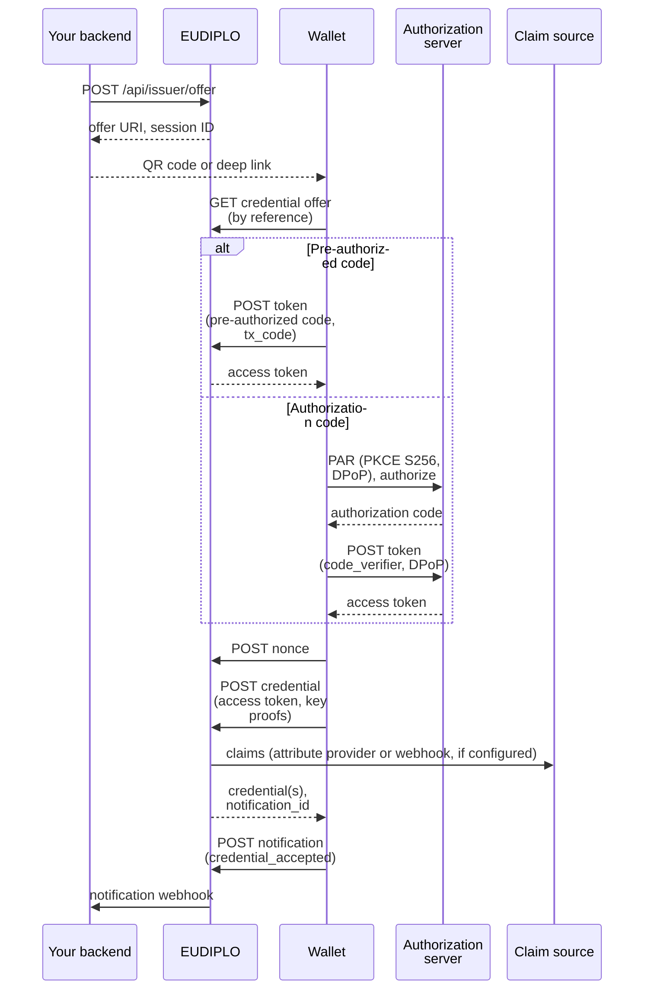
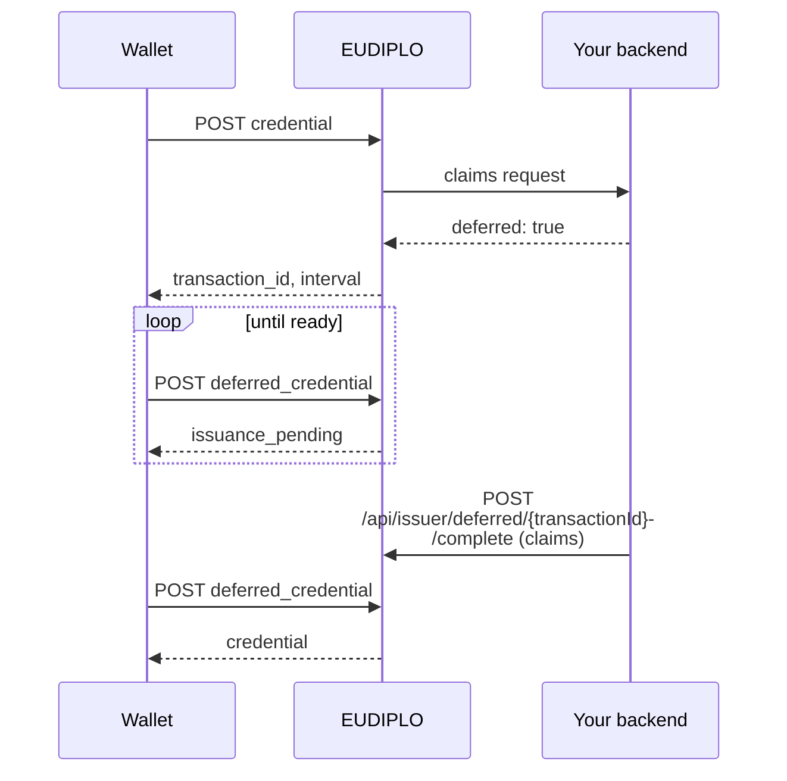
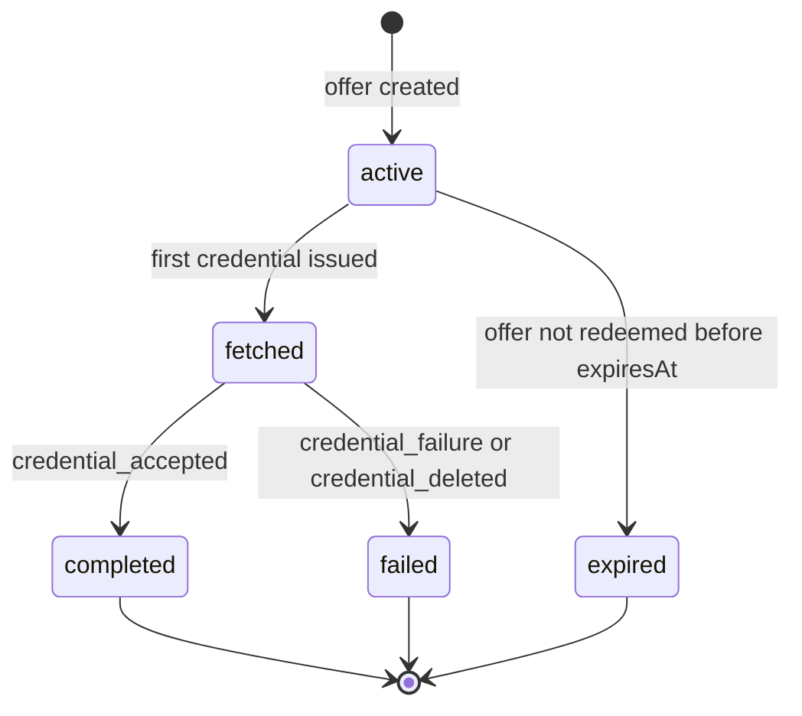

# Issuance under the hood

This page explains what EUDIPLO does during an OID4VCI issuance: the message flow, how the credential endpoint processes a request, deferred issuance and the session states. To set up issuance, start with the [issuance guides](../issuance/index.md); supported features are listed in [Supported protocols](../reference/protocols.md).

## Flow

The offer names the credential configurations and, for the authorization code flow, carries the session ID as `issuer_state`. For the built-in, chained and OID4VP-based servers, "authorization server" is EUDIPLO itself; only an external server issues its own tokens.

## Authorization servers

How the wallet obtains its access token depends on the authorization server the offer uses. Configuration and endpoints are in [Authorization servers](../issuance/authorization-servers.md).

| Type       | User authentication                                       | Token issued by | Token carries the session as          | Wallet attestation |
| ---------- | --------------------------------------------------------- | --------------- | ------------------------------------- | ------------------ |
| `built-in` | None (pre-authorized code, or authorization code without login; optional interactive authorization) | EUDIPLO | `sub`                    | ✅                 |
| `external` | Your OAuth 2.0 server                                     | External server | The claim named in `sessionBinding.claim` | ❌             |
| `chained`  | An upstream OpenID Connect provider, through EUDIPLO      | EUDIPLO         | `issuer_state`                        | ✅                 |
| `oid4vp`   | Presentation of another credential                        | EUDIPLO         | `issuer_state`                        | ✅                 |

Codes work once. With the built-in server, the first successful token request marks the session consumed, so neither its authorization code nor the pre-authorized code can be redeemed again (`invalid_grant`); the chained and OID4VP-based servers track their codes in their own authorization sessions. Refresh tokens stay usable afterwards.

### Interactive authorization

The built-in server can run an interactive authorization ([experimental](../issuance/interactive-authorization.md)). The wallet calls `POST /issuers/{tenant}/authorize/interactive` with `interaction_types_supported` and a PKCE `S256` challenge. EUDIPLO opens an auth session and returns the first action configured in the credential configuration's `iaeActions`: an OpenID4VP presentation, or a redirect to a web page that your backend completes. The wallet works through the actions in order and receives an authorization code after the last one.

A presentation step is verified like any OID4VP response, and the verified credentials are passed to the attribute provider when the credential is issued. Without configured actions, EUDIPLO falls back to the wallet's preference: a presentation of the tenant's first presentation configuration if the wallet supports it, otherwise a web redirect.

## Credential endpoint

`POST /issuers/{tenant}/vci/credential` runs these steps for each request:

1. **Decrypt.** An encrypted request (`application/jwt`) is decrypted with the tenant's `encrypt` key chain, whose public key is published in the issuer metadata.
2. **Validate the request.** The `credential_configuration_id` must exist and requested response encryption must use a supported algorithm.
3. **Verify the access token.** Signature against the issuing server's keys, audience, expiry, and the DPoP proof. With `dPopRequired`, bearer tokens are rejected.
4. **Authorize the credential.** A token with `authorization_details` covers only the configurations listed there (a `credential_identifier` is resolved the same way), and the proof type must be one of the configuration's `proofTypesSupported`.
5. **Find the session and resolve claims.** The session comes from the token (see the table above). Claims come from the offer, a claims webhook or the attribute provider, together with the user identity from the token; [Claims](../issuance/claims.md) explains the order.
6. **Defer, if requested.** If the claim source answers `deferred`, EUDIPLO stops here (see [Deferred issuance](#deferred-issuance)).
7. **Consume nonces.** Each proof must carry a nonce from the nonce endpoint; a nonce works once.
8. **Issue.** EUDIPLO verifies the key proofs, and key attestations against the issuance configuration's wallet-provider trust lists, validates the claims against the configuration's `fields`, and signs one credential per holder key with the configuration's `attestation` key chain. With status management, each credential gets a status-list entry.
9. **Respond.** EUDIPLO records a `notification_id`, moves the session to `fetched` on the first issuance, and returns the credentials, encrypted if the wallet asked for it.

A batch is one request with several proofs; the issuer metadata advertises `batch_credential_issuance` when `batchSize` is greater than 1.

### Single active credential

With `activeCredentials` enabled, a subject keeps only one active set of credentials per credential configuration. EUDIPLO derives two HMAC fingerprints from the at-rest encryption root key (with separate HKDF-derived keys): one from tenant, configuration, `iss` and `sub` of the user identity, and one from the access token. It stores only these digests, never the raw subject or token.

All credentials issued with the same access token form one issuance set. When a different access token for the same subject issues its first credential, EUDIPLO allocates the new status entry first and then revokes every entry of the previous set. The policy therefore needs status management and a stable `iss`/`sub` from the authorization server, and replacing the encryption root key breaks the link to earlier sets. Deferred transactions keep the issuance set of their original token. See [Credential configuration](../issuance/credential-configuration.md) for when to use it.

## Deferred issuance

Deferred issuance separates the credential request from the decision to issue, for example for a manual approval.

When the claim source answers `deferred`, EUDIPLO verifies the key proof, consumes its nonce and stores a transaction with the holder key, valid for 24 hours. Deferred issuance binds exactly one holder key. Your backend later completes the transaction with the claims, which signs the credential immediately, or fails it. The wallet polls `POST /issuers/{tenant}/vci/deferred_credential` with an access token of the same session and can retrieve a ready credential once. A transaction moves from `pending` to `ready` and `retrieved`, or ends as `failed` or `expired`. Steps and API: [Deferred issuance](../issuance/deferred-issuance.md).

## Session states

Authorization and token exchange do not change the status. An offer without `offerLifetimeSeconds` (on the offer or in the issuance configuration) has no `expiresAt`. Once redeemed, a session no longer expires, so a wallet holding tokens can keep requesting credentials. The notification endpoint sets the final status; if the wallet never calls it, the session stays `fetched` until retention cleanup. Rules shared with presentations are on [Sessions](sessions.md).
