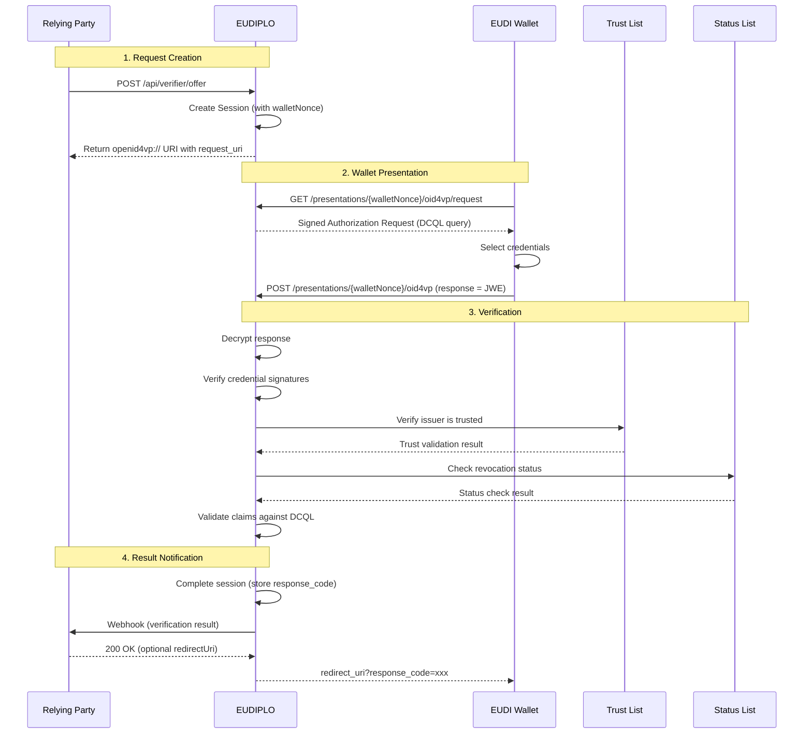
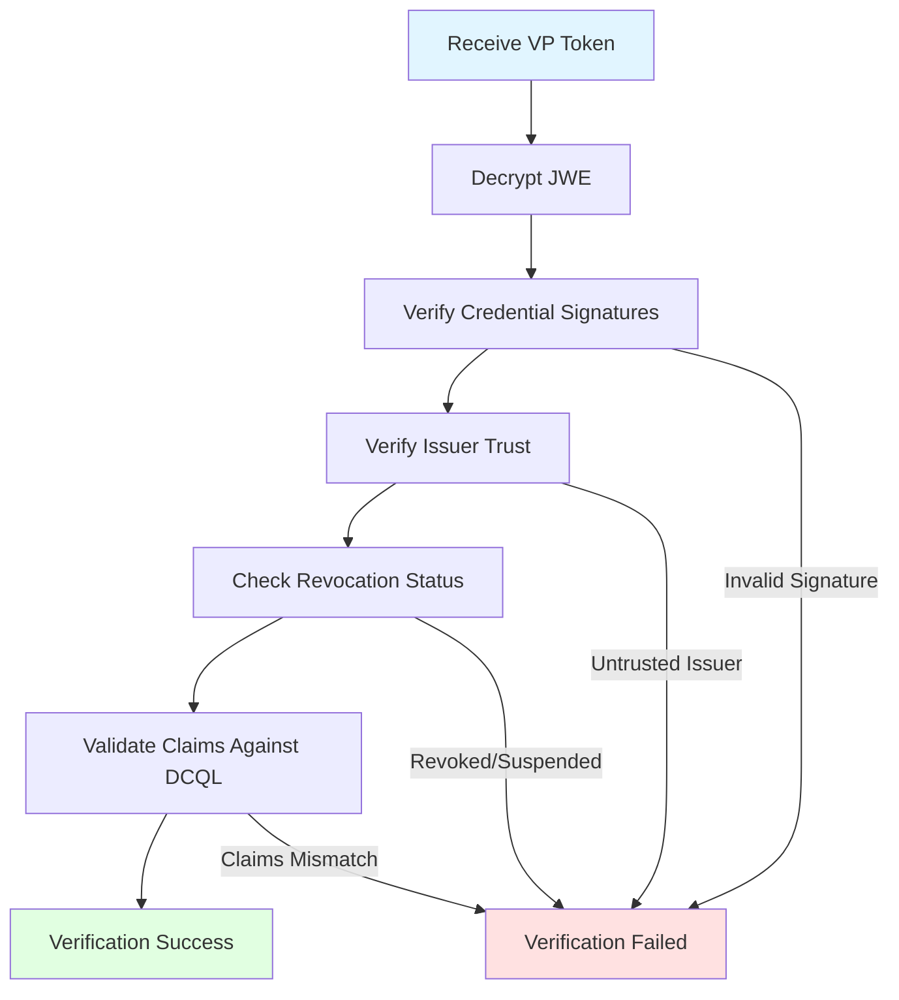
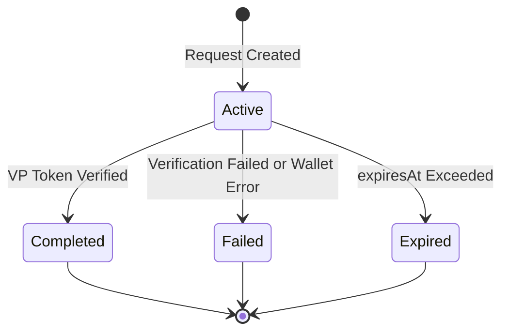

<!-- RESTRUCTURE: content that belongs elsewhere or needs restructuring in the next phase (remove this comment when done):
  - 'Module Structure' -> drop (contributing/backend-architecture.md)
  - credential_sets part of 'DCQL (Digital Credentials Query Language)' -> presentation/dcql.md
  - 'Session Security (OID4VP §13.3)' -> concepts/security-model.md (link only)
  - 'Webhook Integration' -> reference/webhooks.md
  - 'Protocol Coverage' -> reference/protocols.md
-->

# Presentation Architecture

This page provides an architecture-level overview of how EUDIPLO implements the **OpenID for Verifiable Presentations (OID4VP)** protocol. For usage-level documentation and configuration examples, see [Presentation Configuration](../presentation/index.md).

---

## Overview

EUDIPLO implements OID4VP to enable verifiable credential presentation and verification. The presentation flow allows a **verifier** (relying party) to request credentials from a wallet and verify their authenticity:

1. **Request Creation**: EUDIPLO creates a signed presentation request containing a DCQL query
2. **Wallet Response**: The wallet submits a VP Token (always encrypted as JWE)
3. **Verification**: EUDIPLO verifies the credential signatures, claims, and trust chain
4. **Trust Validation**: EUDIPLO checks that the issuer is trusted (via trust lists or federation)
5. **Status Check**: EUDIPLO checks revocation/suspension status (unless disabled)
6. **Webhook Notification**: The verification result is sent to the configured webhook endpoint

---

## Presentation Flow Diagram



---

## Module Structure

The presentation architecture is organized into several modules within `apps/backend/src/verifier`:

```text
verifier/
  ├── presentations/
  │   ├── configuration/      # Presentation configuration CRUD, registration certificates,
  │   │                       #   metadata import (administrative, plain services)
  │   ├── application/        # VerifyPresentationResponse use case, verifier format registry
  │   ├── domain/             # CredentialVerifierFormat contract, DCQL claim policy, trust options
  │   ├── adapters/           # SD-JWT VC and mdoc verifier formats (key binding, session transcript)
  │   ├── credential/         # Cryptographic verifiers and certificate chain validation
  │   ├── ports/              # TrustListRefResolver port (implemented by TrustedAuthoritiesService)
  │   ├── schemas/            # Zod schemas for presentation configs (DCQL, trusted authorities)
  │   ├── exceptions/         # IncompletePresentationException
  │   └── dto/ entities/      # API shapes and the PresentationConfig entity
  ├── oid4vp/                 # OID4VP protocol: request objects, response handling
  │   ├── application/        # Response parsing, completion, failure use cases
  │   └── dto/                # Presentation request and authorization response DTOs
  ├── verifier-offer/         # Presentation request creation API
  ├── iso18013/               # ISO 18013-7 (mDOC presentation via DC API)
  └── resolver/               # Key resolution for verification
```

Adding a presentation format means implementing `CredentialVerifierFormat` and registering it; OID4VP and ISO 18013 resolve formats from the registry. Placement rules: [Backend Architecture](../contributing/backend-architecture.md#feature-folder-shape).

---

## Presentation Request

The presentation request specifies which credentials the verifier requires and how the wallet should respond. EUDIPLO delivers it as a signed JWT (`typ: oauth-authz-req+jwt`, `ES256`, `x5c` from the tenant's access key chain).

**Request Structure (DCQL):**

```json
{
    "response_type": "vp_token",
    "response_mode": "direct_post.jwt",
    "client_id": "x509_hash:<certificate hash>",
    "response_uri": "https://eudiplo.example.com/presentations/<walletNonce>/oid4vp",
    "nonce": "<random UUID>",
    "state": "<walletNonce>",
    "dcql_query": {
        "credentials": [
            {
                "id": "age_credential",
                "format": "dc+sd-jwt",
                "meta": { "vct_values": ["urn:eu:age-over-18"] },
                "claims": [{ "path": ["age_over_18"] }]
            }
        ]
    },
    "client_metadata": {
        "jwks": { "keys": ["<ephemeral ECDH-ES public key>"] },
        "encrypted_response_enc_values_supported": ["A128GCM", "A256GCM"],
        "vp_formats_supported": { "dc+sd-jwt": {}, "mso_mdoc": {} }
    }
}
```

The request object also carries `aud`, `iat`, `exp`, and, when configured, `transaction_data` and a registration certificate in `verifier_info`.

**Session Creation:**

When a presentation request is created, EUDIPLO generates a new `Session` entity:

- **ID**: UUID (the session ID used by the management API and in webhook payloads)
- **Status**: `active`
- **Request ID**: The presentation configuration whose DCQL query is used
- **Expiry**: `expiresAt` from the configuration's `lifeTime` (default 300 seconds)
- **Security Fields**:
    - `walletNonce`: Separate random UUID used only in wallet-facing URLs and as `state` (OID4VP §13.3)
    - `vp_nonce`: The random `nonce` sent in the request object
    - `responseEncryptionPrivateJwk`: Ephemeral private key for decrypting the wallet response
    - `responseCode`: One-time code for same-device redirect (set when the response is verified)

---

## Request Delivery

Presentation requests can be delivered in two ways:

### 1. Request URI (Recommended)

The verifier embeds a `request_uri` in the QR code or deep link. The wallet dereferences this URI to fetch the full request.

**QR Code Content** (parameter values are URL-encoded):

```text
openid4vp://?client_id=x509_hash:<certificate hash>&request_uri=https://eudiplo.example.com/presentations/<walletNonce>/oid4vp/request&request_uri_method=get
```

`POST /api/verifier/offer` returns this link as `uri`, plus a `crossDeviceUri` whose `request_uri` ends in `/request/no-redirect` (fetching it clears the redirect URI, so the wallet is not redirected after a cross-device presentation), and the `session` ID.

**Flow:**

1. Wallet scans QR code
2. Wallet fetches the signed request object from `request_uri`
3. Wallet presents credentials to `response_uri`

**Benefits:**

- QR code size is small (only contains URI)
- Request can be dynamically generated
- Request can include large trust lists or credential queries

---

### 2. Request Object (Inline)

EUDIPLO does not embed the request object in QR codes. The signed request object is passed inline only in Digital Credentials API flows, where the web page hands it to `navigator.credentials.get()` (see [Digital Credentials API](#digital-credentials-api-dc-api)).

---

## DCQL (Digital Credentials Query Language)

EUDIPLO uses **DCQL** to specify credential requirements. DCQL is a structured query language that supports:

- **Credential sets**: Alternative combinations of credentials the wallet can present
- **Selective disclosure**: Request specific claims without revealing others
- **Claim sets**: Alternative combinations of claims within one credential
- **Value constraints**: Restrict claims to specific values (`values`)
- **Intent to retain**: Signal whether the verifier retains claims in mDOC responses

**Example (Age Verification):**

```json
{
    "credentials": [
        {
            "id": "age_credential",
            "format": "dc+sd-jwt",
            "meta": { "vct_values": ["urn:eu:age-over-18"] },
            "claims": [{ "path": ["birthdate"] }, { "path": ["age_over_18"] }]
        }
    ]
}
```

**Credential Sets:**

`credential_sets` references credential queries by `id`:

- **`options`**: Each option is a list of credential IDs; the wallet must present all credentials of at least one option
- **`required`**: Whether the set must be satisfied (defaults to `true`)

Without `credential_sets`, every credential in `credentials` is required.

**Example (Diploma OR Employment Verification):**

```json
{
    "credentials": [
        {
            "id": "diploma",
            "format": "dc+sd-jwt",
            "meta": { "vct_values": ["diploma"] }
        },
        {
            "id": "employment",
            "format": "dc+sd-jwt",
            "meta": { "vct_values": ["employment"] }
        }
    ],
    "credential_sets": [{ "options": [["diploma"], ["employment"]] }]
}
```

---

## Wallet Response

The wallet submits the VP Token to the `response_uri` specified in the presentation request.

**Response Mode: `direct_post.jwt`**

The VP Token is encrypted as a JWE (JSON Web Encryption) and posted directly to EUDIPLO's response endpoint. With the DC API, the response mode is `dc_api.jwt` and the web page posts the wallet's encrypted response to the same endpoint.

**Encryption:**

Response encryption is always required. For each request object, EUDIPLO generates an ephemeral P-256 key pair: the public key (`alg: ECDH-ES`) is published in `client_metadata.jwks`, and the private key is stored in the session. Supported content encryption: `A128GCM`, `A256GCM`.

```text
POST /presentations/{walletNonce}/oid4vp
Content-Type: application/x-www-form-urlencoded

response=<JWE_ENCRYPTED_VP_TOKEN>
```

If the wallet cannot fulfill the request, it posts an OAuth error (`error`, `error_description`) instead, and EUDIPLO marks the session as `failed`.

**Decryption:**

EUDIPLO decrypts the JWE with the session's ephemeral private key (`responseEncryptionPrivateJwk`), which is removed once the session completes or fails.

**VP Token Structure:**

```json
{
    "vp_token": {
        "age_credential": ["<SD-JWT VC presentation with KB-JWT>"]
    },
    "state": "<walletNonce>"
}
```

`vp_token` is keyed by the DCQL credential query `id`. If `state` is present, it must match the `walletNonce`.

---

## Verification Pipeline

Once the VP Token is received, EUDIPLO runs a multi-stage verification pipeline:



### 1. Signature Verification

EUDIPLO verifies the cryptographic signature of each credential:

- **SD-JWT VC**: Verify JWT signature using the issuer's certificate from the `x5c` header (required)
- **mDOC**: Verify COSE signature using the issuer's certificate chain

**Algorithm:** ES256 (ECDSA with P-256 curve)

---

### 2. Trust Validation

EUDIPLO checks that the credential issuer is trusted according to the `trusted_authorities` of the DCQL credential query:

| Trust Model                                 | Validation Method                                                         |
| ------------------------------------------- | ------------------------------------------------------------------------- |
| **ETSI Trust List** (`etsi_tl`)             | Check that the issuer's certificate chains to an entity in the trust list |
| **OpenID Federation** (`openid_federation`) | Resolve trust chain from trust anchor to issuer entity                    |

`etsi_tl` values are trust list references: `{ "trustListId": "..." }` for a trust list managed by the tenant in EUDIPLO, or `{ "url": "...", "verifierKey": { ... } }` / `{ "url": "...", "verifierX509Der": "..." }` for an external trust list. In the request sent to the wallet, EUDIPLO rewrites `etsi_tl` entries to `type: "aki"` with the Subject Key Identifiers of the trust anchor certificates.

**Trust List Verification:**

When using ETSI trust lists, EUDIPLO:

1. Fetches the trust list JWT from the referenced URL (for `trustListId`, the tenant's own trust list)
2. Verifies the trust list signature with the reference's `verifierKey` / `verifierX509Der` (for `trustListId`, the certificate of the tenant's trust list key chain)
3. Builds the issuer's certificate chain and checks that every certificate in it is within its validity period
4. Checks that the chain matches an entity listed as a PID or EAA issuance service

Certificate revocation (CRL/OCSP) is not checked; credential revocation is covered by the status check below.

---

### 3. Status Check

EUDIPLO checks whether the credential has been revoked or suspended:

**OAuth Token Status List:**

1. Extract the status list reference from the credential (`status` claim)
2. Fetch the status list JWT from the issuer
3. Verify the status list signature (its `x5c` chain must belong to the same trusted entity as the credential issuer)
4. Check the bit at the specified index

**Status Values:**

| Bit Value | Status    | Meaning                             |
| --------- | --------- | ----------------------------------- |
| `0x00`    | Valid     | Credential is active                |
| `0x01`    | Revoked   | Credential is permanently revoked   |
| `0x02`    | Suspended | Credential is temporarily suspended |

**Revocation Policy:**

The presentation configuration specifies the revocation check mode in `statusCheckMode`:

| Mode               | Behavior                                         |
| ------------------ | ------------------------------------------------ |
| `strict` (default) | Fail verification if status check is unavailable |
| `best_effort`      | Proceed if status check is unavailable           |
| `disabled`         | Skip status check entirely                       |

---

### 4. Claims Validation

EUDIPLO validates that the presented credentials match the DCQL query:

- **Credentials**: Every required `credential_sets` option is satisfied (or, without credential sets, every credential query is answered); credential IDs not in the query are rejected
- **Format**: Each credential is verified by the verifier format of its DCQL `format` (`dc+sd-jwt`, `mso_mdoc`)
- **Claims**: Requested claims are present and `claim_sets` are satisfied
- **Key Binding**: The key binding proof matches the request (`nonce`, audience, and `transaction_data` hashes when present)

**Value Constraints:**

DCQL supports value constraints for claim validation:

```json
{
    "claims": [{ "path": ["nationality"], "values": ["DE"] }]
}
```

EUDIPLO passes `values` to the wallet as part of the DCQL query; its own verification checks that the requested claims are present but does not re-check their values.

---

## Session Security (OID4VP §13.3)

EUDIPLO implements the **OID4VP §13.3 security model** to prevent session fixation and replay attacks:

### Wallet Nonce

The `walletNonce` is a wallet-facing identifier that is **distinct from the internal session ID**. It is a separate random UUID used only in the wallet-facing URLs (`request_uri`, `response_uri`) and as `state`, so the QR code does not reveal the session ID that the frontend uses for polling.

**Flow:**

1. EUDIPLO creates the session with a separate `walletNonce` and uses it in `request_uri` and `response_uri`
2. The request object carries a fresh random `nonce` (stored as `vp_nonce`) that the wallet binds into its key binding proof
3. EUDIPLO resolves the session from the `walletNonce` in the response URL and checks the `nonce` during verification

---

### Response Code

For same-device flows (e.g., verifier and wallet on the same device), EUDIPLO generates a one-time `response_code` that is appended to the `redirect_uri`:

**Flow:**

1. Wallet submits VP Token to `POST /presentations/{walletNonce}/oid4vp`
2. EUDIPLO validates the VP Token
3. EUDIPLO generates a random `response_code` (UUID) and stores it in the session as `responseCode`
4. If a redirect URI is set (from the request, the configuration, or the webhook response), EUDIPLO returns `{ "redirect_uri": "<redirectUri>?response_code=xxx" }` and the wallet redirects the user agent
5. The relying party compares the `response_code` with the session's `responseCode`

**Security:**

The `response_code` has no separate expiry; the session it belongs to is single-use. It prevents session fixation attacks where an attacker embeds a stolen `redirect_uri` in a malicious QR code.

---

## Digital Credentials API (DC API)

EUDIPLO supports the **Digital Credentials API** (browser-native credential exchange without QR codes or redirects). This enables seamless credential presentation in web applications.

**Supported Protocols:**

| `response_type` | Description                                                        |
| --------------- | ------------------------------------------------------------------ |
| `dc-api`        | OpenID4VP via DC API (`response_mode: dc_api.jwt`)                 |
| `iso-18013-7`   | ISO 18013-7 Annex C (`org-iso-mdoc`, mDOC presentation via DC API) |

**Flow:**

1. Verifier calls `POST /api/verifier/offer` with `response_type: "dc-api"` and `expected_origin`
2. EUDIPLO returns the same `uri`/`crossDeviceUri`/`session` response as for `uri`; the signed request object uses `response_mode: dc_api.jwt` and `expected_origins`
3. The web page passes the signed request object to `navigator.credentials.get()`
4. Wallet handles the presentation request natively
5. The web page posts the wallet's encrypted response to the `response_uri` (`POST /presentations/{walletNonce}/oid4vp`)

With `response_type: "iso-18013-7"`, the offer response contains `org_iso_mdoc.device_request` and `org_iso_mdoc.encryption_info` instead, and the response is posted to `POST /presentations/{session}/iso-18013-7`.

See [Presentation Requests](../presentation/requests.md) for detailed DC API documentation.

---

## Webhook Integration

After verification completes, EUDIPLO sends the result to the configured webhook endpoint.

**Webhook Payload:**

```json
{
    "credentials": [
        {
            "id": "age_credential",
            "values": [
                {
                    "vct": "urn:eu:age-over-18",
                    "age_over_18": true,
                    "birthdate": "1999-01-01"
                }
            ]
        }
    ],
    "session": "session-uuid",
    "transaction_data": []
}
```

`credentials` holds the disclosed claims per DCQL credential ID. For credential IDs listed in the webhook's `includeRawTokensFor`, each entry also contains the presented token as `rawToken`.

**Webhook Configuration:**

A presentation configuration references a `WebhookEndpoint` entity via `webhookEndpointId`; a presentation request can pass an inline `webhook` (`url`, `auth`, `includeRawTokensFor`) instead:

```json
{
    "id": "my-webhook",
    "name": "My webhook",
    "description": "Receives presentation results",
    "url": "https://app.example.com/webhook",
    "auth": {
        "type": "apiKey",
        "config": { "headerName": "x-api-key", "value": "<api-key>" }
    }
}
```

**Authentication:**

Webhook payloads are not signed. `auth` is either `{ "type": "none" }` or `apiKey`, which sends the configured header with each request. If the webhook response contains a `redirectUri`, it replaces the session's redirect URI for the wallet redirect. A failed webhook delivery does not fail the presentation.

---

## Session Lifecycle

The session tracks the state of the presentation flow:



**Session Cleanup:**

Sessions are cleaned up based on the tenant's `sessionConfig` (defaults: global `SESSION_TTL` and cleanup mode):

| Cleanup Mode | Behavior                                                                       |
| ------------ | ------------------------------------------------------------------------------ |
| `full`       | Completely delete the session and all associated data                          |
| `anonymize`  | Keep metadata (status, timestamps) but remove personal data (VP Token, claims) |

**Single-Use Enforcement:**

Sessions are atomically marked `consumed: true` when the first VP Token is verified successfully. Later submissions are rejected, which prevents replay attacks.

---

## Key Management Integration

The presentation flow integrates with the Key Management system:

| Operation                    | Key                                                                                                                                    | Algorithm                            |
| ---------------------------- | -------------------------------------------------------------------------------------------------------------------------------------- | ------------------------------------ |
| **Request Object Signing**   | Access key chain (usage: `access`); its certificate also determines the `client_id`                                                    | ES256                                |
| **VP Token Decryption**      | Ephemeral per-request key pair (not a key chain)                                                                                       | ECDH-ES with A128GCM / A256GCM (JWE) |
| **Trust List Verification**  | `verifierKey` / `verifierX509Der` of the trust list reference; for `trustListId`, the certificate of the tenant's trust list key chain | ES256                                |
| **Status List Verification** | Certificate from the status list's `x5c`, validated against the trust list                                                             | ES256                                |

The `trustList` and `statusList` key chains sign EUDIPLO's own trust lists and status lists. See [Cryptography](./security-model.md#cryptography) for key management details.

---

## Protocol Coverage

EUDIPLO implements the following OID4VP features:

| Feature                                        | Supported | Notes                                                                     |
| ---------------------------------------------- | --------- | ------------------------------------------------------------------------- |
| `direct_post.jwt` Response Mode                | ✅        | Wallet posts VP Token directly to verifier (`dc_api.jwt` with the DC API) |
| DCQL                                           | ✅        | Structured credential queries with selective disclosure                   |
| Session Identifier Separation (§13.3)          | ✅        | `walletNonce` distinct from internal session ID                           |
| Response Code for Same-Device Redirect (§13.3) | ✅        | One-time `response_code` prevents session fixation                        |
| JWE-Encrypted Authorization Responses          | ✅        | Always required; VP Tokens encrypted to an ephemeral per-request key      |
| `x509_hash` / `x509_san_dns` Client ID Scheme  | ✅        | Verifier identification via X.509 certificates (default `x509_hash`)      |
| Digital Credentials API (DC API)               | ✅        | Browser-native credential exchange                                        |

See [Supported Protocols](../reference/protocols.md) for full protocol coverage.

---

## Next Steps

- **Usage Guide**: [Presentation Configuration](../presentation/index.md)
- **DCQL Reference**: [DCQL Documentation](../presentation/dcql.md)
- **Trust Lists**: [Trust List Management](../trust/trust-lists.md)
- **Status Lists**: [Revocation and Suspension](../issuance/revocation.md)
- **ISO 18013-7**: [Presentation Requests](../presentation/requests.md)
- **Key Management**: [Cryptography](./security-model.md#cryptography)
- **Session Management**: [Sessions](./sessions.md)
