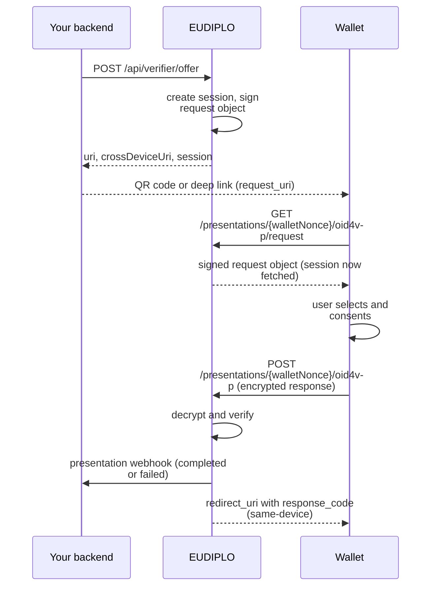
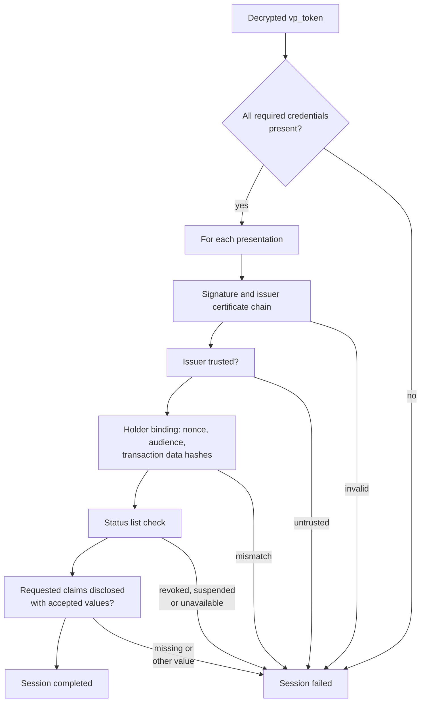
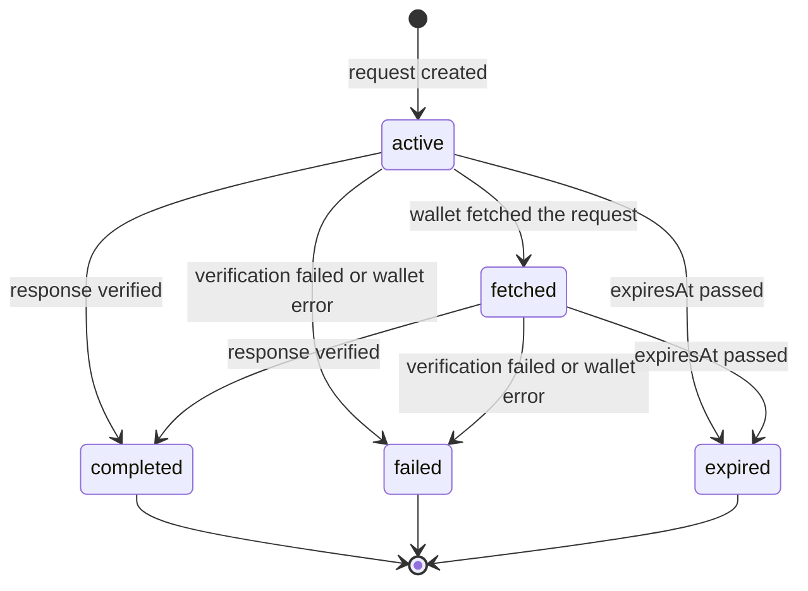

# Presentation under the hood

This page explains what EUDIPLO does during a presentation: the message flow, what the request object contains and how a response is verified. To set up verification, start with the [presentation guides](../presentation/index.md); supported features are listed in [Supported protocols](../reference/protocols.md).

## Flow



`POST /api/verifier/offer` creates the session and signs the request object right away. The response contains `uri` for same-device use, `crossDeviceUri` for a QR code shown on another device, and the `session` ID your backend uses to read the result. Fetching the request through `crossDeviceUri` (its path ends in `/request/no-redirect`) removes the redirect URI, so the wallet does not open the relying party's page on the phone after a cross-device presentation.

The wallet-facing URLs contain a `walletNonce`, not the session ID; [Sessions](sessions.md#session-binding-oid4vp-133) explains why.

## Request object

The request object is a JWT with `typ: oauth-authz-req+jwt`, signed with `ES256` by the presentation configuration's `access` key chain, whose certificate chain is in the `x5c` header.

```json
{
    "response_type": "vp_token",
    "response_mode": "direct_post.jwt",
    "client_id": "x509_hash:<hash of the access certificate>",
    "response_uri": "https://eudiplo.example.com/presentations/<walletNonce>/oid4vp",
    "state": "<walletNonce>",
    "nonce": "<random UUID>",
    "dcql_query": { "credentials": [{ "id": "membership", "format": "dc+sd-jwt", "meta": { "vct_values": ["urn:example:membership:1"] } }] },
    "client_metadata": {
        "jwks": { "keys": ["<ephemeral ECDH-ES public key>"] },
        "encrypted_response_enc_values_supported": ["A128GCM", "A256GCM"],
        "vp_formats_supported": { "dc+sd-jwt": {}, "mso_mdoc": {} }
    }
}
```

What EUDIPLO adds to the configured DCQL query:

- **`client_id`** is derived from the access certificate: `x509_hash` by default, `x509_san_dns` if the request asks for it.
- **Response encryption key.** Each session gets a fresh P-256 key pair. The public key goes into `client_metadata.jwks`; the private key is stored encrypted in the session and deleted when the session ends.
- **`nonce`** is a random value per request; the wallet must bind its presentation to it.
- **Trusted authorities.** `etsi_tl` entries in the configuration reference trust lists. In the request they become `aki` values, the key identifiers of the issuer certificates listed in those trust lists; trust lists whose issuers cannot all be expressed that way are also sent as `etsi_tl` URLs. See [DCQL](../presentation/dcql.md).
- **Optional parts:** `transaction_data` (from the request or the configuration), and a registration certificate in `verifier_info` if the configuration requests one.

### Delivery variants

| Variant                  | How the request reaches the wallet                                                         | Where the response goes                                         |
| ------------------------ | ------------------------------------------------------------------------------------------ | --------------------------------------------------------------- |
| `uri`                    | `openid4vp://` link with `request_uri`, as QR code or deep link                            | The wallet posts to `response_uri`                              |
| `dc-api`                 | Your page passes the request object to the browser's Digital Credentials API; `response_mode` is `dc_api.jwt` and `expected_origins` holds your page's origin | Your page posts the wallet's encrypted response to `response_uri` |
| `iso-18013-7`            | `device_request` and `encryption_info` for the `org-iso-mdoc` protocol                     | Your page posts to `POST /presentations/{session}/iso-18013-7`  |

The ISO 18013-7 variant uses its own request format (HPKE encryption with the tenant's `encrypt` key chain, mdoc device authentication) and does not use `redirectUri`, `transaction_data` or `clientIdScheme`. Details are in [Presentation requests](../presentation/requests.md).

## Wallet response

The wallet posts `response=<JWE>` to the `response_uri`. EUDIPLO only accepts encrypted responses: it decrypts the JWE with the session's private key and checks that `state`, if present, equals the `walletNonce`. The decrypted `vp_token` is an object keyed by DCQL credential `id`, each with one or more presentations.

If the user declines or the wallet cannot answer, the wallet sends an OAuth error (`error`, `error_description`) instead, plain or encrypted. EUDIPLO marks the session `failed` with the wallet's error code and answers with HTTP 200.

## Verification pipeline



1. **Completeness.** Every required `credential_sets` option must be satisfied; without credential sets, every credential query must be answered. Credential IDs that are not in the query are rejected, and a query that does not set `multiple: true` accepts only one presentation.
2. **Signature and trust.** The format verifier (SD-JWT VC or mdoc) checks the issuer signature, builds the issuer certificate chain and checks every certificate's validity period. Trust is opt-in per credential query: with `trusted_authorities`, the chain must match a PID or EAA issuer listed in one of the trust lists, and a trust list that cannot be loaded, has a bad signature or is past its next update fails the check. Without `trusted_authorities`, any validly signed issuer is accepted. Certificate revocation (CRL, OCSP) is not checked. `openid_federation` authorities are evaluated as described in [OpenID Federation](../trust/federation.md).
3. **Holder binding.** The key binding JWT (SD-JWT VC) or device authentication (mdoc) must match the request's `nonce` and audience and, with transaction data, contain the matching hashes.
4. **Status.** The credential's status list is fetched and checked according to `statusCheckMode`: `strict` fails if the list is unavailable, `best_effort` continues, `disabled` skips the check.
5. **Claims.** The requested claims, or one of the `claim_sets`, must be disclosed, each with one of its `values` if the claim query lists them (`claim_value_mismatch` otherwise).

A failed check records the failure as a structured `outcome` on the session, with a machine-readable code such as `trust_chain_not_trusted` ([Session outcome](../reference/session-outcome.md)).

## Result

On success, EUDIPLO completes the session in a single conditional update, so a second response for the same request is rejected. It stores the disclosed claims and a one-time `response_code`, then:

- sends the [presentation webhook](../reference/webhooks.md#presentation-webhook), whose answer may replace the redirect URI;
- answers the wallet with `redirect_uri` plus `response_code` if a redirect URI is set (from the request, the configuration or the webhook), so the user returns to your page on the same device.

On failure, the webhook reports `failed`, and the redirect carries `error` and `error_description` instead of a `response_code`. Your backend can also follow the session through polling or the event stream ([Receive results](../presentation/receive-results.md)).

## Session states



A request expires after the configuration's `lifeTime` (default 300 seconds). The DC API and ISO 18013-7 variants can complete without a `fetched` step. Rules shared with issuance are on [Sessions](sessions.md).
