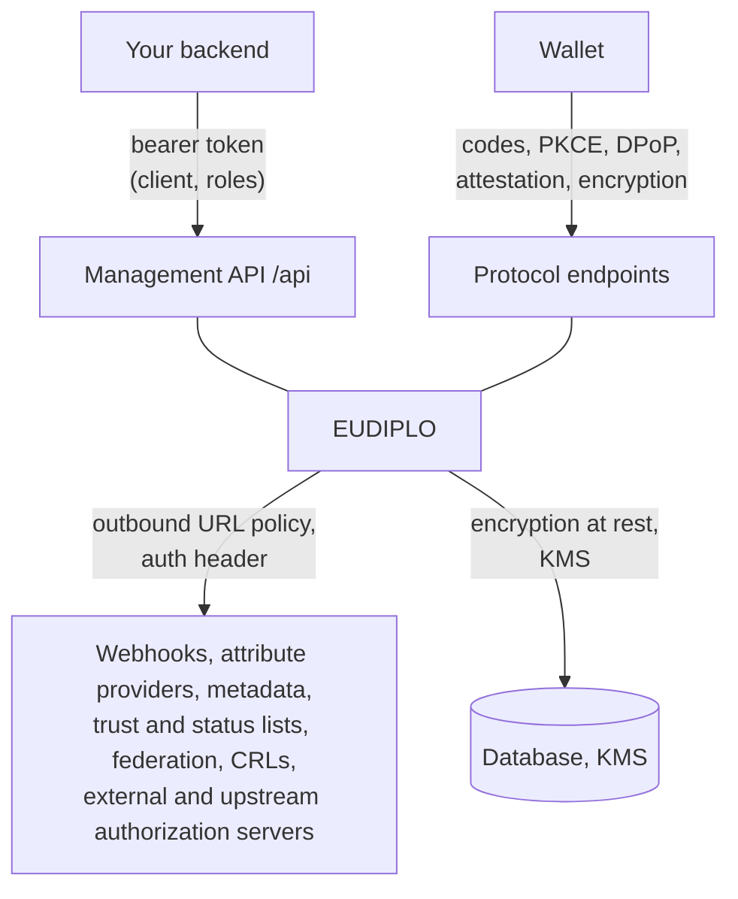

# Security model

This page describes who EUDIPLO trusts, how each boundary is protected and which keys protect which messages. It explains the model only: hardening steps are in the [production checklist](../operate/production-checklist.md), and the presentation session binding (OID4VP §13.3) is explained on [Sessions](sessions.md#session-binding-oid4vp-133).

## Trust boundaries

| Boundary                 | Callers                                   | Protection                                                                                                                                                       |
| ------------------------ | ----------------------------------------- | ---------------------------------------------------------------------------------------------------------------------------------------------------------------- |
| Management API (`/api`)  | Your backend, the web client              | OAuth 2.0 bearer token of a client. The token names one tenant and the client's roles; allow lists can further restrict which configurations a client may use. Changes to tenants and to issuance and presentation configuration are written to an [audit log](../operate/logging.md#audit-log). |
| Protocol endpoints       | Wallets, and your page for the DC API     | Public by design. Each step is protected by the protocol: single-use codes and nonces, PKCE, DPoP, wallet and key attestation, signed requests and encrypted responses. |
| Outbound calls           | EUDIPLO to URLs that tenants configure or that credentials and certificates name | Outbound URL policy (below), optional API key header for webhooks and attribute providers. Webhook requests are not signed. |
| Storage and key material | EUDIPLO to database, object storage, KMS  | Sensitive columns encrypted at rest; with an external KMS the private keys never leave it. Configuration bundle exports never contain private keys. `GET /api/key-chain/{id}/export` returns the private key of a `db` key chain and, like the tenant KMS provider configuration with its provider credentials, needs `tenant:admin` or `tenants:manage`. |

Tenants are isolated in the data layer: every entity carries a `tenantId`, and a client token only reaches its own tenant. A client with the `tenants:manage` role can manage all tenants, so give it only to platform operators ([Tenants and access](../operate/tenants-and-access.md)).

### HTTPS and TLS

Wallets expect HTTPS for every issuer and verifier URL, so `PUBLIC_URL` must be an HTTPS URL. TLS is terminated by a reverse proxy or by EUDIPLO itself ([TLS](../operate/tls.md)).

For outgoing requests to URLs that tenants configure or that credentials and certificates name (webhooks, attribute providers, issuer metadata, rulebooks and schemas, trust lists, status lists, OpenID Federation entity configurations, certificate revocation lists, and the metadata, keys, token and introspection endpoints of external authorization servers and of the chained server's upstream provider), EUDIPLO applies an outbound URL policy against server-side request forgery: only HTTPS targets that resolve to public addresses are allowed, checked after DNS resolution, and every redirect of a download is checked again. `OUTBOUND_URL_ALLOW_HTTP` and `OUTBOUND_URL_ALLOW_PRIVATE_NETWORK` relax this for development or in-cluster services. `OUTBOUND_URL_ALLOWED_HOSTS` narrows it: when set, only the listed hosts and their subdomains are reachable, and they still need HTTPS and public addresses unless the two flags allow otherwise ([environment variables](../reference/environment-variables.md#webhook)).

Two exceptions keep standard deployments working. Trust lists, status lists, federation entity configurations and authorization server keys (JWKS) on EUDIPLO's own `PUBLIC_URL` or `INTERNAL_URL` origin skip the policy, because managed trust lists, the status lists of credentials EUDIPLO issued and the keys of its chained and OID4VP-based authorization servers are fetched from there; a redirect to another origin is checked again. CRL distribution points may use plain HTTP regardless of `OUTBOUND_URL_ALLOW_HTTP`, as is usual for CRLs (RFC 5280); their address is still checked, and a CRL only counts if the CA that issued the certificate signed it ([revocation check](../trust/keys-and-certificates.md#revocation-check)).

Webhooks and attribute providers check every redirect target against the policy and send their API key only to the origin of the configured URL. The token request to the upstream provider and token introspection requests do not follow redirects. KMS providers, including those in a tenant's KMS configuration, are called without the policy; restrict EUDIPLO's egress at the network level if they must not reach internal services.

### Trust decisions

| Decision                                   | Based on                                                                                                                       |
| ------------------------------------------ | ------------------------------------------------------------------------------------------------------------------------------ |
| Is a presented credential's issuer trusted? | Its certificate chain against the LoTE trust lists named in the DCQL query, if any, and optionally OpenID Federation ([Presentation under the hood](presentation.md#verification-pipeline)) |
| Is an external or upstream authorization server trusted? | With a federation policy in the issuance configuration, the server must be trusted by it before EUDIPLO fetches its metadata |
| Is a wallet trusted?                       | Wallet and key attestations, checked against wallet-provider trust lists ([below](#wallet-and-key-attestation))                 |
| Is EUDIPLO trusted by the wallet?          | The access certificate on requests and signed metadata, the registration certificate, and the issuer certificate in credentials |

OpenID Federation support does not yet verify entity statements cryptographically; [OpenID Federation](../trust/federation.md) describes what is and is not checked.

## Tokens and codes

| Token                         | Issued by                                   | Accepted at                                       | Lifetime                                                     | Bound to                                                    |
| ----------------------------- | ------------------------------------------- | ------------------------------------------------- | ------------------------------------------------------------ | ----------------------------------------------------------- |
| Management API token          | `/api/oauth2/token`, or your OIDC provider  | `/api/...`                                        | 24 hours (built-in server)                                   | Client, tenant, roles                                       |
| Pre-authorized code           | EUDIPLO, in the offer                       | Token endpoint                                    | Until the session TTL ends; single use                       | Session; optional `tx_code`                                 |
| Authorization code            | Hosted authorization server                 | Token endpoint                                    | 60 seconds (built-in), 300 seconds (chained, OID4VP-based); single use | Session, grant, PKCE challenge, DPoP key from PAR   |
| OID4VCI access token          | Hosted or external authorization server     | Credential, deferred and notification endpoints   | Built-in: `token.lifetimeSeconds`, default 300 seconds; chained and OID4VP-based: default 3600 seconds | Session; DPoP key (`cnf.jkt`) if DPoP is used |
| Refresh token                 | Hosted authorization server                 | Token endpoint                                    | 30 days by default; not extended by use                      | Session, DPoP key, wallet attestation key                   |
| Credential nonce              | `POST /issuers/{tenant}/vci/nonce`          | Key proofs at the credential endpoint             | Single use                                                   | Tenant                                                      |

Refreshing never extends the authorization: the built-in server keeps the refresh token, the chained and OID4VP-based servers replace it, and in both cases its original expiry stays. Presentation-side values (`nonce`, `response_code`) are described on [Sessions](sessions.md#session-binding-oid4vp-133).

### PKCE

Every authorization code requires PKCE with `S256`: a PAR request without `code_challenge`, or with any other method, is rejected, and the token request must send the matching `code_verifier`. This applies to the built-in, chained and OID4VP-based servers and to interactive authorization. The chained server also uses `S256` towards the upstream provider.

### DPoP

DPoP (RFC 9449) binds an access token to a key the wallet holds, so a stolen token is useless without that key. EUDIPLO verifies every DPoP proof:

- the signature with the public key in the proof header,
- `htm` and `htu` against the request method and URL,
- `iat` no older than 300 seconds, with 60 seconds of clock skew,
- `jti` used once per key, tracked in the database until the proof leaves the freshness window, so a replay is caught across backend instances,
- at the credential, deferred and notification endpoints, `ath` (the access token hash) and the key against the token's `cnf.jkt`.

A key presented at PAR must be used again at the token endpoint and for refreshes. DPoP is required at the credential, deferred and notification endpoints when the issuance configuration sets `dPopRequired`. At the token endpoint, the built-in server requires it with `dPopRequired` or its own `requireDPoP`, the chained and OID4VP-based servers with their `requireDPoP`. A bad proof is answered with `invalid_dpop_proof` at PAR and token, and with HTTP 401 `invalid_token` at the other endpoints. Configuration: [Authorization servers](../issuance/authorization-servers.md).

### Wallet and key attestation

Both mechanisms are signed by the wallet provider and trusted through wallet-provider trust lists, but they answer different questions:

|              | Wallet attestation                                                         | Key attestation                                                                               |
| ------------ | -------------------------------------------------------------------------- | --------------------------------------------------------------------------------------------- |
| Question     | Is this wallet a trusted OAuth client of this authorization server?        | Is this holder key, and the way it is stored and unlocked, acceptable for the credential?     |
| Sent         | `OAuth-Client-Attestation` and `OAuth-Client-Attestation-PoP` headers at PAR and token | An `attestation` proof, or a `key_attestation` header in a `jwt` proof, at the credential endpoint |
| Required by  | The authorization server entry, with issuance-level defaults               | The credential configuration (`keyAttestationsRequired`, `proofTypesSupported`)               |
| Trust anchor | The authorization server's wallet-provider trust lists, or the issuance-level ones | The issuance configuration's `walletProviderTrustLists`                                |

External authorization servers cannot enforce wallet attestation through EUDIPLO. How to configure both: [Wallet and key attestation](../trust/attestation.md).

## Keys and algorithms

EUDIPLO signs with ES256 (ECDSA on P-256) only; `CRYPTO_ALG` accepts no other value, and the verifier metadata advertises ES256. Each operation uses the following key:

| Operation                                                   | Key                                                                                         | Algorithm                       |
| ----------------------------------------------------------- | ------------------------------------------------------------------------------------------- | ------------------------------- |
| Access tokens of hosted authorization servers               | `token.signingKeyId`, then the issuance `signingKeyId`, else the tenant's first signing key chain | ES256                      |
| SD-JWT VC credentials, mdoc MSO                             | `attestation` key chain (`keyChainId` of the credential configuration)                      | ES256                           |
| Status lists                                                | `statusList` key chain                                                                      | ES256                           |
| Trust lists hosted by EUDIPLO                               | `trustList` key chain                                                                       | ES256                           |
| OID4VP request objects, signed issuer metadata, `client_id` | `access` key chain (`accessKeyChainId` of the presentation configuration)                   | ES256                           |
| Encrypted credential requests, ISO 18013-7 responses        | `encrypt` key chain, published in the issuer metadata                                       | ECDH-ES (JWE), HPKE (ISO)       |
| OID4VP responses                                            | A fresh key pair per session, not a key chain                                               | ECDH-ES with A128GCM or A256GCM |
| Credential responses                                        | The wallet's key from the credential request                                                | ECDH-ES with A128GCM or A256GCM |

Key chains live in a KMS provider. With the `db` provider, the private key is stored encrypted in the database; with Vault, AWS KMS, PKCS#11, CSC or an HTTP signer, EUDIPLO only sends data to be signed. Usage types and certificates are explained in [Keys and certificates](../trust/keys-and-certificates.md), providers in [Key management](../operate/kms.md).

### Rotation

A key chain rotates its signing key automatically by its `rotationPolicy` (a daily job checks `intervalDays`) or on demand (`POST /api/key-chain/{id}/rotate`). Rotation creates a new key in the same KMS provider and a new certificate, issued by the chain's internal root CA if it has one and self-signed otherwise; new signatures use it immediately. The previous key and certificate stay available for a fixed grace period of 30 days, so relying parties can still validate recently signed tokens, credentials and lists.

## Encryption at rest

Sensitive columns are encrypted with AES-256-GCM: the private key material of `db` key chains, secrets in the configuration (registrar credentials, webhook and attribute provider API keys, upstream client secrets of chained authorization servers), session data such as offers, authorization requests, presented credentials and response encryption keys, the state of interactive authorization, and the upstream claims of chained authorization. Refresh tokens, authorization codes and pre-authorized codes are stored only as hashes. The data encryption key comes from `ENCRYPTION_KEY_SOURCE`: by default it is derived from `MASTER_SECRET` with HKDF; with `vault`, `aws` or `azure` it is fetched from a secret store at startup and held only in memory. Losing or changing this key makes the encrypted data unreadable, and it also anchors the fingerprints of the [single active credential](issuance.md#single-active-credential) policy. Operating the key: [Encryption keys](../operate/encryption-keys.md).
