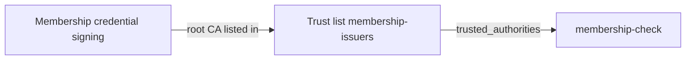

This is chapter 3 of the **Issue and verify** cookbook. You publish a trust list with your issuer, request the `name` and `member_id` claims of the membership credential from chapter 2, approve the request in the wallet, and inspect the verified result.

## What you will build

A managed trust list `membership-issuers` that EUDIPLO signs and publishes, listing the issuer certificate of chapter 2, and a presentation configuration `membership-check` with one DCQL credential query `membership`. It asks for the two claims of `urn:example:membership:1`, accepts them only from issuers on `membership-issuers`, and the request is signed with the access certificate from chapter 2.



## Before you start

- **Starts from:** [chapter 2, Issue a membership credential](first-credential.md). The wallet holds the `Membership` credential with `Max` and `M-001`.
- You are signed in as `membership-demo-admin`, and the public HTTPS URL is unchanged.
- The access key chain `Membership verifier access` has a certificate that your wallet's test environment accepts.

## Step 1: Create the keys for the trust list

Every credential query of a presentation configuration names the issuers it accepts, here through a trust list. Open **Cryptographic Assets → Keys** and create two key chains with **Create Key**:

| Usage                   | Description                       | Purpose                                                           |
| ----------------------- | --------------------------------- | ----------------------------------------------------------------- |
| **Trust List Signing**  | `Membership trust list signing`   | Signs the trust list                                              |
| **Status List Signing** | `Membership status list signing`  | Listed as the issuer's status list certificate                    |

EUDIPLO does not create a trust list signing key on its own, even though the trust list form offers **Auto-generate**.

**Checkpoint:** both key chains appear under **Keys**.

## Step 2: Publish the trust list

Open **Credential Issuance → Trust Lists**, choose **+** (**Create new Trust List**) and enter:

1. **ID** `membership-issuers`, **Description** `Issuers accepted for membership checks`, **Signing Key Chain** `Membership trust list signing`.
2. Choose **Add Internal Entity**. Keep **Provider type** **Credential provider**, select **Issuer Key Chain** `Membership credential signing` and **Revocation Key Chain** `Membership status list signing`, and enter **Entity Name** `Membership Demo`.
3. Choose **Create Trust List**.

For an internal entity, EUDIPLO lists the root CA certificate of the issuer key chain. The root stays the same when the signing key rotates. To list an issuer of another organization, choose **Add External Entity** and paste its certificates instead.

<details>
<summary>Equivalent API call</summary>

`POST /api/trust-list` with the key chain IDs from **Keys**:

```json
{
    "id": "membership-issuers",
    "description": "Issuers accepted for membership checks",
    "keyChainId": "<ID of Membership trust list signing>",
    "entities": [
        {
            "type": "internal",
            "issuerKeyChainId": "<ID of Membership credential signing>",
            "revocationKeyChainId": "<ID of Membership status list signing>",
            "info": { "name": "Membership Demo" }
        }
    ]
}
```

</details>

**Checkpoint:** the trust list page shows the **Trust List URL** `https://YOUR-HTTPS-HOST/issuers/membership-demo/trust-list/membership-issuers`. Wallets and verifiers fetch the list there, so the URL starts with the backend's `PUBLIC_URL`, not with the address you signed in with. It serves a signed list:

```bash
curl -s https://YOUR-HTTPS-HOST/issuers/membership-demo/trust-list/membership-issuers | cut -c1-40
```

The output starts with `eyJ`, the beginning of a signed JWT.

A managed list is valid for 30 days. EUDIPLO re-signs it automatically during the last 10 days, so it never expires while the instance runs.

## Step 3: Define what to request

Open **Credential Verification → Verification Configs** and choose **+** (**Create Configuration**).

1. On **1. Name**, enter **ID** `membership-check` and **Description** `Verify a membership name and ID`. Choose **Continue**.
2. On **2. Credentials**, choose **Add credential** and enter:

    | Field                 | Value                      |
    | --------------------- | -------------------------- |
    | Query ID              | `membership`               |
    | Credential format     | **SD-JWT VC**              |
    | Credential type (VCT) | `urn:example:membership:1` |
    | Claim path            | `name`                     |

3. Choose **Add claim** and enter `member_id` as the second **Claim path**.
4. Expand **Issuer trust**, choose **Add managed trust list** and select `membership-issuers` as **Managed trust list**.
5. Keep **Require all selected credentials** under **Accepted credential combinations**. Choose **Continue**.

**Checkpoint:** the query asks for exactly two claims of the VCT you issued and names `membership-issuers` under **Issuer trust**. The wallet matches on VCT and claim paths, not on the credential configuration ID.

<details>
<summary>Equivalent DCQL for API users</summary>

```json
{
    "credentials": [
        {
            "id": "membership",
            "format": "dc+sd-jwt",
            "meta": {
                "vct_values": ["urn:example:membership:1"]
            },
            "claims": [{ "path": ["name"] }, { "path": ["member_id"] }],
            "trusted_authorities": [{ "type": "etsi_tl", "values": [{ "trustListId": "membership-issuers" }] }]
        }
    ]
}
```

</details>

EUDIPLO uses the trust list in two places:

- **In the request to the wallet**, it replaces the reference with `{"type": "aki", "values": [...]}`, the key identifiers of the listed issuer certificates. If a list cannot be loaded or an entry has no key identifier, it also sends the list URL as `etsi_tl`. Wallets that support `trusted_authorities` offer only matching credentials.
- **During verification**, the issuer certificate chain of the presented credential must lead to a listed entity. This check happens no matter what the wallet does.

For other credentials, **Import from Issuer** fills in the types and claim paths from issuer metadata. See [DCQL](../presentation/dcql.md) for claim options and alternatives.

## Step 4: Review the verification settings

On **3. Settings**:

1. Keep **Lifetime of the request** at `300` seconds and **Status List Check Mode** at **Strict**. The cookbook credential has no status entry, so there is nothing to check yet.
2. Open **Request and verification options** and select `Membership verifier access` in **Access Key Chain (optional)**. Do not select the credential signing key.
3. Leave the registration certificate empty unless your wallet requires one.
4. Leave redirect URI, webhook and the other options empty.
5. Choose **Continue**, check that the review lists `name` and `member_id`, then choose **Create Configuration**.

**Checkpoint:** `membership-check` appears under **Verification Configs**. Only credentials of this type from issuers on `membership-issuers` pass; [Accept only trusted issuers](trusted-issuers.md) shows what happens to one from another issuer.

## Step 5: Generate and approve a request

1. Open `membership-check` and choose the **Create offer** button, or open **Credential Verification → New Verification** and select `membership-check` as **Presentation Configuration**.
2. Choose **Generate Request**.
3. Scan the QR code with the wallet that holds the credential.
4. Check that the wallet offers the membership credential and asks for name and member ID, then approve before the request expires.

**Checkpoint:** the wallet reports that the data was shared. That alone does not prove that verification succeeded; check the session in the next step.

## Step 6: Inspect the verified session

Open **Sessions → All Sessions** and open the new presentation session. Its status chip shows `completed`. The **Credentials** tab shows the verified claims for query `membership`:

| Claim       | Expected value |
| ----------- | -------------- |
| `name`      | `Max`          |
| `member_id` | `M-001`        |

**Checkpoint:** the session is `completed` and shows both values. A `failed` session is never a success, even if the wallet reported that it shared the data.

You have now issued and verified a credential end to end. In an application, you receive this result by webhook instead of reading the session view; see [Integrate into your backend](integrate-backend.md).

## Troubleshooting

| Symptom                                     | Cause                                                                    | Fix                                                                                                               |
| ------------------------------------------- | ------------------------------------------------------------------------ | ----------------------------------------------------------------------------------------------------------------- |
| Creating the trust list fails with `409` about the key | No key chain with usage **Trust List Signing**, or a different one selected | Create the key in step 1 and select it as **Signing Key Chain**.                                       |
| Saving fails with `Credential queries without trusted_authorities` | **Issuer trust** of the query is empty                   | Add `membership-issuers` as managed trust list (step 3).                                                          |
| Wallet finds no matching credential         | VCT or claim path differ from chapter 2, the credential expired, or the wallet cannot match the `aki` values | Compare `urn:example:membership:1`, `name` and `member_id` with the credential type; issue a fresh credential. See [Accept only trusted issuers](trusted-issuers.md#troubleshooting) for wallets that cannot match `aki` values. |
| Session `failed` with `trust_chain_not_trusted` | The trust list entity lists a different issuer key chain             | Edit the list and select `Membership credential signing` as **Issuer Key Chain**.                                 |
| Reminder about a missing access certificate | No access key chain selected, or its certificate is not active           | Select `Membership verifier access` in **Access Key Chain (optional)**.                                           |
| Request expired                             | Approved after the 300-second lifetime                                   | Generate a new request and approve it right away.                                                                 |
| Changed claims do not show up               | A wallet credential keeps the claims it was issued with                  | Issue a new credential, then generate a new request.                                                              |

Verifier trust, overasking and failed-session errors are covered in [Troubleshooting](../troubleshooting.md#presentation).

## Next steps

- [Integrate into your backend](integrate-backend.md): create offers and requests from your code and receive the results by webhook.
- [Revocable credentials](revocable-credentials.md): revoke the credential and watch verification fail.
- [Accept only trusted issuers](trusted-issuers.md): watch `membership-check` reject a credential from an issuer that is not on the trust list, and use a list published by someone else.
- [All recipes](index.md)
