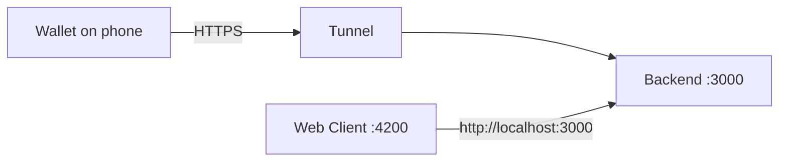

This is chapter 1 of the **Issue and verify** cookbook. You start EUDIPLO and the Web Client on your computer, make the backend reachable from your phone over HTTPS, and sign in as the root administrator.

## What you will build

A local EUDIPLO deployment created by the CLI: the backend on port `3000` with SQLite, local file storage and database-backed keys, plus the Web Client on port `4200`. An HTTPS tunnel forwards a public address to port `3000`, so the wallet on your phone can reach the backend.



## Before you start

- **Container runtime:** Docker with Docker Compose v2, or Podman with Podman Compose. Start it before you run the commands below.
- **No other EUDIPLO stack on this machine:** the cookbook uses ports `3000` and `4200`. If you ran `eudiplo demo`, stop it with `eudiplo down --instance local`.
- **A wallet on your phone** that supports SD-JWT VC, the pre-authorized code flow and OpenID4VP. See [Choosing a wallet](index.md#choosing-a-wallet).
- **A tunnel tool** such as [ngrok](https://ngrok.com/docs/share-localhost/quickstart), Cloudflare Tunnel or localtunnel. Free plans can change the URL on restart; you need one stable URL for the whole cookbook.
- **Starts from:** nothing.

## Step 1: Install the CLI

```bash
curl -fsSL https://eudiplo.dev/install.sh | bash
eudiplo --version
```

The installer verifies the release checksum and puts the standalone binary in `~/.local/bin`. It does not need Node.js on Linux (x64, arm64) or Apple-silicon Macs. Watch for two cases:

- If `eudiplo` is not found afterwards, add the directory to your shell profile, as the installer prints: `export PATH="$HOME/.local/bin:$PATH"`.
- On Intel Macs and other platforms without a standalone build, the installer falls back to `npm install -g @eudiplo/cli`. This needs Node.js 22.12 or later and npm. On Windows, use `npx @eudiplo/cli` instead of `eudiplo` in every command.

**Checkpoint:** `eudiplo --version` prints a version number.

## Step 2: Get an HTTPS address for the backend

A phone cannot use your computer's `localhost`: it would connect to the phone itself. The wallet must fetch issuer metadata from EUDIPLO and send its responses there. Start a tunnel to local port `3000`, for example:

```bash
ngrok http 3000
```

Keep this terminal open. Below, `https://YOUR-HTTPS-HOST` stands for the forwarding URL, without a trailing slash. Use this exact address from now on: issued credentials and offers contain URLs that point back to it. If the address changes later, update the deployment and issue a fresh credential.

**Checkpoint:** the tunnel shows an HTTPS forwarding URL. Requests to it return a gateway error until EUDIPLO runs.

## Step 3: Initialize and start EUDIPLO

In a second terminal, create an empty project directory and initialize it:

```bash
mkdir eudiplo-cookbook
cd eudiplo-cookbook
eudiplo init . --instance cookbook --preset minimal --no-demo-tenant --client \
  --public-url https://YOUR-HTTPS-HOST --yes --start
```

This writes `eudiplo.compose.yaml`, `.eudiplo.env` and `config/kms.json`, registers the deployment as CLI instance `cookbook`, and starts it. Instead of the predictable demo credentials, it generates a root client secret and a `MASTER_SECRET`. Keep `.eudiplo.env` private. The SQLite database is stored in `config/`.

The cookbook passes `--instance cookbook` to every CLI command, so the commands reach this deployment even if another instance is your CLI default.

**Checkpoint:** the command ends without errors, and `eudiplo ps --instance cookbook` lists the services `eudiplo` and `eudiplo-client` as running.

## Step 4: Check both network paths

```bash
eudiplo status --instance cookbook
curl http://localhost:3000/health
curl https://YOUR-HTTPS-HOST/health
```

`eudiplo status` checks the public URL you registered. Both `curl` calls return JSON with `"status":"ok"`.

Then open `https://YOUR-HTTPS-HOST/health` in the **browser on your phone**. It must show the same JSON, without a certificate warning, tunnel login or confirmation page. Some free tunnels show such a page on the first visit; the wallet cannot click through it.

**Checkpoint:** the health response appears on both the computer and the phone. Do not continue to QR codes until it does.

## Step 5: Sign in to the Web Client

1. Open [http://localhost:4200](http://localhost:4200), or run `eudiplo open --instance cookbook`.
2. In **EUDIPLO Instance**, enter `http://localhost:3000`. The field can be prefilled with `http://eudiplo:3000`, the backend's address inside the Compose network, which your browser cannot reach.
3. Read the root credentials from the project directory: `grep AUTH_CLIENT .eudiplo.env`.
4. On the **Client ID and Secret** tab, enter `AUTH_CLIENT_ID` (by default `root`) as **Client ID** and `AUTH_CLIENT_SECRET` as **Client Secret**.
5. Choose **Login with Client Credentials**.

The Web Client is for administration from your computer only. The wallet never talks to it; it uses the `PUBLIC_URL` of the backend.

**Checkpoint:** the dashboard opens, and the navigation shows **Administration → Tenants**.

## Which certificates does your wallet need?

:::tip[Decide before chapter 2]
The next chapter creates a signing key for credentials and an access certificate for presentation requests. Some wallet test setups (for example Paradym) accept self-signed certificates. The EU Reference Implementation and the German ecosystem need certificates from their registrar.
Check your wallet's row in [Wallet and registrar requirements](../trust/wallet-registrars.md) and have those certificates ready.
:::

## Troubleshooting

| Symptom                                         | Cause                                                       | Fix                                                                                                                                                         |
| ----------------------------------------------- | ----------------------------------------------------------- | ----------------------------------------------------------------------------------------------------------------------------------------------------------- |
| `init` fails with "port is already allocated"   | The demo or another stack uses port `3000` or `4200`        | Stop the other stack (`eudiplo down --instance local` for the demo), then run `eudiplo up --instance cookbook`.                                             |
| Local health works, phone health fails          | Tunnel stopped, wrong target port or an interstitial page   | Restart the tunnel to port `3000`; make sure the phone gets the JSON directly.                                                                              |
| Offers or metadata contain `localhost` or an old tunnel URL | `PUBLIC_URL` in `.eudiplo.env` is wrong              | Edit `PUBLIC_URL`, run `eudiplo up --instance cookbook` (Compose recreates the backend with the new environment), then create a new offer.                   |

For login errors, `eudiplo: command not found` and other common problems, see [Troubleshooting](../troubleshooting.md).

## Next steps

- Keep the deployment and the tunnel running. To stop it later, run `eudiplo down --instance cookbook`.
- Continue with chapter 2: [Issue a membership credential](first-credential.md).
