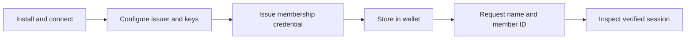

<!-- RESTRUCTURE: content that belongs elsewhere or needs restructuring in the next phase (remove this comment when done):
  - turn this page into the cookbook catalog; merge the appended 'Choose your next outcome' table (from removed getting-started/next-steps.md) into the catalog
  - chapter table, ingredients and shared values belong to the issue-and-verify recipe (cookbooks/first-credential.md, cookbooks/first-presentation.md)
-->

Build one complete flow: run EUDIPLO, issue a membership credential to a wallet, then request and verify its claims. Use the Web Client wizards throughout; you do not need to write an application or assemble API requests first.

## What you will build

| Chapter                                                      | What you do                                                                        | Checkpoint                                                           |
| ------------------------------------------------------------ | ---------------------------------------------------------------------------------- | -------------------------------------------------------------------- |
| [1. Install and connect](foundation.md)                     | Start a minimal instance with an HTTPS address the phone can reach                 | Health endpoint works on both computer and phone                     |
| [2. Wallet and registrar requirements](../trust/wallet-registrars.md) | Choose wallet-specific access and registration certificates                        | The target wallet's trust prerequisites are known                    |
| [3. Issue your first credential](first-credential.md)        | Create a tenant, keys, issuer identity, and a membership credential; send an offer | Wallet contains `Membership` with `name: Max` and `member_id: M-001` |
| [4. Verify the credential](first-presentation.md)            | Request those same claims and approve their disclosure                             | A successful presentation session contains `Max` and `M-001`         |
| [5. Extend the flow](#choose-your-next-outcome)                          | Add application integration and deployment-specific trust                          | Choose the next capability your application needs                    |

Follow the chapters in order. Keep the same instance, tenant, public URL, and wallet for the whole recipe. The wallet and registrar chapter is a decision point: complete the self-signed path for a compatible test wallet, or configure the relevant registrar before issuing and verifying.

## Recipe ingredients

- Docker with Docker Compose, or Podman with Podman Compose. The standalone `eudiplo` CLI does not require Node.js; Node.js 22+ is required only when using the npm package.
- A computer running the Web Client and a phone running a wallet with SD-JWT VC, pre-authorized issuance, and OpenID4VP support.
- A public HTTPS address forwarding to the backend, such as a development tunnel.
- Synthetic data only: this recipe uses `Max` and `M-001`.

For a starting wallet, the project's [compatibility record](../reference/wallet-compatibility.md#paradym-wallet) lists **Paradym Wallet 1.20.2**, verified on **September 21, 2026**, with issuance and presentation support. That is a historical compatibility record, not a claim that this exact recipe has been tested with every current wallet release. Check the recorded limitations and use a wallet/test environment that accepts your test issuer and verifier certificates. The wallet vendor also documents its [OpenID4VC support](https://paradym.id/articles/paradym-wallet-update).

## Shared values

| Value                      | Used for                                                              |
| -------------------------- | --------------------------------------------------------------------- |
| `membership-demo`          | Tenant ID                                                             |
| `membership`               | Credential configuration ID                                           |
| `urn:example:membership:1` | SD-JWT credential type (VCT), used for both issuance and verification |
| `name`, `member_id`        | Claim paths                                                           |
| `membership-check`         | Presentation configuration ID                                         |
| `membership`               | Credential query ID inside the presentation request                   |

The credential configuration ID identifies what EUDIPLO issues. The VCT identifies the credential type the wallet must match. The presentation configuration ID identifies the reusable verification request. They serve different purposes even when names look similar.

:::note[Scope of this recipe]
This is a learning setup with one tenant acting as both issuer and verifier. It uses test certificates and disables credential status management to keep the first flow small. Production deployments need their own certificate trust, status policy, authentication, and operational setup. See [production deployment](../showcase.md) before using real credentials.
:::

**Start with [Install and Connect](foundation.md).**

## Choose your next outcome

You have completed the [membership cookbook](index.md): installation, issuer setup, issuance, and verification. Keep that working flow as your baseline and add one capability at a time.

| Outcome                             | Change to the recipe                                                                                     | Guide                                                                      |
| ----------------------------------- | -------------------------------------------------------------------------------------------------------- | -------------------------------------------------------------------------- |
| Accept only approved issuers        | Add trusted authorities to `membership-check`; test both an accepted and an untrusted issuer             | [DCQL](../presentation/dcql.md) and [Trust Lists](../trust/trust-lists.md) |
| Issue after login                   | Add an authorization server and use an authorization-code offer                                          | [Authorization](../issuance/authorization-servers.md)                              |
| Fetch real membership data          | Replace the example defaults with an attribute provider                                                  | [Attribute Providers](../issuance/attribute-provider.md)                   |
| Receive results in your application | Configure a webhook and handle successful and failed sessions                                            | [Handling Results](../presentation/receive-results.md)                    |
| Revoke credentials                  | Enable status management, issue a new credential, then test verification after revocation                | [Status Management](../issuance/revocation.md)                      |
| Deploy beyond a local exercise      | Replace test certificate trust, the tunnel, and learning defaults with deployment-specific configuration | [Production](../showcase.md)                                  |

Changing a configuration does not change a credential already stored in a wallet. Reissue the credential when testing a change to its claims, type, signing key, or status settings.
