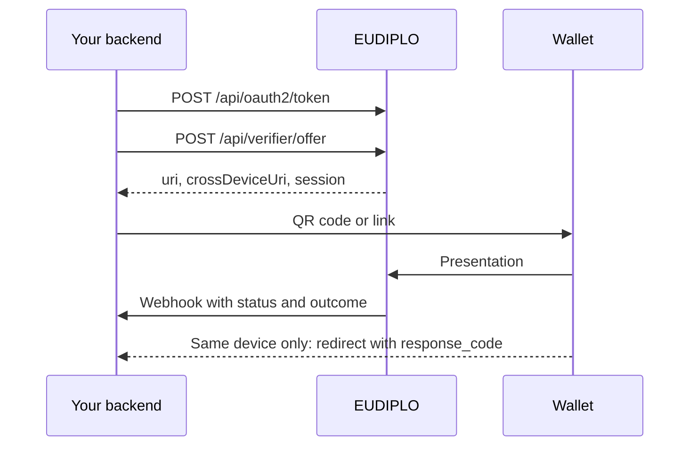

Your backend takes over from the Web Client: it gets a token, creates presentation requests and credential offers, and receives the results by webhook. You make every call once with `curl`, then with `@eudiplo/sdk-core`.

## What you will build

A least-privilege API client `membership-backend`, a small webhook receiver, and the calls that verify and issue the membership credential from the first recipe. You also handle the same-device redirect and failed sessions.



## Before you start

- **Starts from:** [Issue and verify](index.md). You need tenant `membership-demo` with `membership` and `membership-check`, the wallet with the membership credential, and the secret of `membership-demo-admin` from [chapter 2](first-credential.md).
- `curl`, `jq` and Node.js 22 or later. To show QR codes in the terminal, install `qrencode`, or use any other QR tool that runs locally.
- A token of `membership-demo-admin` for the setup calls. `read -rs` waits for you to paste the secret without showing it:

```bash
export EUDIPLO=http://localhost:3000
read -rs ADMIN_SECRET
ADMIN_TOKEN=$(curl -s -X POST "$EUDIPLO/api/oauth2/token" \
  -d grant_type=client_credentials -d client_id=membership-demo-admin \
  --data-urlencode client_secret="$ADMIN_SECRET" | jq -r .access_token)
```

The token endpoint accepts the client credentials in the form body or as HTTP Basic authentication. Tokens are valid for 24 hours (`expires_in: 86400`); request a new one before then.

## Step 1: Create a least-privilege API client

The backend only creates offers and requests, so it gets only `issuance:offer` and `presentation:request`, limited to the two configurations of this recipe:

```bash
curl -s -X POST "$EUDIPLO/api/client" \
  -H "Authorization: Bearer $ADMIN_TOKEN" -H "Content-Type: application/json" \
  -d '{
    "clientId": "membership-backend",
    "description": "Backend integration from the cookbook",
    "roles": ["issuance:offer", "presentation:request"],
    "allowedIssuanceConfigs": ["membership"],
    "allowedPresentationConfigs": ["membership-check"]
  }' | jq
```

The response contains `clientSecret`, shown only this once. Store it in your secret manager and in the shell:

```bash
read -rs BACKEND_SECRET
TOKEN=$(curl -s -X POST "$EUDIPLO/api/oauth2/token" \
  -d grant_type=client_credentials -d client_id=membership-backend \
  --data-urlencode client_secret="$BACKEND_SECRET" | jq -r .access_token)
```

**Checkpoint:** the allow-list works. A request for another configuration is refused:

```bash
curl -s -o /dev/null -w '%{http_code}\n' -X POST "$EUDIPLO/api/verifier/offer" \
  -H "Authorization: Bearer $TOKEN" -H "Content-Type: application/json" \
  -d '{ "response_type": "uri", "requestId": "something-else" }'
```

It prints `403`. All roles are described in the [roles reference](../reference/roles.md).

## Step 2: Run a webhook receiver

Save as `webhook-receiver.mjs`:

```js
import { createServer } from 'node:http';

createServer((req, res) => {
  if (req.headers['x-api-key'] !== process.env.WEBHOOK_API_KEY) {
    res.writeHead(401).end();
    return;
  }
  let body = '';
  req.on('data', (chunk) => (body += chunk));
  req.on('end', () => {
    const event = JSON.parse(body);
    if (event.notification) {
      console.log('issuance', event.session, event.notification.event);
    } else if (event.status === 'completed') {
      console.log('verified', event.session, JSON.stringify(event.credentials));
    } else {
      console.log('failed', event.session, event.outcome?.error, event.outcome?.message);
    }
    res.writeHead(200, { 'content-type': 'application/json' }).end('{}');
  });
}).listen(8787, '0.0.0.0');
```

Start it with `WEBHOOK_API_KEY=change-me node webhook-receiver.mjs`.

EUDIPLO only calls public HTTPS URLs by default. For this local exercise, allow HTTP and private addresses: append these lines to `.eudiplo.env` in the cookbook directory, then run `eudiplo up --instance cookbook`. Never set them in production.

```env
OUTBOUND_URL_ALLOW_HTTP=true
OUTBOUND_URL_ALLOW_PRIVATE_NETWORK=true
```

Register the receiver and attach it to `membership-check`. Inside the container, `host.docker.internal` reaches your computer with Docker Desktop; use `host.containers.internal` with Podman, or your computer's LAN IP address with Docker Engine on Linux.

```bash
curl -s -X POST "$EUDIPLO/api/issuer/webhook-endpoints" \
  -H "Authorization: Bearer $ADMIN_TOKEN" -H "Content-Type: application/json" \
  -d '{
    "id": "membership-backend",
    "name": "Membership backend",
    "url": "http://host.docker.internal:8787/eudiplo",
    "auth": { "type": "apiKey", "config": { "headerName": "x-api-key", "value": "change-me" } }
  }' | jq

curl -s -X PATCH "$EUDIPLO/api/verifier/config/membership-check" \
  -H "Authorization: Bearer $ADMIN_TOKEN" -H "Content-Type: application/json" \
  -d '{ "webhookEndpointId": "membership-backend" }' | jq .webhookEndpointId
```

**Checkpoint:** the second call prints `"membership-backend"`. The full payloads are in [Webhooks](../reference/webhooks.md).

## Step 3: Request a presentation

```bash
curl -s -X POST "$EUDIPLO/api/verifier/offer" \
  -H "Authorization: Bearer $TOKEN" -H "Content-Type: application/json" \
  -d '{ "response_type": "uri", "requestId": "membership-check" }' | tee request.json | jq
qrencode -t ansiutf8 "$(jq -r .crossDeviceUri request.json)"
SESSION=$(jq -r .session request.json)
```

The response has `uri` (same device, with redirect), `crossDeviceUri` (QR code on another screen) and `session`. Scan the QR code with the wallet and approve.

**Checkpoint:** the receiver prints `verified`, the session ID and the claims `"name":"Max"` and `"member_id":"M-001"`.

Webhooks are delivered once and not retried. Read the result from the session at any time, or stream status changes with server-sent events; the stream ends after a final status:

```bash
curl -s "$EUDIPLO/api/session/$SESSION" -H "Authorization: Bearer $TOKEN" \
  | jq '{status, failureCode, outcome}'
curl -N "$EUDIPLO/api/session/$SESSION/events" -H "Authorization: Bearer $TOKEN"
```

## Step 4: Issue a credential

```bash
curl -s -X POST "$EUDIPLO/api/issuer/offer" \
  -H "Authorization: Bearer $TOKEN" -H "Content-Type: application/json" \
  -d '{
    "response_type": "uri",
    "flow": "pre_authorized_code",
    "credentialConfigurationIds": ["membership"],
    "credentialClaims": {
      "membership": { "type": "inline", "claims": { "name": "Max", "member_id": "M-001" } }
    },
    "webhookEndpointId": "membership-backend",
    "offerLifetimeSeconds": 600
  }' | tee offer.json | jq
qrencode -t ansiutf8 "$(jq -r .uri offer.json)"
```

EUDIPLO validates the claims against the credential configuration and returns `uri` and `session`. Scan the QR code with the wallet and accept the credential. Without `offerLifetimeSeconds` or a lifetime in the issuer settings, an offer does not expire.

**Checkpoint:** the session status is `fetched` once the wallet has the credential. If the wallet sends a notification, the receiver prints `issuance <session> credential_accepted` and the status becomes `completed`.

## Step 5: Check the same-device redirect

When the wallet runs on the device that started the flow, send the user back to your application. `{sessionId}` is replaced with the session ID:

```bash
curl -s -X POST "$EUDIPLO/api/verifier/offer" \
  -H "Authorization: Bearer $TOKEN" -H "Content-Type: application/json" \
  -d '{
    "response_type": "uri",
    "requestId": "membership-check",
    "redirectUri": "https://app.example.com/membership/done?session={sessionId}"
  }' | tee same-device.json | jq
qrencode -t ansiutf8 "$(jq -r .uri same-device.json)"
```

Scan this `uri` (not `crossDeviceUri`) and approve. The wallet then opens `https://app.example.com/membership/done?session=<id>&response_code=<code>` in the phone's browser. The page does not need to exist for this test; read the parameters from the address bar.

Before your application trusts the result in that browser, it must compare `response_code` with the session's `responseCode`:

```bash
curl -s "$EUDIPLO/api/session/<id>" -H "Authorization: Bearer $TOKEN" | jq '{status, responseCode}'
```

**Checkpoint:** `status` is `completed` and `responseCode` equals the `response_code` from the address bar. Only then does that browser session belong to the person who presented the credential. A webhook can also return `{"redirectUri": "..."}` to send the user to a different page.

## Step 6: Handle failed and expired sessions

1. Create another presentation request and **decline** it in the wallet.
2. The receiver prints `failed <session> access_denied Wallet error: access_denied` (some wallets add a description after the code). The session has `status: failed` and `failureCode: access_denied`, and a same-device redirect carries `error=access_denied` instead of `response_code`.
3. Create one more request and let it sit for more than 300 seconds. When the wallet tries it, it gets "The session has expired".

Failure webhooks never contain credentials. A periodic cleanup job writes the `expired` status later and sends no webhook, so treat a session whose `expiresAt` has passed as expired. Failure codes are listed in [Session outcome](../reference/session-outcome.md#failure-codes).

**Checkpoint:** your backend marks both sessions as unsuccessful and never reads claims from them.

## Step 7: Do the same with the SDK

```bash
npm install @eudiplo/sdk-core
```

Save as `verify.mjs` and run it with `EUDIPLO=$EUDIPLO BACKEND_SECRET=$BACKEND_SECRET node verify.mjs`:

```js
import { EudiploClient } from '@eudiplo/sdk-core';

const client = new EudiploClient({
  baseUrl: process.env.EUDIPLO,
  clientId: 'membership-backend',
  clientSecret: process.env.BACKEND_SECRET,
});

const request = await client.createPresentationRequest({ configId: 'membership-check' });
console.log('Show as QR code:', request.crossDeviceUri);

try {
  const session = await client.waitForSession(request.sessionId);
  console.log(JSON.stringify(session.credentials));
} catch {
  const session = await client.getSession(request.sessionId);
  console.log('not verified:', session.status, session.failureCode ?? session.errorReason);
}

const offer = await client.createIssuanceOffer({
  credentialConfigurationIds: ['membership'],
  claims: { membership: { name: 'Max', member_id: 'M-001' } },
});
console.log('Offer:', offer.uri, offer.sessionId);
```

The client fetches and renews its token. `waitForSession` polls the session every second for up to five minutes and throws on `failed` or `expired`. For issuance it waits for `completed`, which needs a wallet notification, so check for `fetched` with `getSession` instead. The SDK has no options for `webhookEndpointId` or `offerLifetimeSeconds`; use the REST call for those.

**Checkpoint:** the script prints the verified claims after you approve, and `not verified: failed access_denied` after you decline.

## Troubleshooting

| Symptom                                       | Cause                                                                 | Fix                                                                                                         |
| --------------------------------------------- | --------------------------------------------------------------------- | ----------------------------------------------------------------------------------------------------------- |
| `403` "Client is not authorized to use ..."   | The configuration is not in the client's allow-list                    | Add it to `allowedIssuanceConfigs` or `allowedPresentationConfigs`, or use the listed one.                  |
| `400` that names an unrecognized key          | Request bodies are strict; a field name is misspelled                  | Compare with the examples and the [API reference](../reference/api.md).                                     |
| Creating the webhook endpoint fails           | The outbound URL policy rejects the URL, or the host does not resolve in the container | Set the two `OUTBOUND_URL_*` variables, run `eudiplo up --instance cookbook`, and check the host name. |
| The receiver logs nothing                     | Webhook not attached, or the receiver is not reachable from the container | Check `webhookEndpointId` of `membership-check` and the backend log.                                   |
| No `response_code` in the redirect            | The wallet declined, or you scanned `crossDeviceUri`, which has no redirect | Use `uri` for same-device flows; handle the `error` parameter.                                         |

General problems are covered in [Troubleshooting](../troubleshooting.md).

## Next steps

- [Receive results](../presentation/receive-results.md): webhooks, server-sent events and polling in detail.
- [Webhooks](../reference/webhooks.md): every payload field.
- [Credential offers](../issuance/credential-offers.md) and [Presentation requests](../presentation/requests.md): all request options, including the Digital Credentials API.
