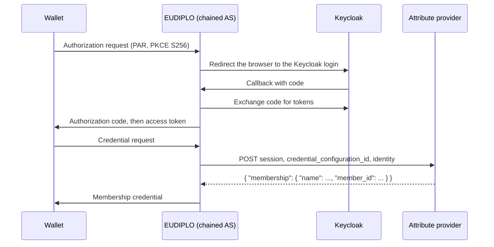

The person receiving the credential signs in at Keycloak first. EUDIPLO then asks your attribute provider for the claims of exactly that person. Use this when the claims live in your own systems and the user must prove who they are before they get a credential.

## What you will build

EUDIPLO acts as a **chained authorization server**: the wallet talks OAuth to EUDIPLO, and EUDIPLO sends the user's browser to Keycloak to sign in. When the wallet requests the credential, EUDIPLO calls your attribute provider with the Keycloak identity, and the provider returns `name` and `member_id`.



## Before you start

- **Starts from:** [Issue and verify](index.md). You need tenant `membership-demo` with the credential configuration `membership`, the HTTPS tunnel to the backend, and a sign-in as `membership-demo-admin`.
- A wallet that supports the authorization code flow with pushed authorization requests (PAR), PKCE `S256` and DPoP.
- Keycloak 26 or later, reachable over HTTPS **under the same URL** from the phone's browser and from the EUDIPLO backend. Below, `https://YOUR-KEYCLOAK-HOST` stands for that URL. For a test, run Keycloak in a container behind a second HTTPS tunnel to port `8080`.
- Node.js 22 or later for the attribute provider, and `curl` and `jq` for the checks.

## Step 1: Start Keycloak

Skip this step if you already have a Keycloak realm you can use. Otherwise, start a development instance:

```bash
docker run --name keycloak -p 8080:8080 \
  -e KC_BOOTSTRAP_ADMIN_USERNAME=admin -e KC_BOOTSTRAP_ADMIN_PASSWORD=change-me \
  quay.io/keycloak/keycloak:latest start-dev \
  --hostname https://YOUR-KEYCLOAK-HOST --proxy-headers xforwarded
```

`--hostname` makes Keycloak put the public URL into its metadata, so the phone and EUDIPLO see the same issuer.

**Checkpoint:** `curl -s https://YOUR-KEYCLOAK-HOST/realms/master/.well-known/openid-configuration | jq .issuer` prints `"https://YOUR-KEYCLOAK-HOST/realms/master"`.

## Step 2: Create the realm, client and user

In the Keycloak admin console at `https://YOUR-KEYCLOAK-HOST/admin`:

1. Create a realm `membership`.
2. Create an OpenID Connect client with client ID `eudiplo-chained-as`. Turn **Client authentication** on, keep **Standard flow** on, and set the valid redirect URI to exactly:

    ```text
    https://YOUR-HTTPS-HOST/issuers/membership-demo/chained-as/callback
    ```

3. Copy the client secret from the client's **Credentials** tab.
4. Create a user with username `max` and first name `Max`, and set a non-temporary password.

**Checkpoint:** `curl -s https://YOUR-KEYCLOAK-HOST/realms/membership/.well-known/openid-configuration | jq .issuer` prints `"https://YOUR-KEYCLOAK-HOST/realms/membership"`.

## Step 3: Add the chained authorization server

In the Web Client, open **Credential Issuance → Issuer Settings** and go to the **Wallet access** tab. Under **Authorization Servers**, choose **Add Authorization Server** and enter:

| Field               | Value                                          |
| ------------------- | ---------------------------------------------- |
| ID                  | `keycloak`                                     |
| Type                | **Chained**                                    |
| Upstream Issuer URL | `https://YOUR-KEYCLOAK-HOST/realms/membership` |
| Client ID           | `eudiplo-chained-as`                           |
| Client Secret       | the secret from step 2                         |

Keep the built-in server for the pre-authorized offers of the other recipes, then save the settings.

EUDIPLO requests the scopes `openid`, `profile` and `email` from Keycloak, uses PKCE `S256` towards Keycloak, and sends the client secret in the token request body. Towards the wallet it requires PAR and PKCE `S256`. If the wallet sends a DPoP proof, the key is bound to the authorization and must be used again at the token endpoint. Refresh tokens are on by default and valid for 30 days. The field reference is in [Authorization servers](../issuance/authorization-servers.md).

<details>
<summary>Equivalent API call</summary>

`POST /api/issuer/config` replaces the whole `authorizationServers` list, so include the built-in server:

```json
{
    "authorizationServers": [
        { "type": "built-in", "id": "issuer-built-in" },
        {
            "type": "chained",
            "id": "keycloak",
            "upstream": {
                "issuer": "https://YOUR-KEYCLOAK-HOST/realms/membership",
                "clientId": "eudiplo-chained-as",
                "clientSecret": "<secret>",
                "scopes": ["openid", "profile", "email"]
            }
        }
    ]
}
```

Use the ID of your existing built-in entry; `GET /api/issuer/config` shows it.

</details>

**Checkpoint:** the authorization server metadata is published:

```bash
curl -s https://YOUR-HTTPS-HOST/.well-known/oauth-authorization-server/issuers/membership-demo/chained-as \
  | jq '{issuer, pushed_authorization_request_endpoint, code_challenge_methods_supported}'
```

`issuer` is `https://YOUR-HTTPS-HOST/issuers/membership-demo/chained-as` and the only code challenge method is `S256`.

## Step 4: Run the attribute provider

Save as `attribute-provider.mjs`. It looks the member up by the Keycloak username:

```js
import { createServer } from 'node:http';

const members = { max: { name: 'Max', member_id: 'M-001' } };

createServer((req, res) => {
  if (req.headers['x-api-key'] !== process.env.PROVIDER_API_KEY) {
    res.writeHead(401).end();
    return;
  }
  let body = '';
  req.on('data', (chunk) => (body += chunk));
  req.on('end', () => {
    const { credential_configuration_id, identity } = JSON.parse(body);
    const username = identity?.token_claims?.preferred_username;
    console.log('claims requested for', username, 'sub', identity?.sub);
    const member = members[username];
    if (!member) {
      res.writeHead(404).end();
      return;
    }
    res.writeHead(200, { 'content-type': 'application/json' })
      .end(JSON.stringify({ [credential_configuration_id]: member }));
  });
}).listen(8788, '0.0.0.0');
```

Start it with `PROVIDER_API_KEY=change-me node attribute-provider.mjs`. EUDIPLO sends `session`, `credential_configuration_id` and `identity` (`iss`, `sub` and the merged Keycloak ID and access token claims in `token_claims`). It expects the claims under the credential configuration ID. The call is made once, without retries; the full contract is in [Attribute provider API](../reference/attribute-provider-api.md).

The provider runs on plain HTTP on your computer, which EUDIPLO's outbound URL policy blocks by default. For this exercise, add `OUTBOUND_URL_ALLOW_HTTP=true` and `OUTBOUND_URL_ALLOW_PRIVATE_NETWORK=true` to `.eudiplo.env`, then run `eudiplo up --instance cookbook`. Never set them in production.

Then open **Credential Issuance → Attribute Providers**, choose **+** (**Create New Attribute Provider**) and enter ID `membership-directory`, name `Membership directory`, URL `http://host.docker.internal:8788/claims`, **Auth Type** **API Key**, **Header Name** `x-api-key` and **Header Value** `change-me`. Choose **Create**. With Podman, use `host.containers.internal`; with Docker Engine on Linux, use your computer's LAN IP address.

**Checkpoint:** a test call returns the claims:

```bash
curl -s -X POST http://localhost:8788/claims -H 'x-api-key: change-me' -H 'content-type: application/json' \
  -d '{"session":"test","credential_configuration_id":"membership","identity":{"iss":"test","sub":"test","token_claims":{"preferred_username":"max"}}}'
```

It prints `{"membership":{"name":"Max","member_id":"M-001"}}`.

## Step 5: Send an authorization-code offer

1. Open **Credential Issuance → New Issuance**.
2. In **Select Flow**, choose **Authorization Code (External AS)** and **Next**.
3. Select `membership` under **Credential Configuration IDs** and continue.
4. Select `keycloak` as **Authorization Server**. Under **Claims Attribute Providers**, select `membership-directory` for `membership`.
5. Choose **Generate Offer** and scan the QR code with the wallet.
6. The wallet opens the Keycloak login. Sign in as `max`, then accept the credential.

The same offer through the API is `POST /api/issuer/offer` with:

```json
{
    "response_type": "uri",
    "flow": "authorization_code",
    "credentialConfigurationIds": ["membership"],
    "authorization_server": "keycloak",
    "credentialClaims": {
        "membership": { "type": "attributeProvider", "attributeProviderId": "membership-directory" }
    }
}
```

**Checkpoint:** the attribute provider prints `claims requested for max` with Max's Keycloak subject, and the wallet stores a `Membership` credential with `Max` and `M-001`. Verify it with `membership-check` as in [chapter 3](first-presentation.md).

## Troubleshooting

| Symptom                                                   | Cause                                                                   | Fix                                                                                                         |
| --------------------------------------------------------- | ----------------------------------------------------------------------- | ----------------------------------------------------------------------------------------------------------- |
| Keycloak shows "Invalid parameter: redirect_uri"          | The redirect URI in Keycloak differs from the callback                  | Use exactly `https://YOUR-HTTPS-HOST/issuers/membership-demo/chained-as/callback`, including `/issuers/`.  |
| The wallet cannot open the Keycloak login                 | Keycloak's metadata contains `localhost` or another internal address   | Start Keycloak with `--hostname` set to the public HTTPS URL.                                               |
| The wallet fails at the authorization request             | The wallet does not use PAR, or sends no `S256` code challenge          | Use a wallet that supports PAR and PKCE `S256`.                                                             |
| `invalid_dpop_proof` at the token endpoint                | The wallet signs the token request with a different DPoP key            | Use a wallet with consistent DPoP support.                                                                  |
| Credential request fails, attribute provider logs nothing | The outbound URL policy blocks the provider, or the host is unreachable | Set the two `OUTBOUND_URL_*` variables, run `eudiplo up --instance cookbook`, and check the provider URL.   |
| Attribute provider logs a different username or none      | The ID token lacks `preferred_username`                                 | Check the client scopes in Keycloak; `profile` must be assigned to `eudiplo-chained-as`.                    |

General problems are covered in [Troubleshooting](../troubleshooting.md).

## Next steps

- [Attribute providers](../issuance/attribute-provider.md): authentication, deferred issuance and claim validation.
- [Authorization servers](../issuance/authorization-servers.md): external authorization servers, presentation-based login and token settings.
- [Keycloak SSO](../operate/keycloak.md): use Keycloak for EUDIPLO's own administrators.
