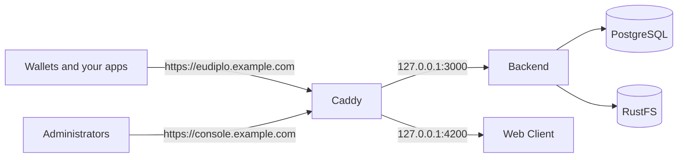

You run EUDIPLO on a single Linux server with the CLI, behind a TLS reverse proxy, with restricted ports, backups and a strict health check. The result is a deployment that wallets and your applications reach at a stable HTTPS address.

## What you will build

The CLI's `standard` preset: the backend, the Web Client, PostgreSQL and RustFS object storage, all in one Compose project. Caddy terminates TLS with Let's Encrypt certificates for two host names. The backend and the Web Client listen on `127.0.0.1` only, so Caddy is the only way in.



## Before you start

- **Starts from:** nothing. If EUDIPLO is new to you, run the [Issue and verify](foundation.md) cookbook on your computer first.
- A Linux VM with a public IP address, and DNS records for `eudiplo.example.com` and `console.example.com` that point to it. Replace both names with your own throughout.
- A firewall in front of the VM (for example your cloud provider's security group) that allows inbound traffic only on ports 22, 80 and 443. Docker publishes container ports past host firewalls such as `ufw`, and the `standard` preset publishes RustFS on ports 9000 and 9001 on all interfaces.
- Docker Engine with the Compose v2 plugin. For Podman with Podman Compose, run `export EUDIPLO_CONTAINER_RUNTIME=podman` before the CLI commands.
- [Caddy](https://caddyserver.com/docs/install) installed as a system service.

## Step 1: Install the CLI

```bash
curl -fsSL https://eudiplo.dev/install.sh | bash
eudiplo --version
```

If the shell does not find `eudiplo`, add `~/.local/bin` to your `PATH`, as the installer prints. Other installer caveats are listed in [Install and connect](foundation.md#step-1-install-the-cli).

**Checkpoint:** `eudiplo --version` prints a version number.

## Step 2: Initialize the deployment

Pin the image version you want to run (image tags have no `v` prefix, for example `9.0.0`). Without `--image-tag`, the deployment uses `latest`.

```bash
eudiplo init ~/eudiplo --instance production --preset standard \
  --public-url https://eudiplo.example.com --image-tag 9.0.0
```

The wizard asks the remaining questions. Answer them like this:

| Prompt                                     | Answer                                        |
| ------------------------------------------ | --------------------------------------------- |
| Add the bundled demo tenant?               | `n`                                           |
| Auth client ID                             | keep `root`, or choose your own name          |
| Auth client secret (leave blank to generate) | leave blank                                 |
| Include the web client?                    | `y`                                           |
| Start the deployment now?                  | `n`, because step 3 changes the environment   |

The wizard keeps the generated secret out of your shell history. It writes `.eudiplo.env` with mode `0600`. This file contains `MASTER_SECRET`, which encrypts keys stored in the database, as well as the database, RustFS and root client secrets.

**Checkpoint:** `eudiplo instance list` shows `production`, and `~/eudiplo` contains `.eudiplo.env`, `eudiplo.compose.yaml` and `config/kms.json`. As the first instance on this server, `production` is the CLI default, so the commands below omit `--instance`.

## Step 3: Restrict ports and browser origins

Append two lines to `~/eudiplo/.eudiplo.env`:

```env
EUDIPLO_BIND_ADDRESS=127.0.0.1
CORS_ORIGINS=https://console.example.com
```

- `EUDIPLO_BIND_ADDRESS` publishes the backend (`3000`) and the Web Client (`4200`) on the loopback interface only.
- `CORS_ORIGINS` lets browsers call the management API (`/api/*`) only from the console origin. Wallet-facing and public endpoints stay open to all origins. Use `scheme://host` without a path or trailing slash; the backend refuses to start with an invalid value.

**Checkpoint:** `grep -E 'PUBLIC_URL|EUDIPLO_BIND_ADDRESS|CORS_ORIGINS' ~/eudiplo/.eudiplo.env` prints all three settings.

## Step 4: Start EUDIPLO

```bash
eudiplo up
eudiplo ps
curl http://127.0.0.1:3000/health
```

**Checkpoint:** `eudiplo ps` shows `eudiplo`, `eudiplo-client`, `postgres` and `rustfs` as running, and the health call returns JSON with `"status":"ok"`. If not, read the backend log with `eudiplo logs --service eudiplo --tail 100`; add `--follow` to keep streaming.

## Step 5: Put Caddy in front

Replace `/etc/caddy/Caddyfile` with:

```text
eudiplo.example.com {
    reverse_proxy 127.0.0.1:3000
}

console.example.com {
    reverse_proxy 127.0.0.1:4200
}
```

Then run `sudo systemctl reload caddy`. Caddy requests Let's Encrypt certificates for both names on the first request. For nginx, Traefik or EUDIPLO's built-in TLS, see [TLS and reverse proxies](../operate/tls.md).

**Checkpoint:** `curl https://eudiplo.example.com/health` returns `"status":"ok"` from another machine, and `https://console.example.com` shows the Web Client login.

## Step 6: Sign in and run the strict check

Sign in at `https://console.example.com`. Enter `https://eudiplo.example.com` as **EUDIPLO Instance** (replace any prefilled value), then use the **Client ID and Secret** tab with `AUTH_CLIENT_ID` and `AUTH_CLIENT_SECRET` from `.eudiplo.env`.

Then let the CLI check the whole deployment:

```bash
export EUDIPLO_CLIENT_ID=root
read -rs EUDIPLO_CLIENT_SECRET && export EUDIPLO_CLIENT_SECRET
eudiplo doctor --strict
```

`read -rs` waits for you to paste the secret without showing it. `--strict` treats every warning as a failure, for example a public URL without HTTPS, a TLS certificate close to expiry or missing client credentials. Skipped checks do not fail.

**Checkpoint:** `eudiplo doctor --strict` exits with status `0`. Run it after every change and from your monitoring.

## Step 7: Back up

Back up these items regularly and keep the copies off the VM:

| Item                         | Why                                                                         | How                                                                                             |
| ---------------------------- | --------------------------------------------------------------------------- | ----------------------------------------------------------------------------------------------- |
| `~/eudiplo/.eudiplo.env`     | Without `MASTER_SECRET`, the keys in the database cannot be decrypted       | Store it in your secret manager once, and again after each change                              |
| `~/eudiplo/config/`          | KMS configuration and file-managed tenant configuration                     | Copy the folder                                                                                 |
| PostgreSQL                   | Tenants, configurations, keys, sessions and status lists                    | `docker exec eudiplo-postgres-1 pg_dump -U eudiplo -Fc eudiplo > eudiplo-$(date +%F).dump`      |
| RustFS volume `eudiplo_rustfs-data` | Uploaded images such as logos                                        | Archive the volume, for example with a short-lived container that runs `tar`                    |

`eudiplo ps` shows the actual container name if it differs from `eudiplo-postgres-1`. Test a restore on a second VM before you rely on the backups.

**Checkpoint:** `docker exec -i eudiplo-postgres-1 pg_restore --list < eudiplo-$(date +%F).dump` lists the tables of the dump.

## Step 8: Upgrade

```bash
eudiplo upgrade --image-tag 9.0.1
```

The command shows the image changes, points to the upgrade guide when a major version changes, and asks for confirmation. It then writes the new tags to `.eudiplo.env`, pulls the images and recreates the containers. Database migrations run when the backend starts, and downgrades are not supported, so back up first. Read the [upgrade guide](../upgrade/index.md) before every major upgrade.

**Checkpoint:** `eudiplo doctor --strict` passes again after the upgrade.

## Troubleshooting

| Symptom                                           | Cause                                                              | Fix                                                                                                         |
| ------------------------------------------------- | ------------------------------------------------------------------ | ----------------------------------------------------------------------------------------------------------- |
| Caddy gets no certificate                         | DNS does not point to the VM, or port 80 or 443 is blocked         | Check the DNS records and the firewall; read `journalctl -u caddy`.                                         |
| Caddy returns `502`                               | The backend or Web Client is not running                           | Run `eudiplo ps` and `eudiplo logs --service eudiplo --tail 100`.                                           |
| Web Client login fails with a CORS error          | `CORS_ORIGINS` does not match the console origin exactly           | Correct the value in `.eudiplo.env`, then run `eudiplo up`. Compose recreates the backend.                  |
| `doctor --strict` fails on authentication         | `EUDIPLO_CLIENT_ID` or `EUDIPLO_CLIENT_SECRET` is not exported     | Export both in the shell that runs `doctor`.                                                                |
| RustFS answers on port 9000 from the Internet     | The VM firewall does not block it                                  | Allow only ports 22, 80 and 443 in the firewall in front of the VM.                                         |

More symptoms are listed in [Troubleshooting](../troubleshooting.md).

## Next steps

- Work through the [production checklist](../operate/production-checklist.md) before you issue real credentials.
- Create tenants and least-privilege API clients: [Tenants and access](../operate/tenants-and-access.md).
- Keep keys outside the database: [Key management](../operate/kms.md).
- Manage tenant configuration as files: [Configuration as code](../operate/configuration-as-code.md). To iterate on such files on your computer, see [Development setup](../contributing/development-setup.md).
