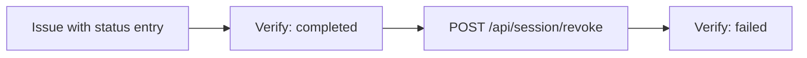

You turn on status management for the membership credential, issue a new one, revoke it, and watch the next presentation fail. A variant at the end keeps only one active credential per person.

## What you will build

Every new `membership` credential gets an entry in a Token Status List that EUDIPLO publishes. Revoking or suspending sets the entry for one issuance session. `membership-check` checks the status during verification and rejects the credential.



## Before you start

- **Starts from:** [Issue and verify](index.md): tenant `membership-demo`, credential configuration `membership`, presentation configuration `membership-check` (with the default **Strict** status check), the tunnel and the wallet.
- `curl` and `jq`, and the secret of `membership-demo-admin`. The revocation calls have no Web Client button. Get a token:

```bash
export EUDIPLO=http://localhost:3000
read -rs ADMIN_SECRET
ADMIN_TOKEN=$(curl -s -X POST "$EUDIPLO/api/oauth2/token" \
  -d grant_type=client_credentials -d client_id=membership-demo-admin \
  --data-urlencode client_secret="$ADMIN_SECRET" | jq -r .access_token)
```

## Step 1: Set the status list defaults

Open **Credential Issuance → Status Lists** and choose the gear button (**Configure default settings**). Set:

| Field            | Value                                          | Why                                                                           |
| ---------------- | ---------------------------------------------- | ----------------------------------------------------------------------------- |
| Bits per status  | **2 bits** (Valid/Revoked/Suspended)           | The default of 1 bit can only express valid and revoked                       |
| TTL (seconds)    | `60`                                           | Verifiers cache a status list until it expires; the default is one hour       |
| Immediate Update | on                                             | EUDIPLO re-signs the list right after a status change                         |

Choose **Save Configuration**. Capacity and bits only apply to lists created afterwards, so set them before the first credential with status is issued. In production, choose the TTL from how fast a revocation must take effect. The API equivalent is `PUT /api/status-list-config` with `{"bits": 2, "ttl": 60, "immediateUpdate": true}`.

**Checkpoint:** the page shows the saved values after a reload.

## Step 2: Check the status list signing key

Open **Cryptographic Assets → Keys** and check that the key chain `Membership status list signing` with usage **Status List Signing** exists; [chapter 3](first-presentation.md) created it for the trust list. EUDIPLO signs status lists with it. Without such a key, EUDIPLO signs status lists with the credential signing key.

**Checkpoint:** `Membership status list signing` appears under **Keys**.

## Step 3: Turn on status management

Open **Credential Issuance → Credential Types → membership** and choose **Edit configuration**. On **Settings**, under **Credential Features**, turn **Status Management** on. Choose **Save Configuration**. The API equivalent is `PATCH /api/issuer/credentials/membership` with `{"statusManagement": true}`.

**Checkpoint:** the credential type shows **Status Management** as enabled.

## Step 4: Issue a credential with a status entry

The credential from chapter 2 has no status entry and cannot be revoked. Issue a new one:

1. Open **Credential Issuance → New Issuance**, choose **Pre-Authorized Code**, select `membership`, choose **Use Pre-configured Default Values** and **Generate Offer**.
2. Scan the QR code with the wallet and accept the credential.
3. Delete the chapter 2 credential from the wallet, so that the wallet cannot pick it in the next steps.
4. Open **Sessions → All Sessions**, open this issuance session and copy its ID:

```bash
export SESSION=<issuance session ID>
```

EUDIPLO creates the status list on first use and adds a `status` claim to the credential that points to it.

**Checkpoint:** `GET /api/status-lists` shows one list for the tenant, and its URL serves a signed status list:

```bash
curl -s "$EUDIPLO/api/status-lists" -H "Authorization: Bearer $ADMIN_TOKEN" | jq '.[] | {id, uri}'
curl -s -o /dev/null -w '%{content_type}\n' "<uri from the previous output>"
```

The second call prints a content type that starts with `application/statuslist+jwt`. The public path is `/issuers/membership-demo/status-management/status-list/{listId}`.

## Step 5: Verify while the credential is valid

Open `membership-check`, choose **Create offer**, then **Generate Request**, and approve it in the wallet.

**Checkpoint:** the presentation session is `completed`.

## Step 6: Revoke the credential

```bash
curl -s -X POST "$EUDIPLO/api/session/revoke" \
  -H "Authorization: Bearer $ADMIN_TOKEN" -H "Content-Type: application/json" \
  -d "{\"sessionId\": \"$SESSION\", \"credentialConfigurationId\": \"membership\", \"status\": 1}" \
  -w '%{http_code}\n'
```

`status` is `0` for valid, `1` for revoked and `2` for suspended. Without `credentialConfigurationId`, every credential of the session changes. The call needs the role `issuance:offer` or `issuance:manage` and returns `204`. Then clear the cached status lists of the verifier, so you do not have to wait for the TTL:

```bash
curl -s -X DELETE "$EUDIPLO/api/cache/status-list" -H "Authorization: Bearer $ADMIN_TOKEN" -w '%{http_code}\n'
```

**Checkpoint:** both calls print `204`.

## Step 7: Watch the verification fail

Generate another request for `membership-check` and approve it in the wallet. Some wallets check the status themselves and refuse to present a revoked credential; that also counts as success for this step.

**Checkpoint:** the presentation session is `failed`. The session API shows the reason:

```bash
curl -s "$EUDIPLO/api/session/<presentation session ID>" -H "Authorization: Bearer $ADMIN_TOKEN" \
  | jq '{status, errorReason}'
```

`errorReason` is "Presentation validation failed: Status is not valid". A webhook, if configured, receives `status: failed` and no credentials.

## Step 8: Suspend and reinstate

Revocation is final: setting `0` or `2` on the credential you revoked in step 6 returns `409`. To try suspension, issue another credential as in step 4, delete the revoked one from the wallet, and set `SESSION` to the new issuance session. Then suspend it:

```bash
curl -s -X POST "$EUDIPLO/api/session/revoke" \
  -H "Authorization: Bearer $ADMIN_TOKEN" -H "Content-Type: application/json" \
  -d "{\"sessionId\": \"$SESSION\", \"credentialConfigurationId\": \"membership\", \"status\": 2}" \
  -w '%{http_code}\n'
```

Clear the cache and verify: a suspended credential fails like a revoked one. Repeat the call with `"status": 0` to lift the suspension, clear the cache and verify again. Status management in detail: [Revocation](../issuance/revocation.md).

**Checkpoint:** verification fails while the credential is suspended and passes after you set `0`.

## Variant: one active credential per person

With **Single Active Credential** (`activeCredentials: {"enabled": true}`), issuing a new credential to a person revokes their previous credentials of the same type. It requires status management; the API rejects the setting without it ("statusManagement must be enabled when activeCredentials is enabled").

EUDIPLO recognizes "the same person" by the issuer and subject that an **external** authorization server binds to the issuance session. Pre-authorized offers and logins through the chained authorization server of [Issue after login](issue-after-login.md) have no such subject; EUDIPLO then skips the policy and logs this at debug level. To try the variant:

1. Configure an external authorization server as described in [Authorization servers](../issuance/authorization-servers.md).
2. Turn on **Single Active Credential** for `membership` under **Credential Features**.
3. Issue two credentials to the same user through that server, then present the first one.

**Checkpoint:** the presentation of the first credential fails with "Status is not valid", and the second one passes.

## Troubleshooting

| Symptom                                               | Cause                                                                  | Fix                                                                                               |
| ----------------------------------------------------- | ---------------------------------------------------------------------- | ------------------------------------------------------------------------------------------------- |
| Revoke returns `409` "No status mapping found"        | The session's credential was issued without status management          | Issue a new credential after step 3 and use its session ID.                                       |
| Verification still passes after revoking              | The wallet presented an older credential, or a cached status list was used | Delete old credentials from the wallet; clear the status-list cache; check the TTL.          |
| Suspend returns `400` "requires a status list with at least 2 bits" | The list was created with 1 bit per status | Set **Bits per status** to 2 (step 1), then issue a new credential; existing lists keep their bits. |
| Suspend or reinstate returns `409` "revocation is final" | The credential is revoked | Revocation cannot be undone; issue a new credential. |
| `403` on `/api/cache/status-list`                     | The token lacks `issuance:manage` or `presentation:manage`             | Use the `membership-demo-admin` token.                                                            |

General problems are covered in [Troubleshooting](../troubleshooting.md).

## Next steps

- [Revocation](../issuance/revocation.md): status list settings, management API and aggregation.
- [Integrate into your backend](integrate-backend.md): revoke from your own code with a least-privilege client.
- [Accept only trusted issuers](trusted-issuers.md): restrict which issuers `membership-check` accepts.
