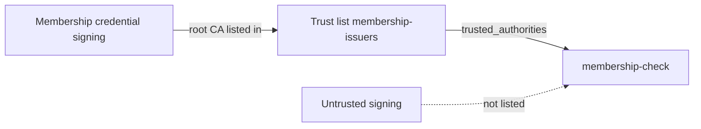

You restrict `membership-check` to issuers on a trust list, then test it with a credential from a listed issuer and one from an unlisted issuer. Without such a restriction, EUDIPLO accepts any correctly signed credential of the requested type.

## What you will build

A managed trust list `membership-issuers` that EUDIPLO signs and publishes, listing the issuer certificate of the cookbook tenant. The DCQL query of `membership-check` references it in `trusted_authorities`. A second signing key acts as an untrusted issuer.



## Before you start

- **Starts from:** [Issue and verify](index.md): tenant `membership-demo` with the key chain `Membership credential signing`, the credential configuration `membership`, the presentation configuration `membership-check`, and the wallet with the membership credential.
- `curl`, `jq` and the secret of `membership-demo-admin` for the checks. Get a token:

```bash
export EUDIPLO=http://localhost:3000
read -rs ADMIN_SECRET
ADMIN_TOKEN=$(curl -s -X POST "$EUDIPLO/api/oauth2/token" \
  -d grant_type=client_credentials -d client_id=membership-demo-admin \
  --data-urlencode client_secret="$ADMIN_SECRET" | jq -r .access_token)
```

## Step 1: Create the signing keys for the list

Open **Cryptographic Assets → Keys** and create two key chains with **Create Key**:

| Usage                   | Description                       | Purpose                                                           |
| ----------------------- | --------------------------------- | ----------------------------------------------------------------- |
| **Trust List Signing**  | `Membership trust list signing`   | Signs the trust list                                              |
| **Status List Signing** | `Membership status list signing`  | Listed as the issuer's status list certificate                    |

Skip the second one if you created it in [Revocable credentials](revocable-credentials.md). EUDIPLO does not create a trust list signing key on its own, even though the trust list form offers **Auto-generate**.

**Checkpoint:** both key chains appear under **Keys**.

## Step 2: Create the trust list

Open **Credential Issuance → Trust Lists**, choose **+** (**Create new Trust List**) and enter:

1. **ID** `membership-issuers`, **Description** `Issuers accepted for membership checks`, **Signing Key Chain** `Membership trust list signing`.
2. Choose **Add Internal Entity**. Keep **Provider type** **Credential provider**, select **Issuer Key Chain** `Membership credential signing` and **Revocation Key Chain** `Membership status list signing`, and enter **Entity Name** `Membership Demo`.
3. Choose **Create Trust List**.

For an internal entity, EUDIPLO lists the root CA certificate of the issuer key chain. The root stays the same when the signing key rotates. To list an issuer of another organization, choose **Add External Entity** and paste its certificates instead.

<details>
<summary>Equivalent API call</summary>

`POST /api/trust-list` with the key chain IDs from **Keys**:

```json
{
    "id": "membership-issuers",
    "description": "Issuers accepted for membership checks",
    "keyChainId": "<ID of Membership trust list signing>",
    "entities": [
        {
            "type": "internal",
            "issuerKeyChainId": "<ID of Membership credential signing>",
            "revocationKeyChainId": "<ID of Membership status list signing>",
            "info": { "name": "Membership Demo" }
        }
    ]
}
```

</details>

**Checkpoint:** the trust list page shows the **Trust List URL** `https://YOUR-HTTPS-HOST/issuers/membership-demo/trust-list/membership-issuers`, and it serves a signed list:

```bash
curl -s https://YOUR-HTTPS-HOST/issuers/membership-demo/trust-list/membership-issuers | cut -c1-40
```

The output starts with `eyJ`, the beginning of a signed JWT.

A managed list is valid for 30 days. EUDIPLO re-signs it automatically during the last 10 days, so it never expires while the instance runs.

## Step 3: Require the trust list in the request

Open **Credential Verification → Verification Configs → membership-check** and choose **Edit configuration**. On **2. Credentials**, expand **Issuer trust** for the `membership` query, choose **Add managed trust list** and select `membership-issuers` as **Managed trust list**. Continue to the review and choose **Save Configuration**.

The stored query now reads:

```json
{
    "credentials": [
        {
            "id": "membership",
            "format": "dc+sd-jwt",
            "meta": { "vct_values": ["urn:example:membership:1"] },
            "claims": [{ "path": ["name"] }, { "path": ["member_id"] }],
            "trusted_authorities": [{ "type": "etsi_tl", "values": [{ "trustListId": "membership-issuers" }] }]
        }
    ]
}
```

EUDIPLO uses this in two places:

- **In the request to the wallet**, it replaces the reference with `{"type": "aki", "values": [...]}`, the key identifiers of the listed issuer certificates. If a list cannot be loaded or an entry has no key identifier, it also sends the list URL as `etsi_tl`. Wallets that support `trusted_authorities` offer only matching credentials.
- **During verification**, the issuer certificate chain of the presented credential must lead to a listed entity. This check happens no matter what the wallet does.

**Checkpoint:** generate a request for `membership-check` and present the membership credential from chapter 2. The session is `completed`.

## Step 4: Issue a credential from an untrusted issuer

Create a second issuer key in the same tenant and a credential type of the same VCT that uses it:

1. Under **Keys**, create **Credential Signing (Attestation)** → **Create Key Chain (Recommended)** with description `Untrusted signing`.
2. Under **Credential Types**, create `membership-untrusted` exactly like `membership` in [chapter 2, step 4](first-credential.md#step-4-define-the-membership-credential), with two differences: **Display Name** `Untrusted membership`, and the signing key chain `Untrusted signing`.
3. Send a pre-authorized offer for `membership-untrusted` with the default values, and accept it in the wallet.

**Checkpoint:** the wallet holds two credentials of type `urn:example:membership:1`: `Membership` and `Untrusted membership`.

## Step 5: Test the untrusted issuer

Generate a new request for `membership-check` and scan it. There are two correct outcomes:

- **The wallet offers only `Membership`.** It filtered by the `aki` values. Present it; the session is `completed`.
- **The wallet offers both.** Choose `Untrusted membership`. EUDIPLO rejects it.

To see the server-side rejection with a wallet that filters, add `VP_REMOVE_TA=true` to `.eudiplo.env` and run `eudiplo up --instance cookbook`. EUDIPLO then leaves `trusted_authorities` out of the wallet request but still enforces the list. Remove the setting afterwards.

**Checkpoint:** the session of the untrusted credential is `failed`:

```bash
curl -s "$EUDIPLO/api/session/<presentation session ID>" -H "Authorization: Bearer $ADMIN_TOKEN" \
  | jq '{status, failureCode, errorReason}'
```

`failureCode` is `trust_chain_not_trusted` ("The credential issuer is not in the trusted list.") or `no_trust_chain_to_root`.

## Variant: use a trust list published by someone else

To accept the issuers of an external List of Trusted Entities (LoTE), choose **Add external trust list** under **Issuer trust** instead. Enter the **External trust-list URL** and, under **Trust-list verification material**, the **Verification certificate (base64 DER)** of the list's signer. In the query this becomes:

```json
{ "type": "etsi_tl", "values": [{ "url": "https://trust.example.org/lists/members", "verifierX509Der": "MIIB..." }] }
```

Without verification material, EUDIPLO cannot check the list's signature, and verification fails with `trust_list_unavailable`. EUDIPLO caches fetched lists for 5 minutes; `DELETE /api/cache/trust-list` clears the cache after the publisher changes a list. To try the variant without a second organization, use the URL of `membership-issuers` and the certificate of `Membership trust list signing`.

**Checkpoint:** the same two tests as in steps 3 and 5 give the same results.

## Troubleshooting

| Symptom                                               | Cause                                                                    | Fix                                                                                                    |
| ----------------------------------------------------- | ------------------------------------------------------------------------ | ------------------------------------------------------------------------------------------------------ |
| Creating the list fails with `409` about the key      | No key chain with usage **Trust List Signing**, or a different one selected | Create the key in step 1 and select it as **Signing Key Chain**.                                    |
| The trusted credential is rejected too                | The entity lists a different issuer key chain                            | Edit the list and select `Membership credential signing` as **Issuer Key Chain**.                      |
| The wallet offers no credential at all                | The wallet cannot match the `aki` values                                 | Test with `VP_REMOVE_TA=true`; report the wallet's behavior to its vendor.                             |
| `trust_list_unavailable`                              | The list URL is unreachable, expired or lacks verification material      | Open the URL; for external lists, add `verifierX509Der` or `verifierKey`.                              |

General problems are covered in [Troubleshooting](../troubleshooting.md).

## Next steps

- [Trust lists](../trust/trust-lists.md): entity types, wallet provider lists and renewal.
- [DCQL](../presentation/dcql.md): `trusted_authorities` together with other query options.
- [Keys and certificates](../trust/keys-and-certificates.md): import issuer certificates from your PKI.
