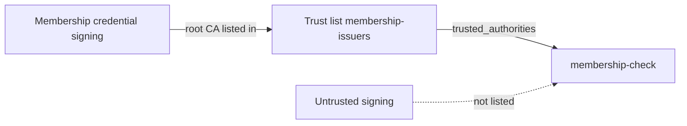

In [chapter 3](first-presentation.md), `membership-check` accepts the membership credential only from issuers on the trust list `membership-issuers`. You now test it with a credential from an issuer that is not on the list, and then switch to a trust list published by someone else.

## What you will build

A second signing key acts as an untrusted issuer of the same credential type. `membership-check` rejects its credentials, either in the wallet or during verification.



## Before you start

- **Starts from:** [Issue and verify](index.md): tenant `membership-demo` with the key chain `Membership credential signing`, the credential configuration `membership`, the trust list `membership-issuers`, the presentation configuration `membership-check` that references it, and the wallet with the membership credential.
- `curl`, `jq` and the secret of `membership-demo-admin` for the checks. Get a token:

```bash
export EUDIPLO=http://localhost:3000
read -rs ADMIN_SECRET
ADMIN_TOKEN=$(curl -s -X POST "$EUDIPLO/api/oauth2/token" \
  -d grant_type=client_credentials -d client_id=membership-demo-admin \
  --data-urlencode client_secret="$ADMIN_SECRET" | jq -r .access_token)
```

## Step 1: Issue a credential from an untrusted issuer

Create a second issuer key in the same tenant and a credential type of the same VCT that uses it:

1. Under **Keys**, create **Credential Signing (Attestation)** → **Create Key Chain (Recommended)** with description `Untrusted signing`.
2. Under **Credential Types**, create `membership-untrusted` exactly like `membership` in [chapter 2, step 4](first-credential.md#step-4-define-the-membership-credential), with two differences: **Display Name** `Untrusted membership`, and the signing key chain `Untrusted signing`.
3. Send a pre-authorized offer for `membership-untrusted` with the default values, and accept it in the wallet.

**Checkpoint:** the wallet holds two credentials of type `urn:example:membership:1`: `Membership` and `Untrusted membership`.

## Step 2: Test the untrusted issuer

Generate a new request for `membership-check` and scan it. There are two correct outcomes:

- **The wallet offers only `Membership`.** It filtered by the `aki` values. Present it; the session is `completed`.
- **The wallet offers both.** Choose `Untrusted membership`. EUDIPLO rejects it.

To see the server-side rejection with a wallet that filters, add `VP_REMOVE_TA=true` to `.eudiplo.env` and run `eudiplo up --instance cookbook`. EUDIPLO then leaves `trusted_authorities` out of the wallet request but still enforces the list. Remove the setting afterwards.

**Checkpoint:** the session of the untrusted credential is `failed`:

```bash
curl -s "$EUDIPLO/api/session/<presentation session ID>" -H "Authorization: Bearer $ADMIN_TOKEN" \
  | jq '{status, failureCode, errorReason}'
```

`failureCode` is `trust_chain_not_trusted` ("The credential issuer is not in the trusted list.") or `no_trust_chain_to_root`.

## Variant: use a trust list published by someone else

To accept the issuers of an external List of Trusted Entities (LoTE), edit `membership-check` and replace the managed trust list under **Issuer trust** with **Add external trust list**. Enter the **External trust-list URL** and, under **Trust-list verification material**, the **Verification certificate (base64 DER)** of the list's signer. In the query this becomes:

```json
{ "type": "etsi_tl", "values": [{ "url": "https://trust.example.org/lists/members", "verifierX509Der": "MIIB..." }] }
```

Without verification material, EUDIPLO cannot check the list's signature, and verification fails with `trust_list_unavailable`. EUDIPLO caches fetched lists for 5 minutes; `DELETE /api/cache/trust-list` clears the cache after the publisher changes a list. To try the variant without a second organization, enter the **Trust List URL** of `membership-issuers` from [chapter 3](first-presentation.md). For the certificate, open `Membership trust list signing` under **Keys**, choose **Copy PEM** under **Active Certificate**, and paste it without the `-----BEGIN CERTIFICATE-----` and `-----END CERTIFICATE-----` lines.

**Checkpoint:** presenting `Membership` completes the session as in chapter 3, and `Untrusted membership` is rejected as in step 2.

## Troubleshooting

| Symptom                                               | Cause                                                                    | Fix                                                                                                    |
| ----------------------------------------------------- | ------------------------------------------------------------------------ | ------------------------------------------------------------------------------------------------------ |
| The trusted credential is rejected too                | The entity lists a different issuer key chain                            | Edit the list and select `Membership credential signing` as **Issuer Key Chain**.                      |
| The wallet offers no credential at all                | The wallet cannot match the `aki` values                                 | Test with `VP_REMOVE_TA=true`; report the wallet's behavior to its vendor.                             |
| `trust_list_unavailable`                              | The list URL is unreachable or expired, or the verification material is missing or wrong | Open the URL; for external lists, check `verifierX509Der` (the signer's certificate without the PEM header and footer lines) or `verifierKey`. |

General problems are covered in [Troubleshooting](../troubleshooting.md).

## Next steps

- [Trust lists](../trust/trust-lists.md): entity types, wallet provider lists and renewal.
- [DCQL](../presentation/dcql.md): `trusted_authorities` together with other query options.
- [Keys and certificates](../trust/keys-and-certificates.md): import issuer certificates from your PKI.
