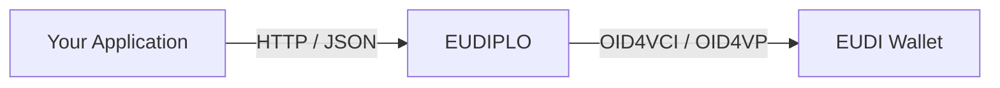

# What is EUDIPLO?

EUDIPLO is open-source middleware that connects your backend to EUDI Wallets. Your application calls a JSON management API to issue a credential or to request one. EUDIPLO handles the wallet-facing protocols (OID4VCI, OID4VP, SD-JWT VC, mDOC) and reports the result back through a webhook, server-sent events or polling.

You run EUDIPLO yourself, as one backend container with optional PostgreSQL, S3-compatible storage and an external key store. One instance serves many tenants, and each tenant has its own keys, credential types and verification requests. A Web Client and a CLI help you configure and operate the instance; everything the Web Client does is also available through the API.

EUDIPLO only implements the protocols of the EUDI Wallet ecosystem. See the [standards support matrix](reference/protocols.md) for the exact scope.

## Where does it fit?

## Get started

**[Start the cookbook →](cookbooks/foundation.md)** It installs EUDIPLO, issues a membership credential to a wallet on your phone, and verifies it.

For a quick look at the Web Client with sample data, run `eudiplo demo`. Open `http://localhost:4200`, check that **EUDIPLO Instance** is `http://localhost:3000`, and sign in with client ID and secret `root`. The demo uses the same ports as the cookbook, so stop it with `eudiplo down --instance local` before you begin.

## Find your way

### Cookbooks

Recipes that end in a working result, with a checkpoint after every step.

[Browse the recipes](cookbooks/index.md)

### Guides

One task per page: [Issuance](issuance/index.md), [Presentation](presentation/index.md), [Trust](trust/index.md) and [Operate](operate/index.md).

### Reference

Exact facts: the [management API](reference/api.md), [environment variables](reference/environment-variables.md), the [CLI](reference/cli.md) and [webhooks](reference/webhooks.md).

