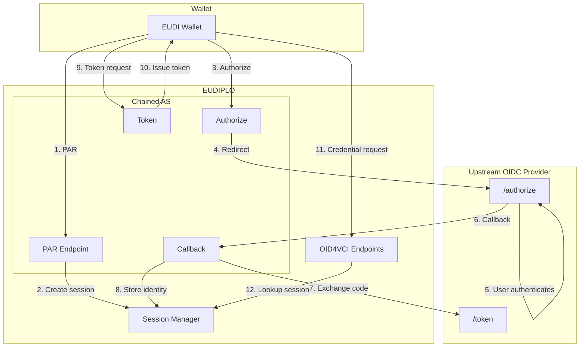
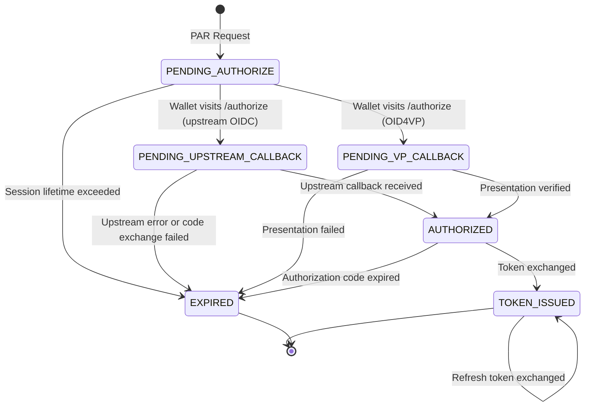

<!-- RESTRUCTURE: content that belongs elsewhere or needs restructuring in the next phase (remove this comment when done):
  - merged from issuance/authorization.md and architecture/authorization.md: keep the user parts of 'Authorization' (modes, configuration, endpoints, upstream provider requirements)
  - 'Authorization > Architecture', 'Session Flow States', 'Token Structure' (internals) -> concepts/issuance.md
  - add refresh tokens (from issuance/issuance-configuration.md) and the DPoP/PKCE model
-->

## Authorization Servers

Authorization servers define how wallets authenticate before receiving credentials. EUDIPLO supports four types: `external`, `oid4vp`, `chained`, and `built-in`.

### Overview

The `authorizationServers` array in [Issuance Configuration](issuance-configuration.md) manages all available authorization server options for a tenant. Each entry defines a distinct authentication method that can be selected at offer creation time.

**Key Concepts:**

- Define one or more authorization servers in the issuance configuration
- Reference a specific server by `id` when creating an offer
- Each server type has its own configuration requirements and behavior
- Authorization servers can be enabled/disabled without removal

### Authorization Server Types

| Type       | Purpose                                                                                       |
| ---------- | --------------------------------------------------------------------------------------------- |
| `external` | Uses a remote OAuth/OIDC AS via issuer URL discovery.                                         |
| `oid4vp`   | Creates a tenant-local AS facade at `/issuers/{tenant}/authorization-servers/{id}`.           |
| `chained`  | Creates a tenant-local chained AS facade at `/issuers/{tenant}/chained-as` via upstream OIDC. |
| `built-in` | Uses issuer-local authorization endpoints provided by EUDIPLO.                                |

### Common Fields

These fields apply to all authorization server types:

| Field                   | Type    | Required                | Description                                                                             |
| ----------------------- | ------- | ----------------------- | --------------------------------------------------------------------------------------- |
| `id`                    | string  | Yes                     | Unique identifier used to reference this AS in offer requests (`authorization_server`). |
| `type`                  | string  | Yes                     | One of `external`, `oid4vp`, `chained`, `built-in`.                                     |
| `label`                 | string  | No                      | Optional UI label.                                                                      |
| `enabled`               | boolean | No                      | Enables/disables this entry. Default `true`.                                            |
| `requireDPoP`           | boolean | No (`oid4vp`/`chained`) | Require DPoP proofs on token requests for this AS.                                      |
| `token.lifetimeSeconds` | number  | No (`oid4vp`/`chained`) | Access token lifetime for this AS.                                                      |
| `token.signingKeyId`    | string  | No (`oid4vp`/`chained`) | Key used to sign AS-issued tokens.                                                      |

:::note
The `id` values `built-in` and `chained-as` are reserved and cannot be used for custom authorization servers.
:::

### External Authorization Server

External authorization servers delegate authentication to a remote OAuth 2.0 or OpenID Connect provider.

#### Configuration

```json
{
    "type": "external",
    "id": "external-corp-idp",
    "label": "Corporate IdP",
    "enabled": true,
    "issuer": "https://auth.example.com",
    "sessionBinding": {
        "method": "access_token_claim",
        "claim": "issuer_state"
    }
}
```

#### Type-Specific Fields

| Field                   | Type   | Required | Description                                           |
| ----------------------- | ------ | -------- | ----------------------------------------------------- |
| `issuer`                | string | Yes      | External AS issuer URL.                               |
| `sessionBinding`        | object | Yes\*    | Session correlation configuration (see below).        |
| `sessionBinding.method` | string | Yes      | Must be `access_token_claim`.                         |
| `sessionBinding.claim`  | string | Yes      | Access-token claim containing the EUDIPLO session ID. |

\*Required for external token-backed issuance.

#### Session Binding

External access tokens must be bound to the issuance session created for the credential offer. The configured claim in the access token must contain the EUDIPLO issuance session ID.

**For standard authorization-code flow**, this is the `issuer_state` value from the credential offer. The external authorization server must copy that value into the access token without modification.

**Validation Behavior:**

1. EUDIPLO validates the access token signature and expiration
2. Verifies the issuer matches the configured `issuer` URL
3. Reads the configured claim value
4. Resolves exactly one existing issuance session

**Tokens are rejected when:**

- The configured claim is missing or empty
- The claim value points to an unknown session
- The session belongs to a different tenant or authorization server

:::warning[Important]
EUDIPLO does not create a new issuance session from an external token and does not implicitly use the token `sub` claim for session correlation. The configured claim must explicitly contain the EUDIPLO session ID.
:::

#### Usage in Offers

When creating an offer with an external authorization server, reference it by `id`:

```json
{
    "response_type": "uri",
    "flow": "authorization_code",
    "credentialConfigurationIds": ["pid"],
    "authorization_server": "external-corp-idp"
}
```

### OID4VP Authorization Server

OID4VP authorization servers use OpenID for Verifiable Presentations (OID4VP) as the authentication mechanism. The wallet presents existing credentials to prove identity instead of traditional username/password authentication.

#### Configuration

```json
{
    "type": "oid4vp",
    "id": "pid-auth",
    "label": "PID Authentication",
    "enabled": true,
    "presentationConfigId": "pid-verification",
    "immediateWalletRedirect": true,
    "requireDPoP": true,
    "token": {
        "lifetimeSeconds": 3600,
        "signingKeyId": "default"
    }
}
```

#### Type-Specific Fields

| Field                     | Type    | Required | Description                                     |
| ------------------------- | ------- | -------- | ----------------------------------------------- |
| `presentationConfigId`    | string  | Yes      | Presentation config used for the VP flow.       |
| `immediateWalletRedirect` | boolean | No       | Redirect browser immediately to wallet request. |

#### Behavior

When a wallet initiates the authorization flow with an OID4VP authorization server:

1. EUDIPLO exposes a tenant-local AS facade at `/issuers/{tenant}/authorization-servers/{id}`
2. The wallet is redirected to the OID4VP presentation flow using the referenced presentation configuration
3. After successful presentation verification, EUDIPLO issues an access token for credential issuance
4. The claims from the presented credentials are sent to the Attribute Provider in the `credentials` field (see [Presentation-Based Authorization](attribute-provider.md#presentation-based-authorization))

This flow is commonly used for higher-assurance issuance where the user must prove they already hold a trusted credential (such as a PID) before receiving a new credential.

### Chained Authorization Server

Chained authorization servers federate authentication through an upstream OpenID Connect provider while maintaining a tenant-local token endpoint.

#### Configuration

```json
{
    "type": "chained",
    "id": "chained-auth",
    "label": "Enterprise SSO",
    "enabled": true,
    "upstream": {
        "issuer": "https://keycloak.example.com/realms/eudiplo",
        "clientId": "eudiplo-chained-as",
        "clientSecret": "your-client-secret",
        "scopes": ["openid", "profile", "email"]
    },
    "requireDPoP": true,
    "token": {
        "lifetimeSeconds": 3600,
        "signingKeyId": "default"
    }
}
```

#### Type-Specific Fields

| Field                   | Type   | Required | Description                             |
| ----------------------- | ------ | -------- | --------------------------------------- |
| `upstream.issuer`       | string | Yes      | Upstream OIDC issuer URL.               |
| `upstream.clientId`     | string | Yes      | Client ID at upstream provider.         |
| `upstream.clientSecret` | string | No       | Client secret for confidential clients. |
| `upstream.scopes`       | array  | No       | Scopes requested upstream.              |

#### Behavior

When enabled, EUDIPLO:

1. Exposes a tenant-local chained AS at `/{tenant}/chained-as/*`
2. Publishes this issuer in the `authorization_servers` metadata
3. Redirects authentication to the upstream OIDC provider
4. Exchanges the upstream authorization code for tokens
5. Merges claims from the upstream ID token and access token
6. Issues a tenant-local access token for credential issuance

**Identity Context:**

Attribute Providers receive merged claims from both the upstream ID token and access token in the `identity.token_claims` field.

### Built-in Authorization Server

The built-in authorization server uses EUDIPLO's internal authentication system. This is primarily intended for testing and development scenarios.

#### Configuration

```json
{
    "type": "built-in",
    "id": "local-dev-auth",
    "label": "Local Development",
    "enabled": true
}
```

#### Behavior

Built-in authorization servers use EUDIPLO's internal user authentication. This mode is not recommended for production deployments and is primarily used for:

- Local development and testing
- Demo environments
- Proof-of-concept implementations

For production deployments, use external, OID4VP, or chained authorization servers.

### Selecting Authorization Server for Offers

At offer creation time, set `authorization_server` to an enabled authorization server `id`:

```json
{
    "response_type": "uri",
    "flow": "authorization_code",
    "credentialConfigurationIds": ["pid"],
    "authorization_server": "pid-auth"
}
```

**Selection Rules:**

- The `authorization_server` value must match the `id` of an enabled entry in `authorizationServers`
- If omitted, EUDIPLO uses the first enabled authorization server
- For pre-authorized flows (`flow: "pre_authorized_code"`), the `authorization_server` field is ignored

### Migration from Legacy Configuration

:::warning[Migration Note]
`authServers` and `chainedAs` are legacy fields from version 4.x. New configurations should use `authorizationServers` only.

For migration guidance, see [Migrating from 4.x to 5.0](https://github.com/openwallet-foundation/eudiplo/blob/v8.1.0/apps/docs/docs/migration/4.x-to-5.0.md).
:::

### Related Documentation

- [Issuance Configuration](issuance-configuration.md) — Parent configuration structure
- [Credential Offers](credential-offers.md) — Creating offers with authorization server selection
- [Attribute Providers](attribute-provider.md) — Identity context from authorization flows

## Authorization

The authorization layer in EUDIPLO determines how wallets authenticate to receive credentials. EUDIPLO supports four authorization server types for credential issuance (`built-in`, `external`, `chained`, `oid4vp`), each suited to different deployment scenarios and security requirements.

### Authorization Modes

EUDIPLO can act as:

1. **Built-in Authorization Server** (`built-in`) — EUDIPLO issues authorization codes itself, without an external identity provider
2. **External Authorization Server** (`external`) — Delegate to an existing OAuth 2.0/OIDC provider (e.g., Keycloak, Azure AD)
3. **Chained Authorization Server** (`chained`) — EUDIPLO acts as an AS facade, delegating authentication to upstream OIDC while issuing its own tokens
4. **OID4VP-Based Authorization Server** (`oid4vp`) — EUDIPLO acts as an AS facade that authorizes the wallet via an OID4VP presentation (configured `presentationConfigId`) and issues its own tokens. Each entry is served at `/issuers/{tenant}/authorization-servers/{id}` (`par`, `authorize`, `vp-callback`, `token`)

For detailed protocol extension points and integration patterns, see:

- [Interactive Authorization Endpoint (IAE)](./interactive-authorization.md) — Multi-step authorization flows with user interaction
- [OpenID Federation](../trust/federation.md) — Federation-based trust evaluation

### Chained Authorization Server

The **Chained Authorization Server (Chained AS)** is an optional mode where EUDIPLO acts as an OAuth 2.0 Authorization Server facade. Instead of implementing user authentication directly, it delegates to an upstream OIDC provider while issuing its own access tokens with custom claims for session correlation.

#### Overview

In credential issuance flows using the authorization code grant, the wallet needs an access token to request credentials. Typically, this token comes from either:

1. **EUDIPLO's built-in AS** - Simple setup, but it does not authenticate the user against an identity provider
2. **External AS (e.g., Keycloak)** - Uses existing identity infrastructure, but requires the AS to put the EUDIPLO session ID into the access token claim configured as `sessionBinding.claim`

The **Chained AS** provides another option: EUDIPLO acts as the AS but delegates authentication to an upstream OIDC provider. This combines the benefits of both approaches without requiring modifications to your existing OIDC provider.

#### Architecture



#### Session Flow States

The Chained AS maintains session state through the OAuth flow:



The same session model is used by the OID4VP-based authorization servers (`PENDING_VP_CALLBACK` instead of `PENDING_UPSTREAM_CALLBACK`).

A VP-backed variant of the chained AS also exists at `/issuers/{tenant}/chained-as-vp` (`par`, `authorize`, `vp-callback`, `token`, with metadata and JWKS under the matching `.well-known/.../chained-as-vp` paths). It is selected by a `chained` entry with `vp.enabled` and `vp.presentationConfigId`, which the current `chained` configuration schema does not accept; use the `oid4vp` type for presentation-based authorization.

#### Token Structure

Access tokens issued by the Chained AS are JWTs signed by EUDIPLO containing:

| Claim                   | Description                                                          |
| ----------------------- | -------------------------------------------------------------------- |
| `iss`                   | Chained AS issuer URL (`{PUBLIC_URL}/issuers/{tenant}/chained-as`)   |
| `sub`                   | Client ID of the requesting wallet                                   |
| `aud`                   | EUDIPLO credential issuer URL (`{PUBLIC_URL}/issuers/{tenant}`)      |
| `iat` / `exp`           | Issued-at and expiry (`token.lifetimeSeconds`, default 3600 seconds) |
| `jti`                   | Unique token identifier                                              |
| `issuer_state`          | Session ID for credential offer correlation                          |
| `client_id`             | Wallet's client identifier                                           |
| `authorization_details` | Authorization details from the pushed authorization request (if any) |
| `upstream_sub`          | Subject from upstream ID token (if the upstream returned one)        |
| `upstream_iss`          | Issuer from upstream ID token (if the upstream returned one)         |
| `cnf.jkt`               | DPoP key thumbprint (if DPoP is used)                                |

With the example host and tenant, `iss` is `https://eudiplo.example.com/issuers/tenant1/chained-as`.

#### Comparison with Other Modes

| Feature                  | Built-in AS                  | External AS                              | Chained AS        | OID4VP-based AS     |
| ------------------------ | ---------------------------- | ---------------------------------------- | ----------------- | ------------------- |
| User authentication      | No login step (IAE optional) | External provider                        | External provider | OID4VP presentation |
| Token issuer             | EUDIPLO                      | External                                 | EUDIPLO           | EUDIPLO             |
| Session ID in token      | ✅ `sub` (automatic)         | ⚠️ Configured `sessionBinding.claim`     | ✅ `issuer_state` | ✅ `issuer_state`   |
| Session correlation      | ✅ Native                    | ⚠️ Via configured `sessionBinding.claim` | ✅ Native         | ✅ Native           |
| Modify external provider | N/A                          | Required (to emit the binding claim)     | Not required      | N/A                 |
| DPoP support             | ✅                           | Depends on provider                      | ✅                | ✅                  |
| Wallet attestation       | ✅                           | ❌ Not possible                          | ✅                | ✅                  |

#### Security Considerations

##### Client Secret Management

The upstream client secret (`upstream.clientSecret`) is optional and stored in the issuance configuration. If it is omitted, EUDIPLO authenticates to the upstream token endpoint as a public client and relies on PKCE. If you use a secret, consider:

- Using environment variables for secrets in production
- Rotating secrets periodically
- Using a secrets manager for enterprise deployments

##### PKCE

The request from EUDIPLO to the upstream provider always uses PKCE with `S256`.

On the wallet leg, PKCE with `S256` is required, as mandated by HAIP: a PAR request without a `code_challenge`, or with a `code_challenge_method` other than `S256`, is rejected with `invalid_request`. The token request must include the matching `code_verifier`. The AS metadata advertises only `S256`.

##### DPoP

When `requireDPoP` is enabled, wallets must provide a DPoP proof with their PAR and token requests. The thumbprint of the DPoP key presented at PAR is bound to the access token via the `cnf.jkt` claim.

##### State Parameter

The Chained AS generates a cryptographically random state parameter for the upstream authorization request, preventing CSRF attacks.

#### Configuration

See [Issuance: Authorization](authorization-servers.md) for configuration details and examples.

#### Endpoints Reference

All endpoints are tenant-scoped:

| Endpoint                                                              | Method | Auth | Description                                                                  |
| --------------------------------------------------------------------- | ------ | ---- | ---------------------------------------------------------------------------- |
| `/issuers/{tenant}/chained-as/par`                                    | POST   | None | Pushed Authorization Request - initiates the flow                            |
| `/issuers/{tenant}/chained-as/authorize`                              | GET    | None | Authorization endpoint - redirects to upstream                               |
| `/issuers/{tenant}/chained-as/callback`                               | GET    | None | Handles upstream callback                                                    |
| `/issuers/{tenant}/chained-as/token`                                  | POST   | None | Exchanges code (`authorization_code`) or `refresh_token` for an access token |
| `/.well-known/oauth-authorization-server/issuers/{tenant}/chained-as` | GET    | None | AS metadata discovery                                                        |
| `/.well-known/jwks.json/issuers/{tenant}/chained-as`                  | GET    | None | Public keys for token verification                                           |

#### Upstream Provider Requirements

The upstream OIDC provider must:

1. **Support OIDC Discovery** - Publish `.well-known/openid-configuration`
2. **Support Authorization Code Flow** - With `response_type=code`
3. **Client Registration** - A confidential client (the secret is sent as `client_secret` in the token request) or, if `upstream.clientSecret` is omitted, a public client using PKCE
4. **Return ID Tokens** - Include `sub` and `iss` claims

Tested providers:

- Keycloak
- Auth0
- Azure AD / Entra ID
- Google Identity Platform
