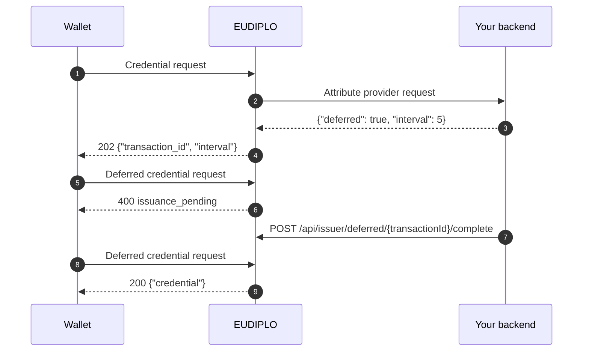

Issue a credential later, for example after a manual review or a background check. Your attribute provider tells EUDIPLO to defer, the wallet polls with a transaction ID, and your backend completes or fails the transaction through the management API.

**Prerequisites:** an [attribute provider](attribute-provider.md) (or offer `webhook` source) for the credential configuration, and a client with the `issuance:offer` role.



## 1. Defer in the attribute provider

Answer the attribute provider request with:

```json
{ "deferred": true, "interval": 5 }
```

EUDIPLO stores the wallet's holder key and answers the wallet with HTTP `202` and `{ "transaction_id": "…", "interval": 5 }`. `interval` (seconds, default 5) is the polling interval suggested to the wallet.

Deferred requests must carry exactly one key proof with a `nonce`; batch requests (several proofs) are rejected with `invalid_proof`.

## 2. Let the wallet poll

The wallet polls `POST /issuers/{tenant}/vci/deferred_credential` with `{"transaction_id": "…"}` and the access token of the issuance (with DPoP when `dPopRequired` is set). While the transaction is pending, it receives HTTP `400`:

```json
{ "error": "issuance_pending", "error_description": "The credential issuance is still pending", "interval": 5 }
```

## 3. Complete or fail the transaction

When your process has finished, provide the claims:

```bash
curl -X POST "$EUDIPLO_URL/api/issuer/deferred/$TRANSACTION_ID/complete" \
  -H "Authorization: Bearer $TOKEN" \
  -H "Content-Type: application/json" \
  -d '{ "claims": { "name": "Max", "member_id": "M-001" } }'
```

EUDIPLO signs the credential immediately and answers `200` with `{ "transactionId", "status": "ready", "message" }`. The claims are validated against the configuration's `fields` like every other [claim source](claims.md#validation); `claims` holds the claim values directly, not keyed by configuration ID.

If the credential must not be issued:

```bash
curl -X POST "$EUDIPLO_URL/api/issuer/deferred/$TRANSACTION_ID/fail" \
  -H "Authorization: Bearer $TOKEN" \
  -H "Content-Type: application/json" \
  -d '{ "error": "Identity verification failed" }'
```

`error` is optional; the wallet's next poll receives `invalid_transaction_id` with it as description. `complete` answers `404` for an unknown transaction or one that is no longer pending, `fail` for an unknown transaction.

:::caution[Transaction ID]
EUDIPLO currently does not send the `transaction_id` to your backend: the attribute provider request carries only the session ID, and no management endpoint lists transactions. Only the wallet receives the ID.
:::

## Transaction states

| Status | Meaning | Wallet's next poll |
| --- | --- | --- |
| `pending` | Waiting for complete or fail | `issuance_pending` |
| `ready` | Credential signed | Credential (once) |
| `retrieved` | The wallet fetched the credential | `invalid_transaction_id` |
| `failed` | Marked as failed | `invalid_transaction_id` |
| `expired` | 24 hours passed since the transaction was created | `invalid_transaction_id` |

Expired transactions are deleted every hour. A poll with an access token that does not belong to the transaction's session also answers `invalid_transaction_id`.
