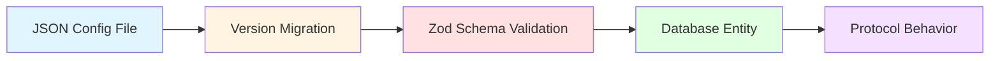

<!-- RESTRUCTURE: content that belongs elsewhere or needs restructuring in the next phase (remove this comment when done):
  - merged from deployment/configuration-validation.md and architecture/configuration-model.md; keep the operator parts
  - 'Configuration Model > Directory Structure', 'Resource Envelope', 'Bundle Layout', 'Secret and Key Policy', 'Import Pipeline' (plan actions), 'Configuration Types' -> reference/config-bundle-format.md
  - 'Configuration Model > Configuration-to-Protocol Translation' -> concepts/index.md
-->

## Configuration Validation

The CLI can validate local EUDIPLO configuration without starting EUDIPLO, connecting to a database, or writing anything.

### Validate one tenant

```bash
eudiplo config tenant validate <tenant-id>
```

When using a configured Compose instance, this validates the tenant from its local `config/` directory. Use `--config-directory` when validating a specific configuration root:

```bash
eudiplo config tenant validate root --config-directory ./config
```

The explicit path-based form remains available:

```bash
eudiplo config validate tenant ./assets/config/playground
```

### Validate multiple tenants

```bash
eudiplo config tenant validate --config-directory ./config
```

The explicit path-based form is also supported:

```bash
eudiplo config validate tenants ./assets/config
```

Use `--format json` for a machine-readable report suitable for CI:

```bash
eudiplo config validate tenants ./assets/config --format json
```

The validator checks every supported config-import resource against the same JSON Schemas used by the backend, including tenant metadata, clients, key chains, credential configs, issuance configs, presentation configs, status lists, trust lists, attribute providers, webhook endpoints, registrar config, and tenant-specific KMS config.

New config files declare their type and version using `$schema`, for example `https://eudiplo.dev/schemas/v1/PresentationConfigFile.schema.json`. VS Code can use that URL for validation, completion and property documentation without workspace setup. In v1, IDs belong only in `spec.id` (`spec.clientId` for clients). Optional metadata contains generation and ownership; singleton settings need no document ID. `config upgrade` moves legacy metadata IDs into the data and refuses conflicting IDs. The URL must match the document type; changing it alone does not migrate the data.

The backend and CLI use bundled, versioned schemas and never fetch a user-supplied URL. Offline upgrades validate the source shape, execute each registered migration, and validate the target before advancing its identifier. Format annotations and application-specific semantics are additionally checked by the existing domain validators and tenant validation command. Known folder importers may wrap bare root payloads into canonical `$schema` documents. See [Publishing configuration schemas](../contributing/configuration-schemas.md) for the Cloudflare Pages publication workflow.

### Enable VS Code schema support

Install the schemas bundled with the current CLI and add their file associations to the workspace's `.vscode/settings.json`:

```bash
# Run from a workspace whose tenant configuration root is ./config
eudiplo config editor setup

# Select a different workspace and config root
eudiplo config editor setup ./deployment --config-directory ./tenant-config
```

The command copies the complete schema set to `.vscode/eudiplo-schemas/`, including schemas referenced by other schemas. It then merges scoped `json.schemas` entries into `.vscode/settings.json`. Existing settings, JSON-with-comments (JSONC) comments, and schema associations not managed by EUDIPLO are preserved. Running the command again replaces the EUDIPLO-managed associations instead of duplicating them.

The copied schemas match the installed CLI version. Rerun the setup command after upgrading the CLI. The generated `.vscode` files may also be committed if all contributors should receive the same completion, documentation, and inline validation without running a bootstrap command.

The backend and CLI share placeholder resolution for `${VAR}` and `${VAR:default}`. Missing or empty environment values use the default, when supplied. Unresolved placeholders report the variable name and JSON pointer without printing resolved values. Substitution runs once: environment values are treated as data, even if they contain another placeholder. The command exits with a non-zero status when any selected tenant fails validation.

### Schema sources

`apps/cli/src/commands/config/validate/registry.json` maps each tenant config-import file or folder to its resource type and schema. Run the following from the repository root after changing backend import schemas:

```bash
pnpm run gen:api
```

This regenerates the API/DTO and compatibility file schemas and the repository's editor associations. Run `pnpm --filter @eudiplo/cli assets:sync` to synchronize CLI assets. Published versioned schemas are explicit snapshots; `gen:api` never overwrites them. This developer command updates the EUDIPLO source workspace; `eudiplo config editor setup` configures an arbitrary consumer workspace.

### Export and migrate instance configuration

Export the current tenant, including configuration created through the web client or API:

```bash
export EUDIPLO_TOKEN='<management-access-token>'
eudiplo config export --instance production --output production-config.zip
```

Export never includes secret values or private key material. It replaces retrievable credentials with placeholders, represents external KMS keys by reference, and records client secrets and database-held private keys as required inputs in `manifest.json`. Supply those values from the target deployment's secret manager or KMS before import.

Upgrade a local resource or bundle without connecting to an instance:

```bash
eudiplo config upgrade production-config.zip --dry-run
eudiplo config upgrade production-config.zip --output upgraded-config.zip
```

The upgrade command accepts a single envelope, a JSON bundle, a ZIP bundle, or a configuration folder. It reads both old and new identifiers and writes the canonical `$schema` form. It preserves metadata, writes a separate output by default, and leaves output untouched when validation fails or a migration needs input. `--dry-run` reports issues without writing. Migrations never invent missing security-sensitive configuration; required input must be supplied before continuing.

For a tenant folder or a root containing several tenants:

```bash
eudiplo config upgrade ./config --check --diff
eudiplo config upgrade ./config --output ./config-upgraded
eudiplo config validate tenants ./config-upgraded
```

`--check` writes nothing and exits with status 1 when an upgrade is needed or input is invalid; status 0 means every selected document is current. `--diff` prints field changes with credential fields redacted. Legacy bare files in known tenant paths are wrapped automatically. The folder command validates every selected document before staging output, preserves assets, excludes hidden entries, rejects symbolic links, and requires a separate, unused output directory. It publishes the staged directory only after all conversions succeed. Run tenant validation afterward to check references and deployment-specific values.

JSON and ZIP bundles use the same integrity checks in the backend and CLI: resource identities, paths, entry counts and SHA-256 checksums must agree with the manifest. Duplicate resources, unsafe paths and unlisted ZIP entries are rejected. ZIP input is limited to 50 MiB compressed, 100 MiB expanded and 10,000 entries.

Always inspect the server-side plan before apply:

```bash
eudiplo config plan upgraded-config.zip --instance staging --mode upsert --diff --output plan.json
eudiplo config import upgraded-config.zip --instance staging --mode upsert --plan plan.json
```

Plans distinguish `create`, `update`, `unchanged`, `skip`, `delete` and `blocked`. Updates include field-level changes with credentials redacted. Matching resources avoid resource writes; ownership is updated separately only when its source, generation or management status changes. Explicit key regeneration and client-secret generation still require applying. Comparing client secrets uses their stored password hash. Matching status-list definitions preserve their live status data.

Exports, file upgrades and KMS configuration saves replace files atomically using temporary files with owner-only permissions. Tenant settings and ownership changes share a database transaction. An entire bundle is **not** one transaction: file storage, external KMS operations and other resource services can have effects before a later step fails.

If apply fails, the API returns `CONFIG_APPLY_FAILED` with an ordered `operations` report. Each entry identifies its resource or asset, stage, and `running`, `completed`, `failed` or `pending` status. Completed operations remain applied, and the failed operation may have partial effects. Later operations, including deletions, do not run. Inspect the affected state, correct the cause, and run plan again before retrying. The response also retains any client secrets generated successfully before the failure; protect the response as you would a successful import response. Provider exception text is omitted from the report to avoid leaking credentials. Operation progress is also stored in the database before and after each step. The durable report contains identifiers and statuses, never input config, provider errors or generated secret values. If a secret response is lost, rotate that client secret; recovery does not replay secret generation automatically.

### Reviewed plans and recovery

The plan response includes a `planFingerprint`. API import requests must send it as the `planFingerprint` query parameter. The CLI accepts `--plan plan.json` or `--plan-fingerprint <value>`; the web client sends the displayed plan's fingerprint automatically. A changed bundle, import mode, ownership source, target configuration or relevant stored asset causes `CONFIG_PLAN_STALE` before resource writes. Review a fresh plan after a conflict. Create a separate plan with `--mode replace` before using replace mode.

A database constraint allows one configuration writer per tenant across server replicas. Imports, config API edits, ownership detaches and asset uploads participate in this lock. Credential issuance and live status updates continue; status-list binding updates use optimistic concurrency without writing the status values or allocation stack. Direct filesystem/database edits and external KMS administration remain outside this lock.

Existing status-list capacity and bit width cannot change through import. Create a new list ID for a different layout. Binding updates preserve revocations and allocated indexes. Private-key replacements prepare and validate the new material before saving over the existing row, using a distinct import key ID when replacing an external key. A failed external preparation can leave an unused key in the external provider; the recovery report does not claim provider-wide rollback.

Asset additions and replacements appear in the plan. Identical bytes and content type are skipped during apply; create mode preserves existing different assets. Asset hashes are computed from stored content.

Inspect durable progress after a failed request or lost connection:

```bash
eudiplo config operations --instance staging
eudiplo config operations <operation-id> --instance staging
```

The web client also displays recent operation history. A worker crash leaves the run marked `running` and retains its tenant lock. Stop the original worker and ensure it cannot resume (including on another replica), then acknowledge the interruption:

```bash
eudiplo config recover <operation-id> --instance staging --confirm-worker-stopped
```

The API equivalent is `POST /api/config-bundles/operations/<id>/acknowledge-interruption?confirmWorkerStopped=true`. Recovery releases the lock and marks the run `interrupted`; it does not replay or undo operations. A step left `running` has an uncertain outcome. Inspect that resource or asset, then create and review a new plan. Locks deliberately do not expire automatically during slow external calls.

The `AddConfigImportRun1781000000000` database migration creates the journal and lock constraint. The operations API lists the latest 50 tenant operations; full records remain in the database until an operator applies a retention policy.

Replace mode prunes only file-managed resources from the same bundle source and requires an explicit flag:

```bash
eudiplo config import upgraded-config.zip \
  --instance staging \
  --mode replace \
  --plan replace-plan.json \
  --confirm-replace
```

See [Configuration Model](#configuration-model) for the envelope, archive, secret, generation, and ownership model.

## Configuration Model

EUDIPLO's configuration model bridges the gap between human-readable JSON files and runtime protocol behavior. This page explains how configuration flows from JSON → validation → database → protocol execution, and how the import/export system ensures safe portability across environments.

---

### Overview

The configuration lifecycle follows this pipeline:



**Key Principles:**

- **JSON as source of truth**: Configuration is defined in JSON files, validated against Zod schemas, and stored in the database
- **Schema-driven validation**: Every configuration type has a versioned schema that enforces correctness before import
- **Safe portability**: Export never includes secrets or private keys; placeholders and regeneration policies ensure safe migration
- **Ownership model**: Resources can be `unmanaged` (editable via API/UI) or `file-managed` (authoritative from provisioning file)

---

### Configuration-to-Protocol Translation

EUDIPLO translates JSON configuration into protocol behavior at runtime:

| Configuration Layer                                   | Protocol Layer                                                                      | Example                                                                           |
| ----------------------------------------------------- | ----------------------------------------------------------------------------------- | --------------------------------------------------------------------------------- |
| **Credential Configuration** (`CredentialConfig`)     | `credential_configurations_supported` in OID4VCI metadata                           | SD-JWT VC schema, selective disclosure fields, key-attestation proof requirements |
| **Issuance Configuration** (`IssuanceConfig`)         | Authorization server metadata, PAR/token behavior, credential-endpoint trust policy | DPoP enforcement, wallet attestation defaults, key-attestation trust lists        |
| **Presentation Configuration** (`PresentationConfig`) | OID4VP authorization request, DCQL query                                            | Required credentials, trusted issuers, field constraints                          |
| **Key Chain** (`KeyChain`)                            | JWT/CWT signing, JWE encryption                                                     | ES256 signing key with X.509 certificate chain                                    |
| **Trust List** (`TrustList`)                          | Trusted issuer validation                                                           | ETSI TL or OpenID Federation trust anchor                                         |
| **Status List** (`StatusList`)                        | Revocation status lookup                                                            | OAuth Token Status List JWT                                                       |

**Runtime Example (Issuance):**

```text
1. JSON Config (IssuanceConfig)
    └─> { "authorizationServers": [{ "walletAttestationRequired": true }], "walletProviderTrustLists": [...] }

2. Validation (Zod Schema)
   └─> Ensures boolean types, validates authorization server structure

3. Database Entity (IssuanceConfig)
   └─> Stored as rows in `issuance_config` table, scoped by tenantId

4. Protocol Behavior (OID4VCI AS and Credential Endpoints)
    └─> Enforces wallet attestation at PAR/token endpoints and key-attestation trust at the credential endpoint
```

---

### Configuration Import System

EUDIPLO supports importing configurations from JSON files on application startup. This feature allows you to pre-configure credentials, issuance workflows, and presentation verification rules without using the API.

#### Startup Provisioning

Configuration files are loaded from the `CONFIG_FOLDER` directory (`/app/config/config` in the Docker image, `assets/config/` when running locally with Node.js) when the application starts.

**Environment Variables:**

| Variable                 | Description                                                                                                                                                         | Default                                                   |
| ------------------------ | ------------------------------------------------------------------------------------------------------------------------------------------------------------------- | --------------------------------------------------------- |
| `CONFIG_FOLDER`          | Base directory for configuration files                                                                                                                              | `/app/config/config` (Docker), `assets/config/` (Node.js) |
| `CONFIG_IMPORT_MODE`     | Import mode: `disabled`, `create`, `upsert`, `replace`                                                                                                              | `disabled`                                                |
| `CONFIG_VARIABLE_STRICT` | Handling of unresolved `${VAR}` placeholders: `abort`, `skip`, `ignore`, or a boolean (see [Environment Variable Placeholders](#environment-variable-placeholders)) | `skip`                                                    |

**Import Modes:**

- **`disabled`**: No automatic import on startup (manual import via API only)
- **`create`**: Create missing resources; existing resources are skipped (plan action `skip` with a `RESOURCE_EXISTS` warning), so it is safe for initial bootstrap
- **`upsert`**: Create missing resources and update existing resources
- **`replace`**: Upsert the bundle and delete only resources previously managed by the same bundle source but now absent (requires explicit confirmation)

:::warning[Replace Mode Safety]
`replace` mode never prunes unrelated unmanaged resources. It only removes resources that were previously provisioned by the same bundle and are now absent from the updated bundle.
:::

---

### Directory Structure

Configuration files are organized by tenant and resource type:

```text
config/
  ├── kms.json                          # Global KMS provider configuration
  ├── {tenantId}/
  │   ├── info.json                     # Tenant resource (required to create a new tenant)
  │   ├── kms.json                      # Tenant-specific KMS overrides
  │   ├── registrar.json                # Registrar configuration
  │   ├── key-chains/
  │   │   ├── attestation-key.json
  │   │   └── access-token-key.json
  │   ├── clients/
  │   │   └── wallet-client.json
  │   ├── issuance/
  │   │   ├── issuance.json             # Issuance configuration
  │   │   ├── credentials/
  │   │   │   ├── diploma.json
  │   │   │   └── employee-badge.json
  │   │   └── status-lists/
  │   │       └── diploma-status.json
  │   ├── presentation/
  │   │   ├── age-verification.json
  │   │   └── employment-check.json
  │   ├── trust-lists/
  │   │   └── eu-wallet-providers.json
  │   ├── attribute-providers/
  │   │   └── hr-system.json
  │   ├── webhook-endpoints/
  │   │   └── issuance-webhook.json
  │   └── images/
  │       └── logo.png
```

**Key Points:**

- **Tenant isolation**: Each tenant has its own folder (e.g., `tenant1`, `company-xyz`). A folder for a tenant that does not exist yet is skipped unless it contains `info.json`
- **Configuration types**: Multiple configuration types are supported (credentials, issuance, presentation, key chains, etc.)
- **File naming**: Not strictly enforced; the `id` is taken from the JSON file content
- **Nested structure**: Credentials, status lists and the issuance settings are grouped under `issuance/`
- **Symlinks**: Tenant folders are discovered by listing real directories inside `CONFIG_FOLDER`, so a symlinked tenant folder is skipped. Pointing `CONFIG_FOLDER` itself at a symlink works

**Offline Validation:**

Use the CLI to validate a tenant folder before deploying it:

```bash
eudiplo config validate tenant <path>
```

`eudiplo config validate tenants <path>` validates every tenant folder below a config root. Add `--format json` for a machine-readable report.

---

### Resource Envelope

Every portable resource uses a stable envelope structure:

```json
{
    "$schema": "https://eudiplo.dev/schemas/v1/PresentationConfigFile.schema.json",
    "metadata": {
        "generation": 3,
        "ownership": "unmanaged"
    },
    "spec": {
        "id": "age-check"
        // Other desired configuration fields - no runtime state
    }
}
```

**Envelope Fields:**

| Field                       | Description                                                                           |
| --------------------------- | ------------------------------------------------------------------------------------- |
| `$schema`                   | Canonical schema URL identifying both resource type and configuration format version  |
| `spec.id` / `spec.clientId` | Stable identifier across instances                                                    |
| `metadata.generation`       | Prevents an older file/bundle from overwriting newer configuration                    |
| `metadata.ownership`        | Ownership reported on export; ignored on import (apply always records `file-managed`) |
| `spec`                      | Desired configuration only (excludes runtime state, caches, sessions, timestamps)     |

Metadata is optional and currently holds only generation and ownership. Resource IDs live in `spec.id` (`spec.clientId` for clients). Tenant, KMS, registrar and issuance settings are singletons within a tenant and need no ID in the document; their type and tenant context identify them. Bundle manifest IDs remain an index of the resources.

The first published format, v1, rejects `metadata.id` and uses `$schema` as the sole configuration identity.

**Bare JSON Support:**

Startup importers accept bare JSON in folders where the resource type is known and wrap it into a canonical `$schema` document. Arbitrary unversioned files are not guessed by the standalone upgrade command. Unknown schema URLs and unsupported future versions are rejected.

The backend resolves URLs through its bundled registry without network requests. Internally, kind and version remain available for dispatch and ownership tracking. Exported files contain only `$schema`, `metadata`, and `spec`. Each resource type evolves independently; the configuration format version is separate from the application release and `metadata.generation`.

New bundles use `formatVersion: 2`. Manifest resources retain `kind` and `id` as an index and identify their file format with `$schema`. Version 1 bundles remain readable. Upgrading a bundle updates its manifest identifiers and document checksums together; old runtimes do not understand the new bundle format.

---

### Bundle Layout

A ZIP export contains the following structure:

```text
bundle.zip
  ├── manifest.json                    # Bundle metadata, checksums, requirements
  ├── info.json                        # Tenant resource
  ├── kms.json                         # KMS provider configuration
  ├── registrar.json                   # Registrar configuration
  ├── key-chains/
  │   ├── <id>.json
  │   └── ...
  ├── clients/
  │   └── <id>.json
  ├── issuance/
  │   ├── config.json                  # Issuance configuration
  │   ├── credentials/
  │   │   └── <id>.json
  │   └── status-lists/
  │       └── <id>.json
  ├── presentation/
  │   └── <id>.json
  ├── attribute-providers/
  │   └── <id>.json
  ├── webhook-endpoints/
  │   └── <id>.json
  ├── trust-lists/
  │   └── <id>.json
  ├── images/
  │   └── <filename>
  └── ...
```

**`manifest.json` Contents:**

- Bundle format version
- Source EUDIPLO version
- Export timestamp
- Tenant ID
- Resource schema versions and generations
- Ownership status for each resource
- SHA-256 checksums for integrity
- Warnings and required inputs (e.g., missing private keys, secret placeholders)

**Binary Assets:**

Images and other binary assets are stored directly in the ZIP (in the `images/` directory) rather than embedded in resource JSON.

:::note
Inside an exported ZIP the issuance settings are stored as `issuance/config.json`. In a startup config folder the same resource is read from `issuance/issuance.json`.
:::

---

### Secret and Key Policy

Export is **safe by design** and never includes sensitive data:

| Resource Type                    | Export Behavior                                             | Import Requirement                                     |
| -------------------------------- | ----------------------------------------------------------- | ------------------------------------------------------ |
| **Retrievable passwords/tokens** | Replaced with `${ENV_NAME}` placeholders                    | Supply from target environment's secret manager        |
| **Client secrets**               | Not exported (only bcrypt hash is stored)                   | Replace placeholder with new secret or use `!generate` |
| **Database-held private keys**   | Not included, reported as required input                    | Supply from target KMS or use `!regenerate`            |
| **Non-exportable KMS keys**      | Represented by provider ID, external key ID, and public JWK | Provider must have access to the same KMS key          |
| **Runtime session/status data**  | Never exported                                              | N/A - not part of desired configuration                |

**Secret Placeholder Syntax:**

```json
{
    "upstreamClientSecret": "${UPSTREAM_CLIENT_SECRET}"
}
```

**Client Secret Generation:**

For missing client secrets, set the placeholder to `!generate`:

```json
{
    "secret": "!generate"
}
```

EUDIPLO will create a cryptographically random secret during apply and return it once in `generatedSecrets`. The UI offers an immediate download; the CLI prints the import result. The secret is never logged.

**Private Key Regeneration:**

For missing database-held private keys, replace `keySource.type: required` with `keySource.type: regenerate`:

```json
{
    "keySource": {
        "type": "regenerate",
        "keyChainType": "standalone"
    }
}
```

:::danger[Key Regeneration Warning]
Regeneration keeps the resource ID but changes its cryptographic identity. Only use this when issuing fresh key material and certificates is acceptable.
:::

---

### Import Pipeline

All imports (startup provisioning, API import, CLI import) use the same pipeline:

```mermaid
flowchart LR
    Decode[Decode ZIP/JSON] --> Verify[Verify Checksums]
    Verify --> Migrate[Migrate to Latest Version]
    Migrate --> Validate[Validate Against Schema]
    Validate --> Preflight[Preflight References & KMS]
    Preflight --> Plan[Produce Plan]
    Plan --> Apply[Apply in Dependency Order]
    Apply --> Record[Record Ownership]

    style Decode fill:#e1f5ff
    style Verify fill:#ffe1e1
    style Migrate fill:#fff4e1
    style Validate fill:#e1ffe1
    style Preflight fill:#f5e1ff
    style Plan fill:#e1f5ff
    style Apply fill:#ffe1e1
    style Record fill:#fff4e1
```



**Pipeline Stages:**

1. **Decode**: Parse ZIP or JSON input
2. **Verify Checksums**: Ensure bundle integrity (ZIP only)
3. **Migrate**: Run sequential config migrations to upgrade to latest schema version
4. **Validate**: Validate against the current Zod schema
5. **Preflight**: Verify references to other resources (e.g., key chains, webhook endpoints) and test KMS connectivity
6. **Plan**: Produce a read-only plan showing which resources will be created, updated, skipped or deleted
7. **Apply**: Execute the plan in dependency order (e.g., key chains before issuance configs)
8. **Record Ownership**: Mark applied resources as `file-managed` (a `metadata.ownership` value in the file is ignored)

**Plan-Before-Apply:**

Planning is **read-only** and reports each resource as:

- **`create`**: Resource does not exist and will be created
- **`update`**: Resource exists and will be updated
- **`unchanged`**: Resource exists and already matches the bundle
- **`skip`**: Resource exists and is left untouched (only in `create` mode, reported with a `RESOURCE_EXISTS` warning)
- **`delete`**: Resource exists but is absent from bundle (only in `replace` mode)
- **`blocked`**: Resource has an error or required-input issue (e.g., stale `metadata.generation`, schema validation failure, unresolved reference or missing secret/key). A plan with a blocked item cannot be applied

There is no check for resources managed by a different source: importing a resource takes over its ownership and records the new source.

Required human decisions (e.g., selecting trust-list verifier material, replacing a legacy inline webhook with a webhook endpoint reference) are **not guessed** by migrations. These must be resolved manually before import succeeds.

**KMS Preflight:**

External KMS references are preflighted by signing a challenge. When the bundle also replaces KMS configuration, this check is deferred until the new provider configuration has been applied.

---

### Environment Variable Placeholders

Secrets and environment-specific values can be injected at runtime using placeholders:

**Syntax:**

```json
{
    "vaultUrl": "${VAULT_URL}",
    "vaultToken": "${VAULT_TOKEN:default-token}"
}
```

**Resolution:**

- `${VAR_NAME}`: Replaced with the environment variable's value
- `${VAR_NAME:default}`: Replaced with the environment variable's value, or with `default` if it is not set
- Variable names consist of uppercase letters, digits and underscores; an empty environment value counts as not set

During startup import, placeholders are resolved in every resource file loaded from the tenant folder, including `registrar.json` (`info.json` is read without placeholder resolution). A placeholder without a value and without a default is unresolved; `CONFIG_VARIABLE_STRICT` decides what happens:

| Value             | Behavior                                                                                  |
| ----------------- | ----------------------------------------------------------------------------------------- |
| `skip` (default)  | Unresolved placeholders are an error; the import of that tenant fails and others continue |
| `abort`, `true`   | Same as `skip`                                                                            |
| `ignore`, `false` | A warning is logged and the placeholder is kept as literal text                           |

**When to Use:**

- **Development**: Use defaults for local testing
- **Production**: Use actual environment variables for secrets

**Example (KMS Configuration):**

```json
{
    "defaultProvider": "vault",
    "providers": [
        {
            "id": "vault",
            "type": "vault",
            "vaultUrl": "${VAULT_URL}",
            "vaultToken": "${VAULT_TOKEN}"
        }
    ]
}
```

---

### Ownership Model

Resources are either **unmanaged** or **file-managed**:

| Ownership          | API/UI Edits              | Re-import Behavior                                | Use Case                    |
| ------------------ | ------------------------- | ------------------------------------------------- | --------------------------- |
| **`unmanaged`**    | ✅ Allowed                | Import takes over and marks it `file-managed`     | Development, ad-hoc testing |
| **`file-managed`** | ❌ Rejected with conflict | Re-importing is idempotent; file is authoritative | Production, CI/CD, GitOps   |

**Lifecycle:**

1. **Import**: Resource is created with ownership set to `file-managed`
2. **Re-Import**: Updates are idempotent; the file remains authoritative
3. **API/UI Edit Attempt**: Rejected with HTTP 409 Conflict
4. **Detach**: Explicitly change ownership to `unmanaged` (does not delete or alter the resource)
5. **API/UI Edit**: Now allowed

**Preventing Last-Writer-Wins:**

This model avoids silent last-writer-wins behavior when an operator edits a resource in the UI while a deployment continues to provision an older file.

**Web Client Indicators:**

The web client shows a managed-resource notice with the provisioning source and generation on configuration detail and edit screens. Mutation controls are disabled there, while **Settings > Configuration Portability** provides the complete ownership table and the explicit detach action.

---

### Management API

The configuration portability API exposes:

| Endpoint                                         | Method | Purpose                               |
| ------------------------------------------------ | ------ | ------------------------------------- |
| `/api/config-bundles/export?format=zip`          | GET    | Export a tenant archive               |
| `/api/config-bundles/plan/archive?mode=upsert`   | POST   | Validate and plan a ZIP import        |
| `/api/config-bundles/import/archive?mode=upsert` | POST   | Apply a planned ZIP import            |
| `/api/config-bundles/documents/upgrade`          | POST   | Upgrade one resource envelope         |
| `/api/config-bundles/operations`                 | GET    | List recent durable operation reports |
| `/api/config-bundles/operations/:id`             | GET    | Inspect one operation                 |
| `/api/config-bundles/resources`                  | GET    | List ownership and generations        |
| `/api/config-bundles/resources/:kind/:id/detach` | POST   | Detach a managed resource             |

**Import Parameters:**

- `mode`: `create`, `upsert`, or `replace`
- `planFingerprint`: Required fingerprint from the reviewed plan; stale plans are rejected before resource writes.
- `confirmReplace=true`: Required for `replace` mode (safety check)

**Bundle Format:**

- **ZIP**: Multipart field named `bundle`
- **JSON**: JSON body (for single-resource or JSON bundle variants)

**Audit:**

Exports, imports, and detach operations are recorded in the tenant audit log.

---

### Configuration Types

#### Key Chains

**Location**: `config/{tenant}/key-chains/*.json`

Import unified key chains that combine cryptographic keys and their certificates.

**Example (Standalone - Self-Signed):**

```json
{
    "id": "attestation-key",
    "description": "Attestation signing key chain",
    "usageType": "attestation",
    "key": {
        "kty": "EC",
        "x": "pmn8SKQKZ0t2zFlrUXzJaJwwQ0WnQxcSYoS_D6ZSGho",
        "y": "rMd9JTAovcOI_OvOXWCWZ1yVZieVYK2UgvB2IPuSk2o",
        "crv": "P-256",
        "d": "rqv47L1jWkbFAGMCK8TORQ1FknBUYGY6OLU1dYHNDqU",
        "alg": "ES256"
    }
}
```

**Example (With Rotation - Internal CA):**

```json
{
    "id": "attestation-key",
    "description": "HAIP-compliant attestation key chain",
    "usageType": "attestation",
    "key": {
        "kty": "EC",
        "x": "...",
        "y": "...",
        "crv": "P-256",
        "d": "...",
        "alg": "ES256"
    },
    "rotationPolicy": {
        "enabled": true,
        "intervalDays": 90,
        "certValidityDays": 365
    }
}
```

When `rotationPolicy.enabled` is `true`:

- The imported key becomes the **root CA key**
- A new **leaf signing key** is automatically generated
- The leaf certificate is signed by the imported CA key
- Supports automatic key rotation

**Example (With Provided Certificate):**

```json
{
    "id": "attestation-key",
    "description": "Key chain with external certificate",
    "usageType": "access",
    "key": { "kty": "EC", "..." },
    "crt": [
        "-----BEGIN CERTIFICATE-----\nLEAF_CERT...\n-----END CERTIFICATE-----",
        "-----BEGIN CERTIFICATE-----\nCA_CERT...\n-----END CERTIFICATE-----"
    ]
}
```

**Usage Types:**

| Usage Type    | Purpose                                            |
| ------------- | -------------------------------------------------- |
| `access`      | OAuth/OIDC access token signing and authentication |
| `attestation` | Credential/attestation signing (SD-JWT VC, mDOC)   |
| `trustList`   | Trust list signing                                 |
| `statusList`  | Status list (credential revocation) signing        |
| `encrypt`     | Encryption (JWE)                                   |

**Schema Reference**: [Key Chain Import DTO](https://github.com/openwallet-foundation/eudiplo/blob/main/schemas/KeyChainImportDto.schema.json)

---

#### Credential Configurations

**Location**: `config/{tenant}/issuance/credentials/*.json`

Define credential templates and schemas.

**Example:**

```json
{
    "id": "university-diploma",
    "description": "University Diploma Credential",
    "config": {
        "format": "dc+sd-jwt",
        "display": [
            {
                "name": "University Diploma",
                "locale": "en-US",
                "background_color": "#12107c",
                "text_color": "#FFFFFF"
            }
        ],
        "scope": "diploma"
    },
    "fields": [
        {
            "path": ["credentialSubject", "firstName"],
            "type": "string",
            "display": [{ "name": "First Name", "locale": "en-US" }]
        },
        {
            "path": ["credentialSubject", "degree"],
            "type": "string",
            "display": [{ "name": "Degree", "locale": "en-US" }],
            "mandatory": true
        }
    ]
}
```

**Schema Reference**: See [Credential Configuration API](../reference/api.md).

---

#### Issuance Configurations

**Location**: `config/{tenant}/issuance/issuance.json`

Define issuance workflows and authentication requirements.

**Example:**

```json
{
    "batchSize": 1,
    "dPopRequired": true,
    "walletAttestationRequired": true,
    "authorizationServers": [
        {
            "type": "built-in",
            "id": "default"
        }
    ]
}
```

**Schema Reference**: See [Issuance Configuration API](../reference/api.md).

---

#### Presentation Configurations

**Location**: `config/{tenant}/presentation/*.json`

Define verification requirements for credential presentations.

**Example:**

```json
{
    "id": "age-verification",
    "description": "Verify user is over 18",
    "dcql_query": {
        "credentials": [
            {
                "id": "age-proof",
                "format": "dc+sd-jwt",
                "meta": { "vct_values": ["urn:eu:age-over-18"] },
                "claims": [{ "path": ["age"], "values": ["18+"] }],
                "trusted_authorities": [
                    {
                        "type": "etsi_tl",
                        "values": [{ "trustListId": "eu-wallet-providers" }]
                    }
                ]
            }
        ]
    }
}
```

Each `etsi_tl` value references a trust list either by ID (`{ "trustListId": "..." }`) or by URL with verifier material (`{ "url": "...", "verifierX509Der": "..." }`, or `verifierKey` instead of `verifierX509Der`).

**Schema Reference**: See [Presentation Configuration API](../reference/api.md).

---

#### Trust List Configurations

**Location**: `config/{tenant}/trust-lists/*.json`

Define trust lists for credential verification. Trust lists specify which issuers and revocation services are trusted when verifying credentials during presentation flows.

---

### Next Steps

- **Import Configuration**: [Startup Provisioning](../reference/environment-variables.md)
- **Export/Bundle**: [API Reference](../reference/api.md)
- **Core Concepts**: [Entities and Relationships](../concepts/index.md#core-concepts)
- **Issuance**: [Issuance Architecture](../concepts/issuance.md)
- **Presentation**: [Presentation Architecture](../concepts/presentation.md)
