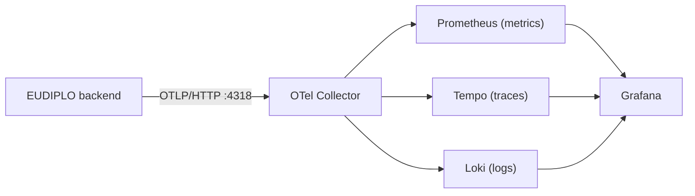

# Monitoring

Collect EUDIPLO's metrics, traces and logs with OpenTelemetry and view them in
Grafana. The backend pushes all three signals over OTLP/HTTP to a collector; it
has no `/metrics` endpoint to scrape. The `monitor/` folder of the repository
contains a ready-made stack.



## Configure the backend

```env
OTEL_EXPORTER_OTLP_ENDPOINT=http://otel-collector:4318   # default http://localhost:4318
OTEL_SERVICE_NAME=eudiplo-backend                        # default
```

The exporter speaks OTLP over HTTP (protobuf) only; point it at the collector's
port 4318, not the gRPC port 4317. Metrics are pushed every 30 seconds. Set
`OTEL_SDK_DISABLED=true` to turn off all export, for example when no collector
runs.

import ConfigTable from "@site/src/components/ConfigTable";

<ConfigTable group="observability" />

With `GRAFANA_URL`, the web client links sessions to their traces and logs in
Grafana; the datasource UIDs must match your Grafana setup.

## Run the bundled stack

```bash
cd monitor
docker compose up -d
```

| Service          | Image                                   | Port                                     |
| ---------------- | --------------------------------------- | ---------------------------------------- |
| `otel-collector` | `otel/opentelemetry-collector-contrib`  | 4318 (OTLP/HTTP), 4317 (gRPC), 8889 (Prometheus exporter) |
| `prometheus`     | `prom/prometheus`                       | 9090                                     |
| `tempo`          | `grafana/tempo`                         | 3200                                     |
| `loki`           | `grafana/loki`                          | 3100                                     |
| `grafana`        | `grafana/grafana`                       | 3001 (user `admin`, password `admin`)    |

The services share the Compose network `monitoring`, which Docker names
`monitor_monitoring` when started from the `monitor` folder. Attach the backend
to it:

```yaml title="docker-compose.override.yml (next to your EUDIPLO Compose file)"
services:
    eudiplo:
        environment:
            OTEL_EXPORTER_OTLP_ENDPOINT: http://otel-collector:4318
        networks:
            - default
            - monitoring

networks:
    monitoring:
        name: monitor_monitoring
        external: true
```

A backend running directly on the host reaches the collector at the default
`http://localhost:4318`. Running the backend from source with `pnpm dev` is
described in [Development setup](../contributing/development-setup.md).

Grafana is provisioned from `monitor/grafana/provisioning/`: the datasources
Prometheus (`prometheus`), Tempo (`tempo`) and Loki (`loki`) with trace-to-log
and log-to-trace links, the alert rule below, and the **EUDIPLO overview**
dashboard from `monitor/grafana/dashboards/`.

**Checkpoint:** `http://localhost:9090/targets` shows the `otel-collector`
target as up, and after a few requests Grafana's **Explore > Loki** returns logs
for `{service_name="eudiplo-backend"}`.

## Metrics

| Metric                                         | Type      | Labels                                                    | Meaning                                                    |
| ---------------------------------------------- | --------- | --------------------------------------------------------- | ---------------------------------------------------------- |
| `http_server_request_duration_seconds`         | histogram | `http_route`, `http_request_method`, `http_response_status_code` | Duration of handled HTTP requests                   |
| `sessions`                                     | gauge     | `tenant_id`, `session_type` (`issuance`, `verification`), `status` (`active`, `fetched`, `completed`, `expired`, `failed`) | Current number of sessions in the database |
| `tenant_total`                                 | gauge     | -                                                         | Number of tenants                                          |
| `federation_trust_cache_hits_total`, `_misses_total`, `_stale_total` | counter | -                                 | OpenID Federation trust cache                              |
| `federation_trust_fetches_total`               | counter   | -                                                         | Outbound federation entity configuration fetches           |
| `oid4vci_as_metadata_cache_hits_total`, `_misses_total`, `_stale_total` | counter | -                              | Cache of external authorization server metadata            |
| `oid4vci_as_metadata_fetches_total`            | counter   | -                                                         | Outbound authorization server metadata fetches             |
| `chained_as_discovery_cache_hits_total`, `_misses_total`, `_stale_total` | counter | -                             | Cache of the chained authorization server's upstream discovery |
| `chained_as_discovery_fetches_total`           | counter   | -                                                         | Outbound upstream discovery fetches                        |

The backend also exports process and host metrics (CPU, memory) and the
automatic Node.js instrumentation traces.

Since 9.0, `sessions` is read from the database (at most every 30 seconds), so
every replica reports the same values. Deduplicate with `max` before summing:

```text
sum by (tenant_id) (max by (tenant_id, session_type, status) (sessions{status="active"}))
```

## Alerts

`monitor/prometheus/rules/eudiplo.yml`:

| Alert              | Fires when                                                         | Severity |
| ------------------ | ------------------------------------------------------------------ | -------- |
| `HighErrorRate`    | More than 0.1 responses per second with status 5xx, for 2 minutes  | warning  |
| `ServiceDown`      | The collector's scrape target is down for 1 minute                 | critical |
| `HighResponseTime` | 95th percentile of request duration above 2 s, for 5 minutes       | warning  |
| `HighMemoryUsage`  | Host memory above 80 %; uses `node_memory_*` metrics from a node exporter, which the stack does not run, so it never fires as shipped | warning |

The file also defines the recording rule `tenant:active_sessions`. Prometheus
has no Alertmanager configured (the `alerting` block in
`monitor/prometheus/prometheus.yml` is commented out), so these alerts are only
visible in Prometheus until you add one.

Grafana evaluates **High Session Error Rate**
(`monitor/grafana/provisioning/alerting/session-alerts.yml`) every 5 minutes: it
fires when more than 10 % of a tenant's finished sessions failed, for 2 minutes.
Add a contact point in Grafana (**Alerting > Contact points**) to receive it.

## Before production

- Change the Grafana admin password and put Prometheus, Tempo and Loki behind
  authentication; the bundled stack has none.
- The stack stores data in local volumes; Prometheus keeps 200 hours. Use
  object storage and retention settings that fit your needs for Tempo and Loki.
- Pin the image versions; most services use `latest`.
