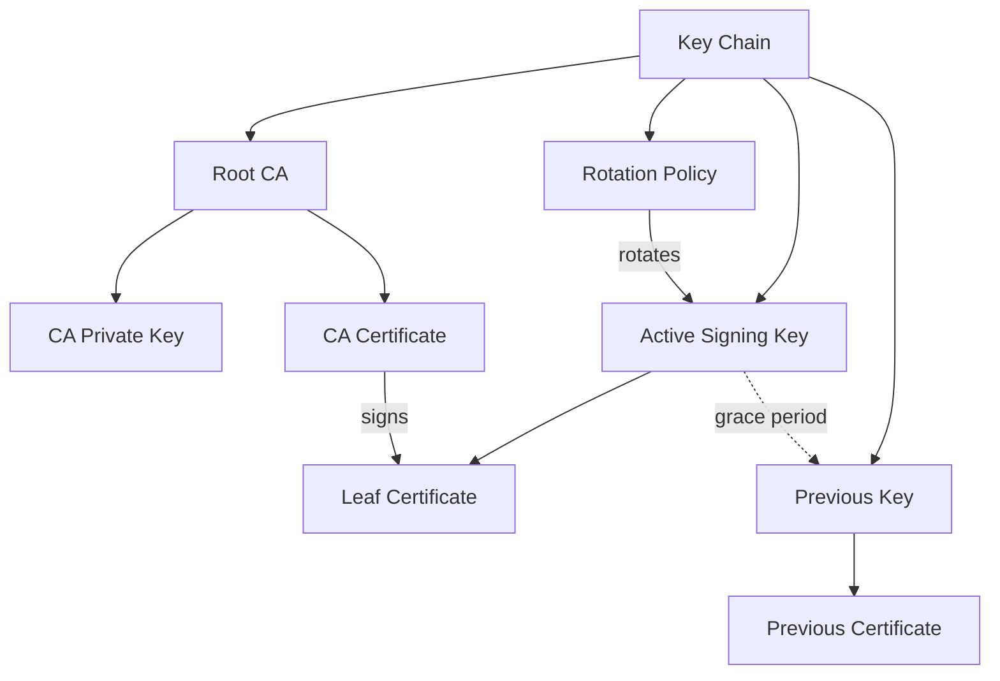

## Key Chains

A **key chain** is EUDIPLO's unified abstraction for managing cryptographic keys and their certificates together as a single entity. This eliminates orphaned keys and simplifies key lifecycle management.

### What Is a Key Chain?

A key chain encapsulates:

- **Active signing key** with its certificate
- **Optional root CA key** (for internal certificate chains / rotation)
- **Previous key** (for grace period after rotation)
- **Rotation policy** (automatic certificate renewal)



Each tenant can manage multiple key chains simultaneously. Each key chain has a unique ID and is isolated via the `tenant_id` field.

### Usage Types

Key chains are organized by usage type:

| Usage         | Purpose                                 |
| ------------- | --------------------------------------- |
| `access`      | Access certificates for wallet requests |
| `attestation` | Credential signing keys                 |
| `trustList`   | Trust list signing keys                 |
| `statusList`  | Status list signing keys                |
| `encrypt`     | Encryption keys for response encryption |

### Creating a Key Chain

#### Via the Web UI

1. Navigate to **Keys** in the sidebar
2. Click **+ Create Key** to open the wizard
3. Select the usage type
4. Select how the key and certificate should be provisioned
5. Enter a description and select the KMS provider
6. Click **Create**

For standalone keys, choose the external certificate option to provide an existing private EC
JWK and certificate chain. The certificate's public key must match the private JWK. The wizard
accepts pasted PEM values and PEM, CRT, CER, or DER certificate files.

For an attestation key using an **External CA Chain**, provide the external CA private JWK and
certificate chain. EUDIPLO imports the CA key, generates the active signing key, has the CA sign
that key, and rotates the active signing key according to the configured policy. The last
certificate in the supplied chain must be the CA certificate matching the private JWK and must
have `CA=true`.

#### Via the API

```bash
curl -X POST https://your-eudiplo-instance/keys \
  -H "Authorization: Bearer <token>" \
  -H "Content-Type: application/json" \
  -d '{
    "name": "my-key-chain",
    "usage": "attestation"
  }'
```

### KMS Provider Selection

When creating or importing a key through the API, include the `kmsProvider` field to select a specific provider by its `id`. If omitted, the `defaultProvider` from `kms.json` is used.

Example with specific provider:

```bash
curl -X POST https://your-eudiplo-instance/keys \
  -H "Authorization: Bearer <token>" \
  -H "Content-Type: application/json" \
  -d '{
    "name": "vault-backed-key",
    "usage": "attestation",
    "kmsProvider": "vault"
  }'
```

### Key Rotation

Key chains support automatic rotation based on certificate expiry. When a certificate approaches expiration, EUDIPLO generates a new key and certificate while keeping the previous key available during a grace period.

This ensures uninterrupted service during key transitions.

#### External CA Rotation

An internal chain can use an external CA as its signing anchor. In this mode:

- The imported private key and final certificate in `crt` represent the CA
- EUDIPLO generates the active leaf signing key
- The external CA signs the generated leaf certificate
- EUDIPLO rotates the leaf key and certificate; the CA key remains the root signing anchor

This mode is available through the web wizard for attestation key chains and through the key-chain
import API with `rotationPolicy.enabled=true`.

Example import payload:

```json
{
    "usageType": "attestation",
    "key": {
        "kty": "EC",
        "crv": "P-256",
        "x": "<ca-public-x>",
        "y": "<ca-public-y>",
        "d": "<ca-private-d>",
        "alg": "ES256"
    },
    "crt": ["<optional-intermediate-certificate-pem>", "<ca-certificate-pem>"],
    "rotationPolicy": {
        "enabled": true,
        "intervalDays": 30,
        "certValidityDays": 365
    }
}
```

The imported CA certificate is validated for `CA=true` and must match the supplied private key.

### Where Keys Are Stored

EUDIPLO supports pluggable KMS backends:

- **Database (default)** — Keys stored encrypted in the database
- **HashiCorp Vault** — Keys managed via Vault Transit engine
- **AWS KMS** — Keys managed by AWS Key Management Service
- **PKCS#11 (HSM)** — Hardware Security Module integration
- **HTTP Remote KMS** — Delegated to a remote microservice
- **CSC** — Cloud Signature Consortium remote signing

The choice of KMS backend is configured globally in `kms.json`. See [KMS Configuration](../operate/kms.md) for technical details on each provider.

### Certificate Types

Key chains can contain different certificate types depending on how they're provisioned:

- **Self-signed** — Generated by EUDIPLO for development/testing
- **CA-issued** — Signed by a Certificate Authority
- **Imported** — Brought in from external PKI systems
- **Registrar-obtained** — Access certificates from EUDI Wallet registrar

See [Certificates](#certificates) for details on certificate management.

### External Certificate Import

External certificate import is supported for standalone access, attestation, status-list, and
trust-list key chains. The imported certificate chain is stored as the active certificate, and
the first certificate is validated against the supplied private key.

For internal attestation chains, use **External CA Chain** instead. This imports an external CA
signing anchor while retaining EUDIPLO's rotating leaf-key lifecycle.

### Best Practices

- Use **separate key chains** for different purposes (issuance vs. status lists)
- Enable **rotation policies** for production key chains
- Use **Vault or AWS KMS** in production for enhanced security
- Keep **backup key material** for disaster recovery (database provider only)
- Never expose **private keys** outside the KMS backend

## Certificates

EUDIPLO manages certificates for signing credentials, authorizing wallet access, and establishing trust. Certificates are always bound to key chains and can be self-signed, CA-issued, or imported from external systems.

### Certificate Types

#### Self-Signed Certificates

Generated by EUDIPLO for development and testing. These certificates are not trusted by production wallets but are useful for:

- Local development
- Integration testing
- Sandbox environments

Self-signed certificates are created automatically when generating a new key chain.

#### CA-Issued Certificates

Signed by a trusted Certificate Authority (CA). Required for production deployments where credentials must be accepted by production wallets.

To use CA-issued certificates:

1. Generate a key chain in EUDIPLO
2. Export the Certificate Signing Request (CSR)
3. Submit the CSR to your CA
4. Import the CA-signed certificate back into the key chain

#### Imported Certificates

Bring existing certificates from external PKI systems. Useful when:

- Migrating from another credential system
- Using certificates from corporate PKI
- Integrating with existing key management infrastructure

Imported certificates must include both the certificate and private key material (for database-backed keys) or reference existing keys (for Vault/AWS KMS).

When importing a certificate chain, provide the leaf certificate first and any issuing
certificates after it. For an external CA-backed rotating internal chain, provide the CA
certificate last. The CA certificate must have `CA=true` and match the supplied private key.

The web key-creation wizard supports pasted PEM values and PEM, CRT, CER, or DER certificate
files. It validates the key/certificate relationship before the key chain is created.

For an attestation internal chain backed by an external CA, EUDIPLO uses the imported CA key to
sign newly generated active leaf keys. Leaf keys and certificates rotate according to the key
chain's rotation policy; the external CA key remains the signing anchor.

### Access Certificates vs Attestation Certificates

EUDIPLO uses certificates for different purposes:

| Type                        | Purpose                       | Obtained From     |
| --------------------------- | ----------------------------- | ----------------- |
| **Access Certificate**      | Grants access to EUDI Wallet  | Registrar         |
| **Attestation Certificate** | Signs verifiable credentials  | Self-signed or CA |
| **Status Certificate**      | Signs credential status lists | Self-signed or CA |
| **Trust List Certificate**  | Signs trust list publications | Self-signed or CA |

### Certificate Chains

For CA-issued certificates, EUDIPLO supports certificate chains:

- **Leaf certificate** — The end-entity certificate used for signing
- **Intermediate certificates** — CA certificates in the chain
- **Root CA certificate** — The trust anchor

When importing or creating certificates, EUDIPLO validates the entire chain to ensure proper trust establishment.

### Certificate Lifecycle

1. **Creation** — Generate a new key chain with self-signed cert or import existing
2. **Active Use** — Certificate is used for signing operations
3. **Near Expiry** — Rotation policy triggers new certificate generation
4. **Grace Period** — Both old and new certificates are valid
5. **Retirement** — Old certificate expires and is archived

### Working with Registrar Certificates

Access certificates for EUDI Wallets are obtained from a registrar service. See [Registrar](registrar.md) for the complete workflow.

Registration certificates authorize credential requests and are managed separately. See [Registration Certificates](registration-certificates.md) for details.

### Certificate Storage

Certificates are stored within key chains in the database. Private key material is stored according to the selected KMS provider:

- **Database provider** — Encrypted private keys in database
- **Vault/AWS KMS** — Private keys never leave the KMS
- **PKCS#11 (HSM)** — Private keys protected by hardware

See [KMS Configuration](../operate/kms.md) for detailed security considerations.

### Related Topics

- [Key Chains](keys-and-certificates.md) — Unified key and certificate management
- [Registrar](registrar.md) — Obtaining access certificates
- [Trust Lists](trust-lists.md) — Publishing trusted issuer certificates
